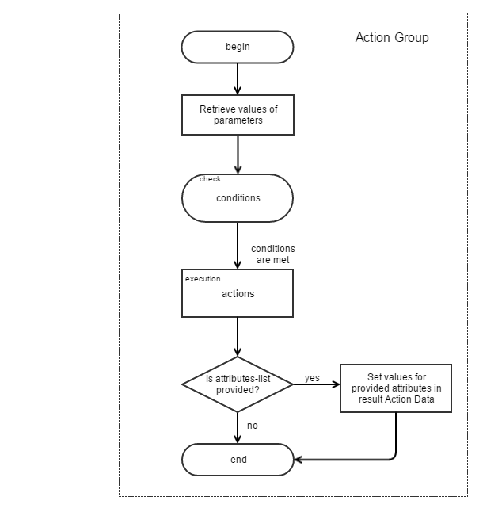

# Action Groups

 * [What are the Action Groups?](#what-are-the-action-groups)
 * [ActionGroup Configuration](#actiongroup-configuration)
 * [Data isolation](#data-isolation)
 * [Call from PHP](#call-from-php)
 * [Recommendations](#recommendations)
 * [Using result of action group](#using-result-of-action-group)
 * [Action Group Diagram](#action-group-diagram)


### What are the Action Groups?

Action Group is a named block of execution logic grouped together under its own `actions` configuration node.
*Action groups* can be called along with the `@run_action_group` action in any application configuration node that Action Component supports.
The *Action group* declaration also has an important configuration section - `parameters` that describes all the data expected to obtain from the caller (with a type, requirement, default value, and validation message).
Parameters are accessible in actions as the root node of contextual data (e.g `$.parameterName`).
Also, along with `parameters` and `actions`, there can be optionally declared special `acl_resource` criteria and a custom `conditions` node where you can define special instructions to check against, before the bunch execution process.

## ActionGroup Configuration

File `<bundleResourceRoot>/config/oro/actions.yml`

```
action_groups:                                  # root node for action groups
    demo_flash_greetings_to:                    # name of action group
        parameters:                             # parameters declaration node
            what:                               # name of the parameter
                type: AcmeBundle/String/Phrase  # (optional, default = any) type validation of parameter (available types: integer, string, boolean, array, double, object, PHP class)
                message: "Bad type"             # (optional) message to be prompted if parameter validation failure met
                default: "Hello"                # (optional) default value for optional parameter, if not set then parameter `what` is required
            who: ~                              # set all defaults to parameter options (type: any)
        conditions:                             # Condition expression
            @not_empty: [$.who]
        actions:                                # list of actions that should be executed
            - @call_service_method:
                service: type_guesser
                method: guess
                method_parameters: [$.who]      # as you can see, parameters are accessible from root $.<parameterName>
                attribute: $.typeOfWho
            - @flash_message:
                message: "%param1%, %param2%!"
                type: 'info'
                message_parameters:
                    param1: $.what
                    param2: $.typeOfWho
```

Now, we can run this action_group as follows:

```
    @run_action_group:
        action_group: demo_flash_greetings_to
        parameters_mapping:
            who: $.myInstanceWithVariousType
```
Here, we skip the `what` parameter, as it has the `default` value. 
To see the `@run_action_group`syntax, please refer to [the actions section](./actions.md#run-action-group-run_action_group)


## Data isolation

Note that **Action group** runs with empty context data. For example, if a caller context is mapped with `parameters_mapping` (under `@run_action_group`) to a new context, **action group** is executed along with it. In this case, there will be only the data supported by the **action group** parameters declaration.
That is why **action groups** can be called from different places and under various circumstances.

## Call from PHP

All named action groups are internally gathered under the `oro_action.action_group_registry` registry service which is the instance of the [`\Oro\Bundle\ActionBundle\Model\ActionGroupRegistry`](../../Model/ActionGroupRegistry.php) class. 
It has simple api to `get` the **action group** ([`\Oro\Bundle\ActionBundle\Model\ActionGroup`](../../Model/ActionGroup.php)) configured instance and perform its execution by applying the `\Oro\Bundle\ActionBundle\Model\ActionGroup::execute` method with proper parameters.

## Recommendations

**User Interface** 

In the abovementioned `actions` block, we have used the action called `@flash_message`. That action was mentioned only for example purpose.
Usually, you should not perform any user interface related actions in the **action group** `actions` set, as they are called or used only in the scope of the actions with no user interface environment available in runtime. 

## Using results of action group

[`ActionInterface`](/src/Oro/Component/Action/Action/ActionInterface.php) implements most actions and stores the results of these actions under their execution context object. Usually it is one of the [`AbstractStorage`](/src/Oro/Component/Action/Model/AbstractStorage.php) child instances. So all the results of the action group are accessed from the context data passed to its `execute(...)` method.

Here, there are two `@run_action_group` configuration options: `results` (transfers data from the action group context to the caller context separately) and `result` (allocates all context of the executed action group under a desired node of the caller context).
[More information about `@run_action_group` options](./actions.md#run-action-group-run_action_group).

## Action Group Diagram

The following diagram shows the logic of the action group process in graphical representation: 
