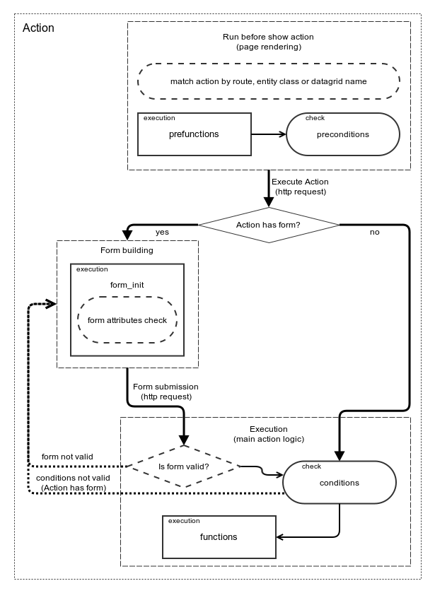

Configuration Reference
=======================

Table of Contents
-----------------
 - [Overview](#overview)
 - [Configuration File](#configuration-file)
 - [Configuration Loading](#configuration-loading)
 - [Configuration Merging](#configuration-merging)
 - [Configuration Replacing](#configuration-replacing)
 - [Defining an Action](#defining-an-action)
   - [Example](#example)
 - [Button Options Configuration](#button-options-configuration)
   - [Example](#example-1)
 - [Frontend Options Configuration](#frontend-options-configuration)
   - [Example](#example-2)
 - [Attributes Configuration](#attributes-configuration)
   - [Example](#example-3)
 - [Datagrid Options Configuration](#datagrid-options-configuration)
   - [Example](#example-4)
 - [Form Options Configuration](#form-options-configuration)
   - [Example](#example-5)
 - [Pre Conditions and Conditions Configuration](#pre-conditions-and-conditions-configuration)
   - [Example](#example-6)
 - [Pre Functions, Form Init Functions and Functions Configuration](#pre-functions-form-init-functions-and-functions-configuration)
   - [Example](#example-7)

Overview
========

Configuration of Action declares all aspects related to specific action:

* basic properties of action like name, label, order, acl resource, etc
* entities or routes or datagrids that is related to action
* conditions and functions
* attributes involved in action
* frontend configuration
* action dialog parameters

Structure of configuration is declared in class Oro\Bundle\ActionBundle\Configuration\ActionDefinitionConfiguration.

Configuration File
==================

Configuration must be placed in a file named Resources/config/actions.yml. For example
Acme/Bundle/DemoBundle/Resources/config/actions.yml.

**Example - actions.yml**
```
actions:
    acme_demo_action:
        label:  Demo Action
        entities:
            - Acme\Bundle\DemoBundle\Entity\User
        ...
```

Configuration Loading
=====================

All actions configuration load automatically on Symfony container building process. Configuration collect from all
bundles, validate and merge. Merged configuration stored in app cache.

To validate configuration manually execute a command:

```
php app/console oro:action:configuration:validate
```

Configuration Merging
=====================

All configurations merge in the boot bundles order. There are two steps of merging process: overriding and extending.

**Overriding**

On this step application collects all configurations of all actions with the same name and merge their to one
configuration.
Merging uses simple rules:
 * if node value is scalar - value will be replaced
 * if node value is array - this array will be complemented by values from the second configuration

After first step application knows about all actions and have only one configuration for each action.

**Extending**
On this step application collects configurations for all actions which contain `extends`. Then main action 
configuration, which specified in `extends`, copied and merged with configuration of original action. Merging use same 
way, which use `overriding` step (rules).

Configuration Replacing
=======================

In merge process we can replace any node on any level of our configuration. If node `replace` is exist and it contains
some nodes which located on the same level of node `replace` - value of these nodes will be replaced by values from
_last_ configuration from queue.

Defining an Action
==================

Root element of configuration is "actions". Under this element actions can be defined.

Single action configuration has next properties:

* **name**
    *string*
    Action should have a unique name in scope of all application.
* **extends**
    *string*
    Action name, which configuration will be used as basis for current action.
* **label**
    *string*
    This value will be shown in the UI.
* **enabled**
    *boolean*
    Flag that define whether this action is enabled. Disabled action will not used in application.
* **entities**
    *array*
    Array of entity class names. Action button will be shown on view/edit pages of this entities.
* **routes**
    *array*
    Action button will be shown on pages which route is in list.
* **datagrids**
    *array*
    Action icon will be shown as an datagrid-action in listed datagrids.
* **order**
    *integer*
    Parameter that specifies the display order of actions buttons.
* **acl_resource**
    *string*
    Action button will be shown only if user have expected permissions.
* **frontend_options**
    Contains configuration for Frontend Options
* **prefunctions**
    Contains configuration for Pre Conditions
* **preconditions**
    Contains configuration for Pre Conditions
* **attributes**
    Contains configuration for Attributes
* **datagrid_options**
    Contains configuration for Datagrid Options
* **form_options**
    Contains configuration for Transitions
* **form_init**
    Contains configuration for Form Init Functions
* **conditions**
    Contains configuration for Conditions
* **functions**
    Contains configuration for Functions

Example
-------
```
actions:                                             # root elements
    demo_action:                                     # name of action
        extends: demo_action_base                    # base action name
        label: aсme.demo.actions.myentity_action     # this value will be shown in UI for action button
        enabled: false                               # action is disabled, means not used in application
        entities:                                    # on view/edit pages of this entities action button will be shown
            - Acme\Bundle\DemoBundle\Entity\MyEntity # entity class name
        routes:                                      # on pages with these routes action button will be shown
            - acme_demo_action_view                  # route name
        datagrids                                    # in listed datagrids action icon will be shown
            - acme-demo-grid                         # datagrid name
        order: 10                                    # display order of action button
        acl_resource: acme_demo_action_view          # ACL resource name that will be checked on pre conditions step
        frontend_options:                            # configuration for Frontend Options
                                                     # ...
        prefunctions:                                # configuration for Pre Functions
                                                     # ...
        preconditions:                               # configuration for Pre Conditions
                                                     # ...
        attributes:                                  # configuration for Attributes
                                                     # ...
        datagrid_options:                            # configuration for Datagrid Options
                                                     # ...
        form_options:                                # configuration for Form Options
                                                     # ...
        form_init:                                   # configuration for Form Init Functions
                                                     # ...
        conditions:                                  # configuration for Conditions
                                                     # ...
        functions:                                   # configuration for Functions
                                                     # ...
```

Button Options Configuration
==============================

Button Options allow to change action button style, override button template and add some data attributes.

Button Options configuration has next options:

* **icon**
    *string*
    CSS class of icon of action button
* **class**
    *string*
    CSS class applied to action button
* **group**
    *string*
    Name of action button menu. Action button will be part of dropdown buttons menu with label (specified group).
    All actions with same group will be shown in one dropdown button html menu.
* **template**
    *string*
    This option provide possibility to override button template.
    Should be extended from `OroActionBundle:Action:button.html.twig`
* **data**
    *array*
    This option provide possibility to add data-attributes to the button tag.
* **page_component_module**
    *string*
    Name of js-component module for the action-button (attribute *data-page-component-module*).
* **page_component_options**
    *array*
    List of options of js-component module for the action-button (attribute *data-page-component-options*).

Example
-------
```
actions:
    demo_action:
        # ...
        button_options:
            icon: icon-ok
            class: btn
            group: aсme.demo.actions.demogroup.label
            template: OroActionBundle:Action:button.html.twig
            data:
                param: value
            page_component_module: acmedemo/js/app/components/demo-component
            page_component_options:
                component_name: '[name$="[component]"]'
                component_additional: '[name$="[additional]"]'
```

Frontend Options Configuration
==============================

Frontend Options allow to override action dialog or page template, title and set widget options.

Frontend Options configuration has next options:

* **template**
    *string*
    You can set custom action dialog template.
    Should be extended from `OroActionBundle:Action:form.html.twig`
* **title**
    *string*
    Custom title of action dialog window.
* **options**
    *array*
    Parameters related to widget component. Can be specified next options: *allowMaximize*, *allowMinimize*, *dblclick*,
    *maximizedHeightDecreaseBy*, *width*, etc.
* **confirmation**
    *string*
    You can show confirmation message before start action`s execution. Translate constant should be available
    for JS - placed in jsmessages.*.yml
* **show_dialog**
    *boolean*
    By default this value is `true`. It mean that on action execution, if form parameters are set, will be shown modal
    dialog with form. Otherwise will be shown separate page (like entity update page) with form.

Example
-------
```
actions:
    demo_action:
        # ...
        frontend_options:
            confirmation: aсme.demo.actions.action_perform_confirm
            template: OroActionBundle:Action:form.html.twig
            title: aсme.demo.actions.dialog.title
            options:
                allowMaximize: true
                allowMinimize: true
                dblclick: maximize
                maximizedHeightDecreaseBy: minimize-bar
                width: 500
            show_dialog: true
```

Attributes Configuration
========================

Action define configuration of attributes. Action can manipulate it's own data (Action Data) that is mapped by
Attributes. Each attribute must to have a type and may have options.

Single attribute can be described with next configuration:

* **unique name**
    Attributes should have unique name in scope of Action that they belong to. Form configuration references attributes
    by this value.
* **type**
    *string*
    Type of attribute. Next types are supported:
    * **boolean**
    * **bool**
        *alias for boolean*
    * **integer**
    * **int**
        *alias for integer*
    * **float**
    * **string**
    * **array**
        Elements of array should be scalars or objects that supports serialize/deserialize
    * **object**
        Object should support serialize/deserialize, option "class" is required for this type
    * **entity**
        Doctrine entity, option "class" is required and it must be a Doctrine manageable class
* **label**
    *string*
    Label can be shown in the UI
* **property_path**
    *string*
    Used to work with attribute value by reference and specifies path to data storage. If property path is specified
    then all other attribute properties except name are optional - they can be automatically guessed based on last
    element (field) of property path.
* **options**
    Options of an attribute. Currently next options are supported
    * **class**
        *string*
        Fully qualified class name. Allowed only when type either entity or object.

**Notice**
Attribute configuration does not contain any information about how to render attribute on step forms, it's
responsibility of "Form Options".

Example
-------

```
actions:
    demo_action:
        # ...
        attributes:
            user:
                label: 'User'
                type: entity
                options:
                    class: Oro\Bundle\UserBundle\Entity\User
            company_name:
                label: 'Company name'
                type: string
            group_name:
                property_path: user.group.name
```

Datagrid Options Configuration
==============================

Datagrid options allow to define options of datagrid mass action. It provide two way to set mass action configuration:
using service which return array of mas action configurations or set inline configuration of mass action.

Single datagrid options can be described with next configuration:

* **mass_action_provider**
    *string*
    Service name. This service must be marked with "oro_action.datagrid.mass_action_provider" tag. Also it must
    implements Oro\Bundle\ActionBundle\Datagrid\Provider\MassActionProviderInterface. Method "getActions" of this
    provider must return array of mass action configurations.
* **mass_action**
    *array*
    Mass action configuration. See datagrid documentation.

**Notice**
It must be used only one parameter "mass_action_provider" or "mass_action".

Example
-------

```
actions:
    demo_action:
        # ...
        datagrid_options:
            mass_action_provider:
                acme.action.datagrid.mass_action_provider
            mass_action:
                type: window
                label: acme.demo.mass_action.label
                icon: plus
                route: acme_demo_bundle_massaction
                frontend_options:
                    title: acme.demo.mass_action.action.label
                    dialogOptions:
                        modal: true
                        ...
```

Form Options Configuration
==========================

These options will be passed to form type of action, they can contain options for form types of attributes that will be
shown when user clicks action button.

Single form configuration can be described with next configuration:

* **attribute_fields**
    *array*
    List of attributes with their options. All attributes specified in this configuration must be contains in attribute
    configuration.
* **attribute_default_values**
    *array*
    List of default values for attributes. This values are shown in action form on form load.

Example
-------

```
actions:
    demo_action:
        # ...
        form_options:
            attribute_fields:
                demo_attr:
                    form_type: text
                        options:
                            required: true
                            constraints:
                                - NotBlank: ~
            attribute_default_values:
                demo_attr: $demo
```

Pre Conditions and Conditions Configuration
===========================================

* **preconditions**
    Configuration of Pre Conditions that must satisfy to allow showing action button.
* **conditions**
    Configuration of Conditions that must satisfy to allow action.

It declares a tree structure of conditions that are applied on the Action Data to check if the Action could be
performed. Single condition configuration contains alias - a unique name of condition - and options.

Optionally each condition can have a constraint message. All messages of not passed conditions will be shown to user
when action could not be performed.

There are two types of conditions - preconditions and actually action conditions. Preconditions are using to check
whether action should be allowed to show, and actual conditions used to check whether action can be done.

Alias of condition starts from "@" symbol and must refer to registered condition. For example "@or" refers to logical
OR condition.

Options can refer to values of main entity in Action Data using "$" prefix. For example "$some_value" refers to value
of "callsome_value" attribute of entity that is processed in condition.

Also it is possible to refer to any property of Action Data using "$." prefix. For example to refer date attribute
with date can be used string "$.created".

Example
-------

```
actions:
    demo_action:
        # ...
        pre_conditions:
            @equal: [$name, 'John Dow']
        conditions:
            @not_empty: [$group]
```

Pre Functions, Form Init Functions and Functions Configuration
==============================================================

* **prefunctions**
    Configuration of Pre Functions that may be performed before pre conditions, conditions, form init functions and post
    functions. It can be used to prepare some data in Action Data that will be used in pre conditions validation.
* **form_init**
    Configuration of Form Init Functions that may be performed on Action Data before conditions and functions.
    One of possible init actions usage scenario is to fill attributes with default values, which will be used in action
    form if it exist.
* **functions**
    Configuration of Functions that must be performed after all previous steps are performed. This is main action step
    that must contain action logic. It will be performed only after conditions will be qualified.

Similarly to Conditions - alias of Function starts from "@" symbol and must refer to registered Functions. For example
"@assign_value" refers to Function which set specified value to attribute in Action Data.

Example
-------

```
actions:
    demo_action:
        # ...
        prefunctions:
            - @assign_value: [$name, 'User Name']
        form_init:
            - @assign_value: [$group, 'Group Name']
        functions:
            - @create_entity:
                class: Acme\Bundle\DemoBundle\Entity\User
                attribute: $user
                data:
                    name: $name
                    group: $group
```

Action Diagram
--------------

Following diagram shows action processes logic in graphical representation: 
