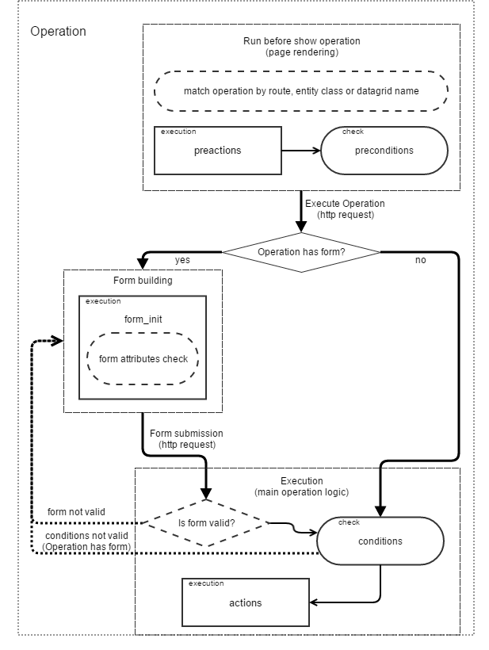

# Operations

  * [What are Operations?](#what-are-operations)
  * [How does it work?](#how-it-works)
  * [Operation Configuration](#operation-configuration)
  * [Configuration Validation](#configuration-validation)
  * [Default Operations](#default-operations)
    * [Questions and Answers](#questions-and-answers)
  * [Operation Diagram](#operation-diagram)

## What are Operations?

*Operations* provide possibility to assign any interaction with a user by specifying:
 - Entity classes
 - Routes
 - Datagrids

Every active *operation* shows a button or a link on the corresponding page. The button is displayed only if all the described preconditions are met. For the *operation* button or link to be displayed the `preconditions` section should evaluate to `true`.  After a user clicks on the button or link the *operation* will be performed only if the `conditions` section evaluates to `true`. Also, if the operation has a form dialog configuration, then a a modal dialog with fields appears when clicking the button. 

## How does it work?

Each *operation* relates to an entity type (consists of a full class name) or\and a route of the page where the operations should be displayed or\and a datagrid. Before the page loading, ActionBundle chooses *operations* that have a corresponding page entity|route. Then these *operations* are checked against the preconditions. If all the preconditions are met - the operation's button is displayed.
Upon clicking the button - all the performed operations (and underlined actions) are executed provided that all the preconditions of *operation* and conditions of *actions* are met.

## Operation Configuration

All operations can be described in the ``actions.yml`` configuration file under the corresponding bundle in the `config/oro` resource directory.
Below, there is an example of a simple operation configuration that performs an execution logic with the MyEntity entity.

```
operations:
    acme_demo_expire_myentity_operation:                            # operation name
        extends: entity_operation_base                              # (optional) parent operation if needed
        replace:                                                    # (optional) the list of nodes that should be replaced in the parent operation
            - frontend_options                                      # node name
        label: aсme.demo.operations.myentity_operation              # label for operation button
        enabled: true                                               # (optional, default = true) is operation enabled
        substitute_operation:  entity_common_operation              # (optional) name of operation that must be substituted with current one if it appears
        entities:                                                   # (optional) list of entity classes
            - Acme\Bundle\DemoBundle\Entity\MyEntity                # entity class
            - AcmeDemoBundle:MyEntity2
        for_all_entities: false                                     # (optional, default = false) is operation match for all entities
        exclude_entities: ['AcmeDemoBundle:MyEntity3']              # (optional) list of entities that must be ignored for this operation (usefull with "for_all_entities" option)
        routes:                                                     # (optional) list of routes
            - acme_demo_myentity_view                               # route name
        datagrids:                                                  # (optional) list of datagrids
            - acme-demo-grid                                        # datagrid name
        for_all_datagrids: false                                    # (optional, default = false) is operation available in all datagrids if any   
        exclude_datagrids: ['datagrid-demo']                        # (optional) list of datagrids that should never be matched by this operation in any context (usefull with "for_all_datagrids" option)
        groups: ['operations_on_acme_entities']                     # (optional) list of groups that can be assigned to operation (tagging mechanism) to be available or filtered among in usual code or templates
        order: 10                                                   # (optional, default = 0) display order of operation button
        acl_resource: acme_demo_myentity_view                       # (optional) ACL resource name that will be checked while checking that operation execution is allowed

        button_options:                                             # (optional) display options for operation button
            icon: fa-clock-o                                         # (optional) class of button icon
            class: btn                                              # (optional) class of button
            group: aсme.demo.operation.demogroup.label              # (optional) group operation to drop-down on the label
            template: customTemplate.html.twig                      # (optional) custom button template
            page_component_module:                                  # (optional) js-component module
                acme/js/app/components/demo-component
            page_component_options:                                 # (optional) js-component module options
                parameterName: parameterValue
            data:                                                   # custom data attributes which will be added to button
                attributeName: attributeValue

        frontend_options:                                           # (optional) display options for operation button
            template: customDialogTemplate.html.twig                # (optional) custom template, can be used both for page or dialog
            title: aсme.demo.operations.dialog.title                # (optional) custom title
            title_parameters:
                %%some_param%%: $.paramValue
            options:                                                # (optional) modal dialog options
                allowMaximize: true
                allowMinimize: true
                dblclick: maximize
                maximizedHeightDecreaseBy: minimize-bar
                width: 1000
            show_dialog: true                                       # (optional, by default: true) if `false` - operation will be opened on page
            confirmation: aсme.demo.operation_perform_confirm       # (optional) Confirmation message before start operation`s execution

        attributes:                                                 # (optional) list of all existing attributes
            demo_attr:                                              # attribute name
                label: Demo Field                                   # attribute label
                type: string                                        # attribute type
                property_path: data.demo                            # (optional if label and type are set) path to entity property, which helps to automatically defined attribute metadata, and will be mapped for that property
                options:                                            # attribute options
                    class: \Acme\Bundle\DemoBundle\Model\MyModel    # (optional) entity class name, set if type is entity

        datagrid_options:
            mass_action_provider:                                   # (optional) service name, marked with "oro_action.datagrid.mass_action_provider" tag
                acme.action.datagrid.mass_action_provider           # and must implement Oro\Bundle\ActionBundle\Datagrid\Provider\MassActionProviderInterface
            mass_action:                                            # (optional) configuration of datagrid mass action
                type: window
                label: acme.demo.mass_action.label
                icon: plus
                route: acme_demo_bundle_massaction
                frontend_options:
                    title: acme.demo.mass_action.action.label
                    dialogOptions:
                        modal: true
                        ...

        form_options:                                               # (optional) parameters which will be passed to form dialog
            attribute_fields:                                       # list of attribute fields which will be shown in dialog
                demo_attr:                                          # attribute name (must be configured in `attributes` block of action config)
                    form_type: text                                 # needed type of current field
                        options:                                    # list of form field options
                            required: true                          # define this field as required
                            constraints:                            # list of constraints
                                - NotBlank: ~                       # this field must be filled
            attribute_default_values:                               # (optional) define default values for attributes
                demo_attr: $demo                                    # use attribute name and property path or simple string for attribute value

        form_init:                                                  # (optional) any needed actions which will execute before showing form dialog
            - @assign_value:                                        # action alias
                conditions:                                         # (optional) conditions list to allow current action
                    @empty: $description                            # condition definition
                parameters: [$.demo_attr, 'Demo Data']              # parameters of current action

        preactions:                                                 # (optional) any needed pre actions which will execute before pre conditions
            - @create_datetime:                                     # action alias
                attribute: $.date                                   # action parameters

        preconditions:                                              # (optional) pre conditions for display Action button
            @gt: [$updatedAt, $.date]                               # condition definition
            
        conditions:                                                 # (optional) conditions for execution Action button
            @equal: [$expired, false]                               # condition definition

        actions:                                                    # (optional) any needed actions which will execute after click on th button
            - @assign_value: [$expired, true]                       # action definition
```

 This configuration describes the operation that relates to the ``MyEntity`` entity. The button with the "adme.demo.myentity.operations.myentity_operation" label is displayed on the view page (acme_demo_myentity_view) of this entity (in case the 'updatedAt' field > new DateTime('now')). If the `expired` property of the entity = false, then clicking the button triggers the "assign_value" action that sets the 'expired' field to `true`.
 If `form_options` are specified, then the form dialog with attributes fields is displayed when clicking the button. The actions run only on the submit form.

# Configuration Validation

Execute a command to validate all operations configuration:

```
php bin/console oro:action:configuration:validate
```

**Note:** All configurations apply automatically after their changes made in developer environment.


## Default Operations

**Oro Action Bundle** defines several system wide default operations for a common purpose. Those are basic CRUD-called operations for entities:
 
 - `UPDATE` - operation for an entity editing that uses a route from the `routeUpdate` option of the entity configuration.
 - `DELETE` - operation for an entity deletion that uses a route from the `routeName` option of the entity configuration.

  If the default operations are used in the nondefault applications, as in `commerce`, for example, the routes are retrieved from the `routeCommerceUpdate` and `routeCommerceDelete` options.

  Configurations for the default operations are allocated in the `Resources/config/oro/actions.yml` file under the **Oro Action Bundle** directory.

### Questions and Answers

#### How can I disable a CRUD default operation for my Bundle?

  Supposing you need to disable the default `DELETE` operation for your new `MyEntity` entity.
Here is the case which describes the solution. You can do this in `actions.yml` under your bundle configuration resources directory:

```
operations:
    DELETE:
        exclude_entities: ['MyEntity']
```
  The operation merges special additional condition to the default operation during the configuration compilation, so that the default `DELETE` operation doesn't match your entity and is not displayed as well.

#### Can I disable default operation for my datagrid?

  Yes. There are two ways to do that. **The first way**: you can disable the operation by updating your datagrid configuration in its `action_configuration` section. Define a key that corresponds to the operation name with the `false` value.

`datagrids.yml`:

```
datagrids:
    your_datagrid_name:
        #... datagrid config sections
        action_configuration:
            some_default_common_operation: false
```

`some_default_common_operation` is not displayed at `your_datagrid_name` grid anymore. 
However, action_configuration can accept callable as value, so sometimes the options are occupied by service callback.
If it is so, we can use another approach.

 The **second way** is to disable the operation for custom datagrid using the `exclude_datagrids` option in operation definition.So you can specify the name of the datagrid that should be excluded from the *operation* matching. If your operation is defined by another bundle, you can use the *merge* behavior of operation configuration and just add anadditional property value under your bundle configuration. For example, the operation that should not be displayed for the `product_view` datagrid is the default `DELETE` operation from `OroActionBundle`. You can exclude your grid from matching with the next addition to `<YourBundle>/Resources/config/oro/actions.yml`

```
operations:
    DELETE:
        exclude_datagrids:
            - product_view
```
You can always use other ways to define, reuse, or customize the operation definition. Along with basic merge there also the `replace`, `extend`, and `substitute_operation` options that become helpful in different cases.

#### How can I modify CRUD default operation for my Bundle?

  If you need to customize a default or any other operation, you should change its `label` as follows:
 
```
operations:
    my_special_entity_custom_edit:
        extends: UPDATE                         # this is for keeping all other properties same as in default
        label: 'Modify me'                      # custom label
        substitute_operation: UPDATE            # replace UPDATE operation with current one
        entities: ['MyEntity']                  # replacement will occur only if this operation will be matched by entity
        for_all_entities: false                 # overriding extended property for `entities` field matching only
```
  Here is a custom modification made through a substitution mechanism when the operation mentioned in the `substitute_operation` field is replaced by the current one.
  Additionally, you can limit the application of the modification only to the entities mentioned in the `entities` field. If you need to make full replacement of the operation instead of copying the extended version of it, the `extends` field can be omitted, and the custom body should be defined.

  See the [substitution](./configuration-reference.md#substitution-of-operation) section in the configuration documentation (./configuration-reference.md) for more details.


## Operation Diagram

The following diagram shows operation processes logic in graphical representation: 
