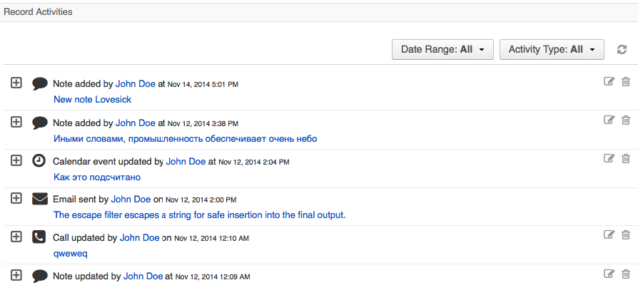

# OroActivityListBundle

OroActivityListBundle adds a widget to the entity view page. The widget displays a list of activities related to the entity record in the chronological order. It also enables widget configuration in the system configuration section.

## Table of contents


- [Fundamentals](#fundamentals)
- [Add widget into a page](#add-widget-into-a-page)
- [Register a new entity](#register-a-new-entity)
- [Configuration](#configuration)

## Fundamentals

The following are examples of activities that can be added to other entities:

- Emails
- Calendar events
- Notes

Visualization of Activity list is defined as a widget block. It shows activities related to the entity record currently being viewed in a single list, with the ability to filter it by activity type (multiselect) and date (daterange filter).

Each activity row shows base information about itself: type of activity, who and when have created and update it, also you have access to the full activity record via "expand" action. By default is displayed 25 records, sorted by update date in descending order. The limitation and sorting can be changed in [UI](#configuration) .

The widget currently displayed in "Record activities" placeholder block on an entities view page.

**Example UI within contact page**


## Add Widget into a Page

Widget is usually rendered in the "view_content_data_activities" placeholder. However, if you need to extend it or use a view template different from 'OroUIBundle:actions:view.html.twig', you will have to define a placeholder in it. For example: 

```
  
    
  
  
```

## Show Widget and Its Button on Specific page (view/edit)

To show a widget and its button on specific pages, set entity annotation.

The widget can be displayed on `view` and/or `update` pages. The list of allowed values can be found in \Oro\Bundle\ActivityBundle\EntityConfig\ActivityScope` e.g.:
```
/**
...
 * @Config(
 *      defaultValues={
 *          ...
 *          "activity"={
 *              "show_on_page"="\Oro\Bundle\ActivityBundle\EntityConfig\ActivityScope::UPDATE_PAGE"
 *          }
 *          ...
 *      }
 * )
 */
class CustomerUserRole extends AbstractRole { ... }
```

## Register a New Entity

To add a new entity to be displayed within a widget, register a service that implements **ActivityListProviderInterface** and tag it as **oro_activity_list.provider**. A working example of this can be found in EmailBundle or CalendarBundle:
```
    oro_calendar.activity_list.provider:
        class: %oro_calendar.activity_list.provider.class%
        arguments:
           - @oro_entity.doctrine_helper
           - @doctrine
        tags:
           - {name: oro_activity_list.provider, priority: 50}
```
This will add your provider class into a bunch of providers (**ActivityListChainProvider**) that will be invoked to fetch data ordering by priority (added in service definition). Priority may be useful in future implementations, or in case of overriding some existing providers in 3rd party bundles.

Each activity entity has its own row template for the UI component. Although you can place it anywhere you want, make sure its path is returned in the Provider via the getTemplate() method. For instance:

```
class CalendarEventActivityListProvider implements ActivityListProviderInterface
{
...
/**
* {@inheritdoc}
*/
public function getTemplate()
{
   return 'OroCalendarBundle:CalendarEvent:js/activityItemTemplate.html.twig';
}
...

```

## Configuration

Sorting and limitation could be changed in the UI by navigating to System -> Configuration -> Display settings -> section "Activity lists".

 - Sort by field - sorting available by "Created date" or "Updated date"(default).
 - Sort direction - Ascending or Descending(default).
 - Items Per Page By Default - the number of activities displayed in the list. Default is 25. 
