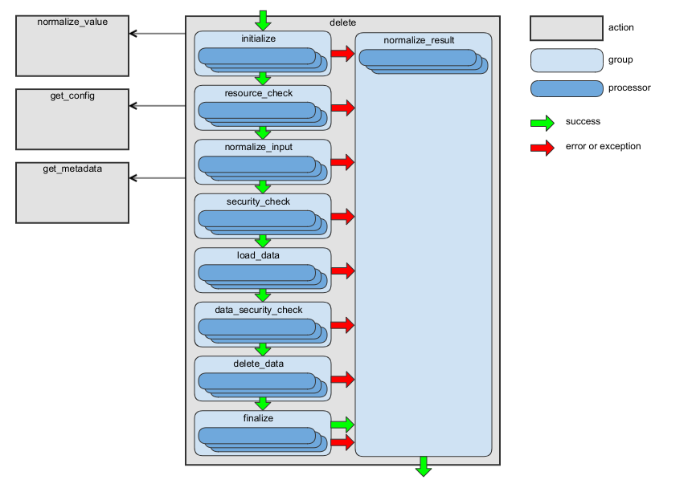
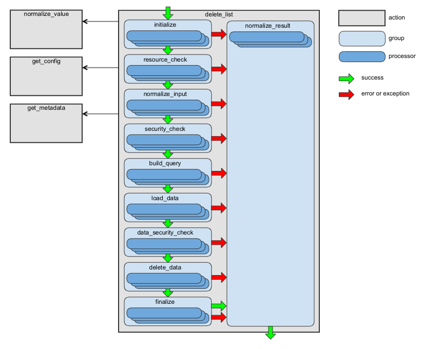
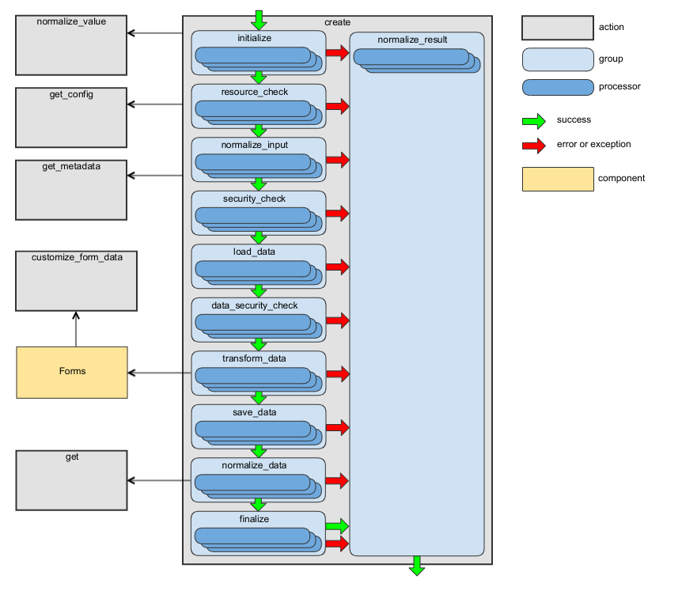
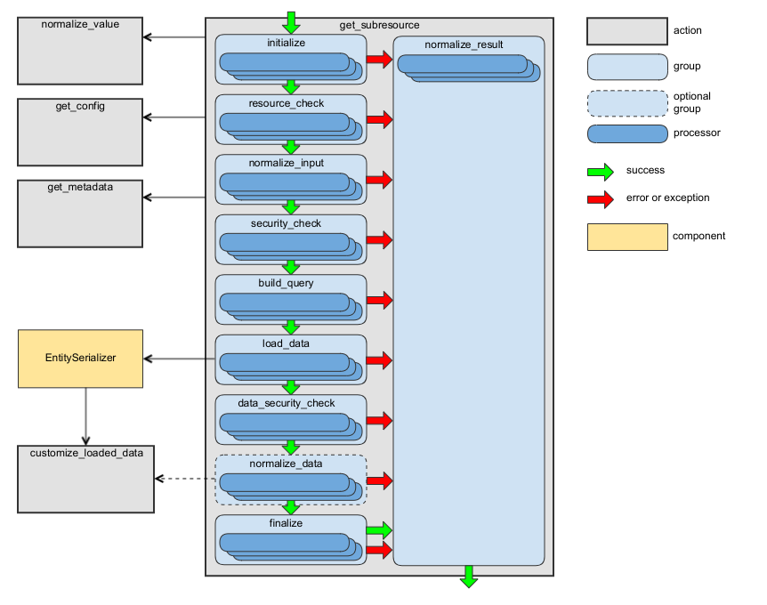
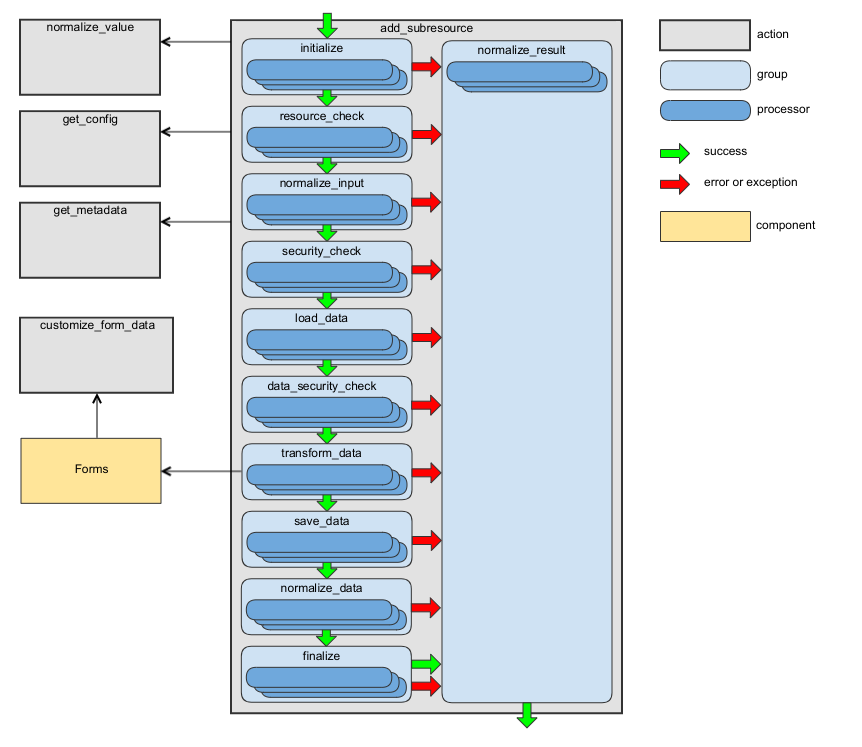
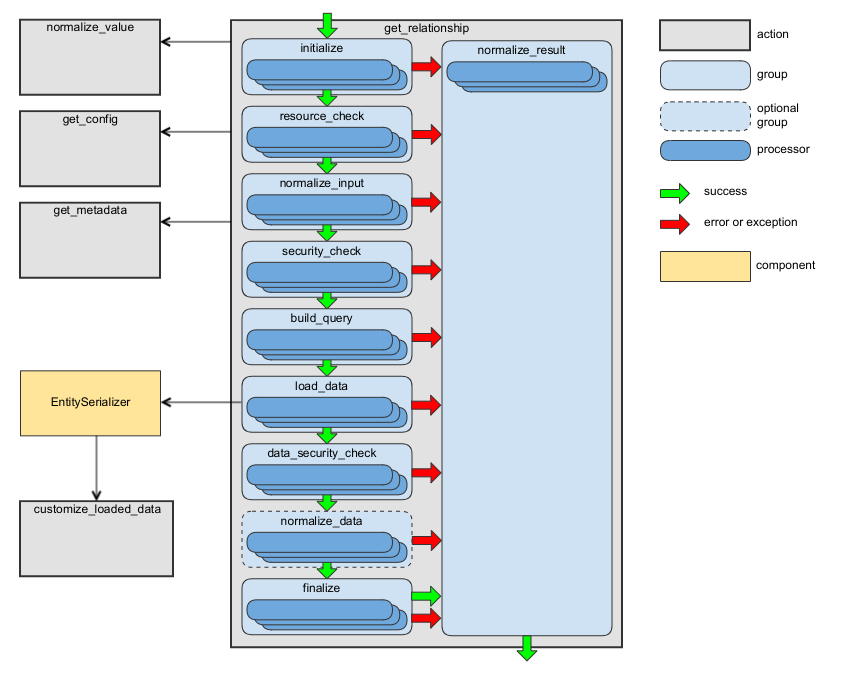
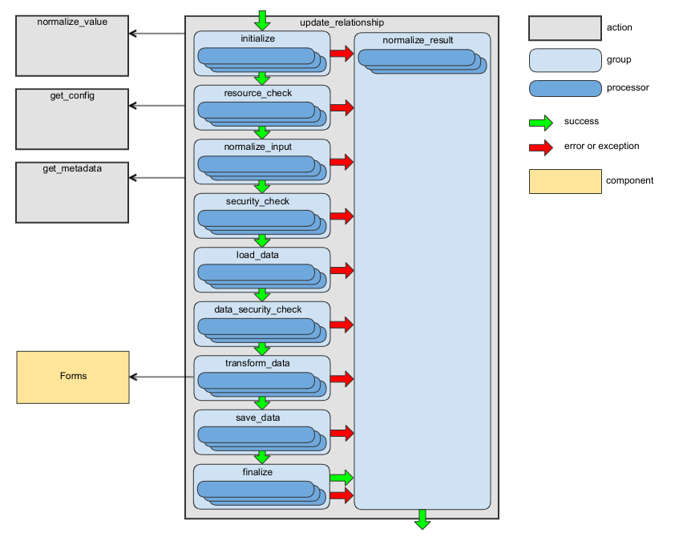

# Actions

 - [Overview](#overview)
 - Public actions
   - [**get** Action](#get-action)
   - [**get_list** Action](#get_list-action)
   - [**delete** Action](#delete-action)
   - [**delete_list** Action](#delete_list-action)
   - [**create** Action](#create-action)
   - [**update** Action](#update-action)
   - [**get_subresource** Action](#get_subresource-action)
   - [**update_subresource** Action](#update_subresource-action)
   - [**add_subresource** Action](#add_subresource-action)
   - [**delete_subresource** Action](#delete_subresource-action)
   - [**get_relationship** Action](#get_relationship-action)
   - [**update_relationship** Action](#update_relationship-action)
   - [**add_relationship** Action](#add_relationship-action)
   - [**delete_relationship** Action](#delete_relationship-action)
   - [**options** Action](#options-action)
 - Auxiliary actions
   - [**customize_loaded_data** Action](#customize_loaded_data-action)
   - [**customize_form_data** Action](#customize_form_data-action)
   - [**get_config** Action](#get_config-action)
   - [**get_relation_config** Action](#get_relation_config-action)
   - [**get_metadata** Action](#get_metadata-action)
   - [**normalize_value** Action](#normalize_value-action)
   - [**collect_resources** Action](#collect_resources-action)
   - [**collect_subresources** Action](#collect_subresources-action)
   - [**not_allowed** Action](#not_allowed-action)
 - [**Context** Class](#context-class)
 - [**SubresourceContext** Class](#subresourcecontext-class)
 - [Creating New Action](#creating-new-action)

## Overview

The action is a set of processors that handle a request.

Each action has two required elements:

- **context** - An object that is used to store the input and output data and share data between processors.
- **main processor** - The main entry point for an action. This class is responsible for creating the context and executing all of the worker processors.

For more details about these elements, see the [Creating new action](#creating-new-action) section.

The following table shows all actions provided out of the box:

| Action Name | Description |
| --- | --- |
| [get](#get-action) | Returns an entity by its identifier. |
| [get_list](#get_list-action) | Returns a list of entities. |
| [delete](#delete-action) | Deletes an entity by its identifier. |
| [delete_list](#delete_list-action) | Deletes a list of entities. |
| [create](#create-action) | Creates a new entity. |
| [update](#update-action) | Updates an existing entity. |
| [get_subresource](#get_subresource-action) | Returns a list of related entities represented by a relationship. |
| [update_subresource](#update_subresource-action) | Updates an entity (or entities, it depends on the association type) connected to an entity the sub-resource belongs to. This action do not have default implementation, additional processors should be added for each sub-resource. |
| [add_subresource](#add_subresource-action) | Adds an entity (or entities, it depends on the association type) connected to an entity the sub-resource belongs to. This action do not have default implementation, additional processors should be added for each sub-resource. |
| [delete_subresource](#delete_subresource-action) | Deletes an entity (or entities, it depends on the association type) connected to an entity the sub-resource belongs to. This action do not have default implementation, additional processors should be added for each sub-resource. |
| [get_relationship](#get_relationship-action) | Returns a relationship data. |
| [update_relationship](#update_relationship-action) | Updates "to-one" relationship and completely replaces all members of "to-many" relationship. |
| [add_relationship](#add_relationship-action) | Adds one or several entities to a relationship. This action is applicable only for "to-many" relationships. |
| [delete_relationship](#delete_relationship-action) | Deletes one or several entities from a relationship. This action is applicable only for "to-many" relationships. |
| [options](#options-action) | Returns the communication options for a resource. |
| [customize_loaded_data](#customize_loaded_data-action) | Modifies the data loaded by [get](#get-action), [get_list](#get_list-action), and [get_subresource](#get_subresource-action) actions. |
| [customize_form_data](#customize_form_data-action) | Modifies the submitted data for [create](#create-action) and [update](#update-action) actions. |
| [get_config](#get_config-action) | Returns an entity configuration. |
| [get_relation_config](#get_relation_config-action) | Returns a configuration of an entity used in a relationship. |
| [get_metadata](#get_metadata-action) | Returns an entity's metadata. |
| [normalize_value](#normalize_value-action) | Converts a value to the requested data type. |
| [collect_resources](#collect_resources-action) | Returns a list of all resources accessible via the data API. |
| [collect_subresources](#collect_subresources-action) | Returns a list of all sub-resources accessible via the data API for a given entity type. |
| [not_allowed](#not_allowed-action) | Builds a response for case when a request does not match any public action. E.g. when HTTP method is not supported for REST API request. |

Please see [processors](./processors.md) section for more details about how to create a processor.

You can use the [oro:api:debug](./commands.md#oroapidebug) command to display the list of  all available actions and processors.

## get Action

This action is intended to retrieve an entity by its identifier. For more details, see the [Fetching Data](http://jsonapi.org/format/#fetching) section of the JSON.API specification.

The route name for REST API: `oro_rest_api_item`.

The URL template for REST API: `/api/{entity}/{id}`.

The HTTP method for REST API: `GET`.

The context class: [GetContext](../../Processor/Get/GetContext.php). See the [Context](#context-class) class for more details.

The main processor class: [GetProcessor](../../Processor/GetProcessor.php).

Existing worker processors: [processors.get.yml](../../Resources/config/processors.get.yml), [processors.shared.yml](../../Resources/config/processors.shared.yml). Run `php bin/console oro:api:debug get` to list the processors.

This action has the following processor groups:

| Group Name | Responsibility of Processors | Description |
| --- | --- | --- |
| initialize | The context initialization. | Also, the processors from this group are executed during the generation of the API documentation. |
| resource_check | Checking whether the requested resource type is accessible via API. | |
| normalize_input | Preparing the input data for use by processors from the next groups. | |
| security_check | Checking whether access to the requested resource type is granted. | To add a new processor to this group, include it to the **security_check** group of actions that execute this action. For example, compare with the **security_check** group of the [create](#create-action) or [update](#update-action) actions. |
| build_query | Building a query required to load the data. | |
| load_data | Loading of the data. | |
| data_security_check | Checking whether access to the loaded data is granted. | Use the same rules as for **security_check** group to add a new processor to this group. |
| normalize_data | Converting the loaded data into an array. | In most cases the processors from this group are skipped because most of the entities are loaded by the [EntitySerializer](../../../../Component/EntitySerializer/README.md) and it returns already normalized data. For details, see [LoadEntityByEntitySerializer](../../Processor/Shared/LoadEntityByEntitySerializer.php). |
| finalize | Final validation of loaded data and adding the required response headers. | |
| normalize_result | Building the action result. | The processors from this group are executed even if an exception has been thrown by a processor of one of the previous groups. For implementation details, see [NormalizeResultActionProcessor](../../Processor/NormalizeResultActionProcessor.php). |

The following diagram shows the main data flow for this action:


For examples of usage, see the `handleGet` method of [RequestActionHandler](../../Request/RequestActionHandler.php).

## get_list Action

This action retrieves a list of entities. For more details, see the [Fetching Data](http://jsonapi.org/format/#fetching) section of the JSON.API specification.

The route name for REST API: `oro_rest_api_list`.

The URL template for REST API: `/api/{entity}`.

The HTTP method for REST API: `GET`.

The context class: [GetListContext](../../Processor/GetList/GetListContext.php). See the [Context](#context-class) class for more details.

The main processor class: [GetListProcessor](../../Processor/GetListProcessor.php).

Existing worker processors: [processors.get_list.yml](../../Resources/config/processors.get_list.yml), [processors.shared.yml](../../Resources/config/processors.shared.yml). Run `php bin/console oro:api:debug get_list` to list the processors.

This action has the following processor groups:

| Group Name | Responsibility&nbsp;of&nbsp;Processors | Description |
| --- | --- | --- |
| initialize | The context initialization. | Also, the processors from this group are executed during the generation of the API documentation. |
| resource_check | Checking whether the requested resource type is accessible via API. | |
| normalize_input | Preparing the input data for use by processors from the next groups. | |
| security_check | Checking whether access to the requested resource type is granted. | |
| build_query | Building a query required to load the data. | |
| load_data | Loading of the data. | |
| data_security_check | Checking whether access to the loaded data is granted. | |
| normalize_data | Converting the loaded data into an array. | In most cases the processors from this group are skipped because most of the entities are loaded by the [EntitySerializer](../../../../Component/EntitySerializer/README.md) and it returns already normalized data. For details, see [LoadEntitiesByEntitySerializer](../../Processor/Shared/LoadEntitiesByEntitySerializer.php). |
| finalize | Final validation of the loaded data and adding the required response headers. | |
| normalize_result | Building the action result. | The processors from this group are executed even if a processor of one of the previous groups throws an exception. For implementation details, see [NormalizeResultActionProcessor](../../Processor/NormalizeResultActionProcessor.php). |

The following diagram shows the main data flow for this action:


For examples of usage, see the `handleGetList` method of [RequestActionHandler](../../Request/RequestActionHandler.php).

## delete Action

This action deletes an entity by its identifier. For more details, see the [Deleting Resources](http://jsonapi.org/format/#crud-deleting) section of the JSON.API specification.

The route name for REST API: `oro_rest_api_item`.

The URL template for REST API: `/api/{entity}/{id}`.

The HTTP method for REST API: `DELETE`.

The context class: [DeleteContext](../../Processor/Delete/DeleteContext.php). Also see [Context](#context-class) class for more details.

The main processor class: [DeleteProcessor](../../Processor/DeleteProcessor.php).

Existing worker processors: [processors.delete.yml](../../Resources/config/processors.delete.yml), [processors.shared.yml](../../Resources/config/processors.shared.yml). Run `php bin/console oro:api:debug delete` to list the processors.

This action has the following processor groups:

| Group Name | Responsibility&nbsp;of&nbsp;Processors | Description |
| --- | --- | --- |
| initialize | The context initialization. | Also, the processors from this group are executed during the generation of the API documentation. |
| resource_check | Checking whether the requested resource type is accessible via API. | |
| normalize_input | Preparing the input data for use by processors from the next groups. | |
| security_check | Checking whether access to the requested resource type is granted. | |
| load_data | Loading an entity that should be deleted and storing it in the `result` property of the context. | |
| data_security_check | Checking whether access to the loaded data is granted. | |
| delete_data | Deleting the entity stored in the `result` property of the context. | |
| finalize | Adding the required response headers. | |
| normalize_result | Building the action result. | The processors from this group are executed even if an exception has been thrown by a processor of one of the previous groups. For implementation details, see [NormalizeResultActionProcessor](../../Processor/NormalizeResultActionProcessor.php). |

The following diagram shows the main data flow for this action:



For examples of usage, see the `handleDelete` method of [RequestActionHandler](../../Request/RequestActionHandler.php).

## delete_list Action

This action deletes a list of entities.

The entities list is built based on input filters. Please take into account that at least one filter must be specified. Otherwise, an error raises.

By default, the maximum number of entities that can be deleted by one request is 100. This limit was introduced to minimize the  impact on the server.
You can change this limit for an entity in `Resources/config/oro/api.yml`. However, please test your limit carefully because a higher limit may make a more significant impact on the server.
An example of how to change the default limit is available at [how-to](how_to.md#change-the-maximum-number-of-entities-that-can-be-deleted-by-one-request).

The route name for REST API: `oro_rest_api_list`.

The URL template for REST API: `/api/{entity}`.

The HTTP method for REST API: `DELETE`.

The context class: [DeleteListContext](../../Processor/DeleteList/DeleteListContext.php). Also see [Context](#context-class) class for more details.

The main processor class: [DeleteListProcessor](../../Processor/DeleteListProcessor.php).

Existing worker processors: [processors.delete_list.yml](../../Resources/config/processors.delete_list.yml), [processors.shared.yml](../../Resources/config/processors.shared.yml). Run `php bin/console oro:api:debug delete_list` to display the list of processors.

This action has the following processor groups:

| Group Name | Responsibility&nbsp;of&nbsp;Processors | Description |
| --- | --- | --- |
| initialize | The context initialization. | Also, the processors from this group are executed during the generation of the API documentation. |
| resource_check | Checking whether the requested resource type is accessible via API. | |
| normalize_input | Preparing the input data for use by processors from the next groups. | |
| security_check | Checking whether access to the requested resource type is granted. | |
| build_query | Building a query that will be used to load an entities list to be deleted. | |
| load_data | Loading the list of entities to be deleted and storing it in the `result` property of the context. | |
| data_security_check | Checking whether access to the loaded data is granted. | |
| delete_data | Deleting the entities list stored in the `result` property of the context. | |
| finalize | Adding the required response headers. | |
| normalize_result | Building the action result. | The processors from this group are executed even if an exception has been thrown by a processor of one of the previous groups. For implementation details, see [NormalizeResultActionProcessor](../../Processor/NormalizeResultActionProcessor.php). |

The following diagram shows the main data flow for this action:



For examples of usage, see the `handleDeleteList` method of [RequestActionHandler](../../Request/RequestActionHandler.php).

## create Action

This action creates a new entity. For more details, see the [Creating Resources](http://jsonapi.org/format/#crud-creating) section of the JSON.API specification.

The route name for REST API: `oro_rest_api_list`.

The URL template for REST API: `/api/{entity}`.

The HTTP method for REST API: `POST`.

The context class: [CreateContext](../../Processor/Create/CreateContext.php). See the [Context](#context-class) class for more details.

The main processor class: [CreateProcessor](../../Processor/CreateProcessor.php).

Existing worker processors: [processors.create.yml](../../Resources/config/processors.create.yml), [processors.shared.yml](../../Resources/config/processors.shared.yml). Run `php bin/console oro:api:debug create` to display the list of processors.

This action has the following processor groups:

| Group Name | Responsibility&nbsp;of&nbsp;Processors | Description |
| --- | --- | --- |
| initialize | The context initialization. | Also, the processors from this group are executed during the generation of the API documentation. |
| resource_check | Checking whether the requested resource type is accessible via API. | |
| normalize_input | Preparing input data for use by processors from the next groups. | |
| security_check | Checking whether access to the requested resource type is granted. | When you add a new processor to the **security_check** group of the [get](#get-action) action, add it to this group as well. This is necessary because the **VIEW** permission is checked here: the created entity should be returned in response, and the **security_check** group of the [get](#get-action) action is disabled by the **oro_api.update.load_normalized_entity** processor. |
| load_data | Creating a new entity object. | |
| data_security_check | Checking whether access to the loaded data is granted. | Use the same rules as for **security_check** group to add a new processor to this group. |
| transform_data | Building a Symfony Form and using it to transform and validate the request data.  | |
| save_data | Validating and persisting an entity. | |
| normalize_data | Converting created entity into an array. | |
| finalize | Adding the required response headers. | |
| normalize_result | Building the action result. | The processors from this group are executed even if an exception has been thrown by a processor of one of the previous groups. For implementation details, see [NormalizeResultActionProcessor](../../Processor/NormalizeResultActionProcessor.php). |

The following diagram shows the main data flow for this action:



For examples of usage, see the `handleCreate` method of [RequestActionHandler](../../Request/RequestActionHandler.php).

## update Action

This action updates an entity. For more details, see the [Updating Resources](http://jsonapi.org/format/#crud-updating) section of JSON.API specification.

The route name for REST API: `oro_rest_api_item`.

The URL template for REST API: `/api/{entity}/{id}`.

The HTTP method for REST API: `PATCH`.

The context class: [UpdateContext](../../Processor/Update/UpdateContext.php). See the [Context](#context-class) class for more details.

The main processor class: [UpdateProcessor](../../Processor/UpdateProcessor.php).

Existing worker processors: [processors.update.yml](../../Resources/config/processors.update.yml), [processors.shared.yml](../../Resources/config/processors.shared.yml). Run `php bin/console oro:api:debug update`  to display the list of processors.

This action has the following processor groups:

| Group Name | Responsibility&nbsp;of&nbsp;Processors | Description |
| --- | --- | --- |
| initialize | The context initialization. | Also, the processors from this group are executed during the generation of the API documentation. |
| resource_check | Checking whether the requested resource type is accessible via API. | |
| normalize_input | Preparing input data for use by processors from the next groups. | |
| security_check | Checking whether access to the requested resource type is granted. | When you add a new processor to the **security_check** group of the [get](#get-action) action, add it to this group as well. This is necessary because the **VIEW** permission is checked here: the updated entity should be returned in response, and the **security_check** group of the [get](#get-action) action is disabled by the **oro_api.update.load_normalized_entity** processor. |
| load_data | Loading an entity object to be updated. | |
| data_security_check | Checking whether access to the loaded data is granted. | Use the same rules as for **security_check** group to add a new processor to this group. |
| transform_data | Building a Symfony Form and using it to transform and validate the request data.  | |
| save_data | Validating and persisting the entity. | |
| normalize_data | Converting the updated entity into an array. | |
| finalize | Adding the required response headers. | |
| normalize_result | Building the action result. | The processors from this group are executed even if an exception has been thrown by a processor of one of the previous groups. For implementation details, see [NormalizeResultActionProcessor](../../Processor/NormalizeResultActionProcessor.php). |

The following diagram shows the main data flow for this action:


For examples of usage, see the `handleUpdate` method of [RequestActionHandler](../../Request/RequestActionHandler.php).

## get_subresource Action

This action retrieves an entity (for "to-one" relationship) or a list of entities (for "to-many" relationship) connected to the entity by a given association. For more details, see the [Fetching Resources](http://jsonapi.org/format/#fetching-resources) section of the JSON.API specification.

The route name for REST API: `oro_rest_api_subresource`.

The URL template for REST API: `/api/{entity}/{id}/{association}`.

The HTTP method for REST API: `GET`.

The context class: [GetSubresourceContext](../../Processor/Subresource/GetSubresource/GetSubresourceContext.php). See the [SubresourceContext](#subresourcecontext-class) class for more details.

The main processor class: [GetSubresourceProcessor](../../Processor/Subresource/GetSubresourceProcessor.php).

Existing worker processors: [processors.get_subresource.yml](../../Resources/config/processors.get_subresource.yml), [processors.shared.yml](../../Resources/config/processors.shared.yml). Run `php bin/console oro:api:debug get_subresource`  to display the list of processors.

This action has the following processor groups:

| Group Name | Responsibility&nbsp;of&nbsp;Processors | Description |
| --- | --- | --- |
| initialize | The context initialization. | Also, the processors from this group are executed during the generation of the API documentation. |
| resource_check | Checking whether the requested resource type is accessible via API. | |
| normalize_input | Preparing input data for use by processors from the next groups. | |
| security_check | Checking whether access to the requested resource type is granted. | |
| build_query | Building a query to use to load data. | |
| load_data | Loading the data. | |
| data_security_check | Checking whether access to the loaded data is granted. | |
| normalize_data | Converting loaded data into an array. | In most cases the processors from this group are skipped because most of the entities are loaded by the [EntitySerializer](../../../../Component/EntitySerializer/README.md) and it returns already normalized data. For details see [LoadEntityByEntitySerializer](../../Processor/Shared/LoadEntityByEntitySerializer.php) and [LoadEntitiesByEntitySerializer](../../Processor/Shared/LoadEntitiesByEntitySerializer.php). |
| finalize | Final validation of the loaded data and adding the required response headers. | |
| normalize_result | Building the action result. | The processors from this group are executed even if an exception has been thrown by a processor of one of the previous groups. For implementation details, see [NormalizeResultActionProcessor](../../Processor/NormalizeResultActionProcessor.php). |

The following diagram shows the main data flow for this action:



For examples of usage, see the `handleGetSubresource` method of [RequestActionHandler](../../Request/RequestActionHandler.php).

## update_subresource Action

Updates an entity (or entities, it depends on the association type) connected to an entity the sub-resource belongs to.
As this action do not have default implementation, additional processors should be added, at least a processor that
will build a form builder for your sub-resource. Take a look at
[BuildFormBuilder](../../Processor/Subresource/ChangeSubresource/BuildFormBuilder.php)
and [BuildCollectionFormBuilder](../../Processor/Subresource/ChangeSubresource/BuildCollectionFormBuilder.php)
as examples of such processors.

The route name for REST API: `oro_rest_api_subresource`.

The URL template for REST API: `/api/{entity}/{id}/{association}`.

The HTTP method for REST API: `PATCH`.

The context class: [ChangeSubresourceContext](../../Processor/Subresource/ChangeSubresourceContext.php). See the [SubresourceContext](#subresourcecontext-class) class for more details.

The main processor class: [ChangeSubresourceProcessor](../../Processor/Subresource/ChangeSubresourceProcessor.php).

Existing worker processors: [processors.change_subresource.yml](../../Resources/config/processors.change_subresource.yml), [processors.shared.yml](../../Resources/config/processors.shared.yml). Run `php bin/console oro:api:debug update_subresource` to display the list of processors.

This action has the following processor groups:

| Group Name | Responsibility&nbsp;of&nbsp;Processors | Description |
| --- | --- | --- |
| initialize | The context initialization. | Also, the processors from this group are executed during the generation of the API documentation. |
| resource_check | Checking whether the requested resource type is accessible via API. | |
| normalize_input | Preparing the input data for use by processors from the next groups. | |
| security_check | Checking whether access to the requested resource type is granted. | |
| load_data | Loading an entity object to be updated. | |
| data_security_check | Checking whether access to the loaded data is granted. | |
| transform_data | Building a Symfony Form and using it to transform and validate the request data.  | |
| save_data | Validating and persisting the entity. | |
| normalize_data | Converting the result entity into an array. | |
| finalize | Adding the required response headers. | |
| normalize_result | Building the action result. | The processors from this group are executed even if an exception has been thrown by a processor of one of the previous groups. For implementation details, see [NormalizeResultActionProcessor](../../Processor/NormalizeResultActionProcessor.php). |

The following diagram shows the main data flow for this action:


For examples of usage, see the `handleUpdateSubresource` method of [RequestActionHandler](../../Request/RequestActionHandler.php).

An example how to register a processor to build a form builder:

```yaml
    acme.api.items.build_form_builder:
        class: Oro\Bundle\ApiBundle\Processor\Subresource\ChangeSubresource\BuildFormBuilder
        arguments:
            - '@oro_api.form_helper'
        tags:
            - { name: oro.api.processor, action: update_subresource, group: transform_data, parentClass: Acme\Bundle\ShoppingListBundle\Entity\ShoppingList, association: items, priority: 100 }
```

## add_subresource Action

Adds an entity (or entities, it depends on the association type) connected to an entity the sub-resource belongs to.
As this action do not have default implementation, additional processors should be added, at least a processor that
will build a form builder for your sub-resource. Take a look at
[BuildFormBuilder](../../Processor/Subresource/ChangeSubresource/BuildFormBuilder.php)
and [BuildCollectionFormBuilder](../../Processor/Subresource/ChangeSubresource/BuildCollectionFormBuilder.php)
as examples of such processors.

The route name for REST API: `oro_rest_api_subresource`.

The URL template for REST API: `/api/{entity}/{id}/{association}`.

The HTTP method for REST API: `POST`.

The context class: [ChangeSubresourceContext](../../Processor/Subresource/ChangeSubresourceContext.php). See the [SubresourceContext](#subresourcecontext-class) class for more details.

The main processor class: [ChangeSubresourceProcessor](../../Processor/Subresource/ChangeSubresourceProcessor.php).

Existing worker processors: [processors.change_subresource.yml](../../Resources/config/processors.change_subresource.yml), [processors.shared.yml](../../Resources/config/processors.shared.yml). Run `php bin/console oro:api:debug add_subresource` to display the list of processors.

This action has the following processor groups:

| Group Name | Responsibility&nbsp;of&nbsp;Processors | Description |
| --- | --- | --- |
| initialize | The context initialization. | Also, the processors from this group are executed during the generation of the API documentation. |
| resource_check | Checking whether the requested resource type is accessible via API. | |
| normalize_input | Preparing the input data for to use by processors from the next groups. | |
| security_check | Checking whether access to the requested resource type is granted. | |
| load_data | Loading an entity object to be updated. | |
| data_security_check | Checking whether access to the loaded data is granted. | |
| transform_data | Building a Symfony Form and using it to transform and validate the request data.  | |
| save_data | Validating and persisting the entity. | |
| normalize_data | Converting the result entity into an array. | |
| finalize | Adding the required response headers. | |
| normalize_result | Building the action result. | The processors from this group are executed even if an exception has been thrown by a processor of one of the previous groups. For implementation details, see [NormalizeResultActionProcessor](../../Processor/NormalizeResultActionProcessor.php). |

The following diagram shows the main data flow for this action:



For examples of usage, see the `handleAddSubresource` method of [RequestActionHandler](../../Request/RequestActionHandler.php).

An example how to register a processor to build a form builder:

```yaml
    acme.api.items.build_form_builder:
        class: Oro\Bundle\ApiBundle\Processor\Subresource\ChangeSubresource\BuildFormBuilder
        arguments:
            - '@oro_api.form_helper'
        tags:
            - { name: oro.api.processor, action: add_subresource, group: transform_data, parentClass: Acme\Bundle\ShoppingListBundle\Entity\ShoppingList, association: items, priority: 100 }
```

## delete_subresource Action

Deletes an entity (or entities, it depends on the association type) connected to an entity the sub-resource belongs to.
As this action do not have default implementation, additional processors should be added, at least a processor that
will build a form builder for your sub-resource. Take a look at
[BuildFormBuilder](../../Processor/Subresource/ChangeSubresource/BuildFormBuilder.php)
and [BuildCollectionFormBuilder](../../Processor/Subresource/ChangeSubresource/BuildCollectionFormBuilder.php)
as examples of such processors.

The route name for REST API: `oro_rest_api_subresource`.

The URL template for REST API: `/api/{entity}/{id}/{association}`.

The HTTP method for REST API: `DELETE`.

The context class: [ChangeSubresourceContext](../../Processor/Subresource/ChangeSubresourceContext.php). See the [SubresourceContext](#subresourcecontext-class) class for more details.

The main processor class: [ChangeSubresourceProcessor](../../Processor/Subresource/ChangeSubresourceProcessor.php).

Existing worker processors: [processors.change_subresource.yml](../../Resources/config/processors.change_subresource.yml), [processors.shared.yml](../../Resources/config/processors.shared.yml). Run `php bin/console oro:api:debug delete_subresource` to display the list of processors.

This action has the following processor groups:

| Group Name | Responsibility&nbsp;of&nbsp;Processors | Description |
| --- | --- | --- |
| initialize | The context initialization. | Also, the processors from this group are executed during the generation of the API documentation. |
| resource_check | Checking whether the requested resource type is accessible via API. | |
| normalize_input | Preparing input data for use by processors from the next groups. | |
| security_check | Checking whether access to the requested resource type is granted. | |
| load_data | Loading an entity object to be updated. | |
| data_security_check | Checking whether access to the loaded data is granted. | |
| transform_data | Building a Symfony Form and using it to transform and validate the request data.  | |
| save_data | Validating and persisting the entity. | |
| normalize_data | Converting the result entity into an array. | |
| finalize | Adding the required response headers. | |
| normalize_result | Building the action result. | The processors from this group are executed even if an exception has been thrown by a processor of one of the previous groups. For implementation details, see [NormalizeResultActionProcessor](../../Processor/NormalizeResultActionProcessor.php). |

The following diagram shows the main data flow for this action:


For examples of usage, see the `handleDeleteSubresource` method of [RequestActionHandler](../../Request/RequestActionHandler.php).

An example how to register a processor to build a form builder:

```yaml
    acme.api.items.build_form_builder:
        class: Oro\Bundle\ApiBundle\Processor\Subresource\ChangeSubresource\BuildFormBuilder
        arguments:
            - '@oro_api.form_helper'
        tags:
            - { name: oro.api.processor, action: delete_subresource, group: transform_data, parentClass: Acme\Bundle\ShoppingListBundle\Entity\ShoppingList, association: items, priority: 100 }
```

## get_relationship Action

This action retrieves an entity identifier (for "to-one" relationship) or a list of entities' identifiers (for "to-many" relationship) connected to the entity by a given association. For more details, see the [Fetching Relationships](http://jsonapi.org/format/#fetching-relationships) section of the JSON.API specification.

The route name for REST API: `oro_rest_api_relationship`.

The URL template for REST API: `/api/{entity}/{id}/relationships/{association}`.

The HTTP method for REST API: `GET`.

The context class: [GetRelationshipContext](../../Processor/Subresource/GetRelationship/GetRelationshipContext.php). See the [SubresourceContext](#subresourcecontext-class) class for more details.

The main processor class: [GetRelationshipProcessor](../../Processor/Subresource/GetRelationshipProcessor.php).

Existing worker processors: [processors.get_relationship.yml](../../Resources/config/processors.get_relationship.yml), [processors.shared.yml](../../Resources/config/processors.shared.yml). Run `php bin/console oro:api:debug get_relationship`  to display the list of processors.

This action has the following processor groups:

| Group Name | Responsibility&nbsp;of&nbsp;Processors | Description |
| --- | --- | --- |
| initialize | The context initialization. | Also, the processors from this group are executed during the generation of the API documentation. |
| resource_check | Checking whether the requested resource type is accessible via API. | |
| normalize_input | Preparing input data for use by processors from the next groups. | |
| security_check | Checking whether access to the requested resource type is granted. | |
| build_query | Building a query to use to load data. | |
| load_data | Loading the data. | |
| data_security_check | Checking whether access to the loaded data is granted. | |
| normalize_data | Converting loaded data into an array. | In most cases the processors from this group are skipped because most of the entities are loaded by the [EntitySerializer](../../../../Component/EntitySerializer/README.md) and it returns already normalized data. For details see [LoadEntityByEntitySerializer](../../Processor/Shared/LoadEntityByEntitySerializer.php) and [LoadEntitiesByEntitySerializer](../../Processor/Shared/LoadEntitiesByEntitySerializer.php). |
| finalize | Final validation of the loaded data and adding the required response headers. | |
| normalize_result | Building the action result. | The processors from this group are executed even if an exception has been thrown by a processor of one of the previous groups. For implementation details, see [NormalizeResultActionProcessor](../../Processor/NormalizeResultActionProcessor.php). |

The following diagram shows the main data flow for this action:



For examples of usage, see the `handleGetRelationship` method of [RequestActionHandler](../../Request/RequestActionHandler.php).

## update_relationship Action

This action changes an entity (for "to-one" relationship) or completely replaces all entities (for "to-many" relationship) connected to a given entity by a given association. For more details, see the [Updating Relationships](http://jsonapi.org/format/#crud-updating-relationships) section of the JSON.API specification.

The route name for REST API: `oro_rest_api_relationship`.

The URL template for REST API: `/api/{entity}/{id}/relationships/{association}`.

The HTTP method for REST API: `PATCH`.

The context class: [UpdateRelationshipContext](../../Processor/Subresource/UpdateRelationship/UpdateRelationshipContext.php). See the [SubresourceContext](#subresourcecontext-class) class for more details.

The main processor class: [UpdateRelationshipProcessor](../../Processor/Subresource/UpdateRelationshipProcessor.php).

Existing worker processors: [processors.update_relationship.yml](../../Resources/config/processors.update_relationship.yml), [processors.shared.yml](../../Resources/config/processors.shared.yml). Run `php bin/console oro:api:debug update_relationship` to display the list of processors.

This action has the following processor groups:

| Group Name | Responsibility&nbsp;of&nbsp;Processors | Description |
| --- | --- | --- |
| initialize | The context initialization. | Also, the processors from this group are executed during the generation of the API documentation. |
| resource_check | Checking whether the requested resource type is accessible via API. | |
| normalize_input | Preparing the input data for use by processors from the next groups. | |
| security_check | Checking whether access to the requested resource type is granted. | |
| load_data | Loading an entity object to be updated. | |
| data_security_check | Checking whether access to the loaded data is granted. | |
| transform_data | Building a Symfony Form and using it to transform and validate the request data.  | |
| save_data | Validating and persisting the entity. | |
| finalize | Adding the required response headers. | |
| normalize_result | Building the action result. | The processors from this group are executed even if an exception has been thrown by a processor of one of the previous groups. For implementation details, see [NormalizeResultActionProcessor](../../Processor/NormalizeResultActionProcessor.php). |

The following diagram shows the main data flow for this action:



For examples of usage, see the `handleUpdateRelationship` method of [RequestActionHandler](../../Request/RequestActionHandler.php).

## add_relationship Action

This action adds one or several entities to a "to-many" relationship. For more details, see the [Updating Relationships](http://jsonapi.org/format/#crud-updating-relationships) section of the JSON.API specification.

The route name for REST API: `oro_rest_api_relationship`.

The URL template for REST API: `/api/{entity}/{id}/relationships/{association}`.

The HTTP method for REST API: `POST`.

The context class: [AddRelationshipContext](../../Processor/Subresource/AddRelationship/AddRelationshipContext.php). See the [SubresourceContext](#subresourcecontext-class) class for more details.

The main processor class: [AddRelationshipProcessor](../../Processor/Subresource/AddRelationshipProcessor.php).

Existing worker processors: [processors.add_relationship.yml](../../Resources/config/processors.add_relationship.yml), [processors.shared.yml](../../Resources/config/processors.shared.yml) or run `php bin/console oro:api:debug add_relationship`.

This action has the following processor groups:

| Group Name | Responsibility&nbsp;of&nbsp;Processors | Description |
| --- | --- | --- |
| initialize | The context initialization. | Also, the processors from this group are executed during the generation of the API documentation. |
| resource_check | Checking whether the requested resource type is accessible via API. | |
| normalize_input | Preparing the input data for to use by processors from the next groups. | |
| security_check | Checking whether access to the requested resource type is granted. | |
| load_data | Loading an entity object to be updated. | |
| data_security_check | Checking whether access to the loaded data is granted. | |
| transform_data | Building a Symfony Form and using it to transform and validate the request data.  | |
| save_data | Validating and persisting the entity. | |
| finalize | Adding the required response headers. | |
| normalize_result | Building the action result. | The processors from this group are executed even if an exception has been thrown by a processor of one of the previous groups. For implementation details, see [NormalizeResultActionProcessor](../../Processor/NormalizeResultActionProcessor.php). |

The following diagram shows the main data flow for this action:


For examples of usage, see the `handleAddRelationship` method of [RequestActionHandler](../../Request/RequestActionHandler.php).

## delete_relationship Action

This action removes one or several entities from a "to-many" relationship. For more details, see the [Updating Relationships](http://jsonapi.org/format/#crud-updating-relationships) section of the JSON.API specification.

The route name for REST API: `oro_rest_api_relationship`.

The URL template for REST API: `/api/{entity}/{id}/relationships/{association}`.

The HTTP method for REST API: `POST`.

The context class: [AddRelationshipContext](../../Processor/Subresource/AddRelationship/AddRelationshipContext.php). See the [SubresourceContext](#subresourcecontext-class) class for more details.

The main processor class: [AddRelationshipProcessor](../../Processor/Subresource/AddRelationshipProcessor.php).

Existing worker processors: [processors.delete_relationship.yml](../../Resources/config/processors.delete_relationship.yml), [processors.shared.yml](../../Resources/config/processors.shared.yml). Run `php bin/console oro:api:debug delete_relationship` to display the list of processors.

This action has the following processor groups:

| Group Name | Responsibility&nbsp;of&nbsp;Processors | Description |
| --- | --- | --- |
| initialize | The context initialization. | Also, the processors from this group are executed during the generation of the API documentation. |
| resource_check | Checking whether the requested resource type is accessible via API. | |
| normalize_input | Preparing input data for use by processors from the next groups. | |
| security_check | Checking whether access to the requested resource type is granted. | |
| load_data | Loading an entity object to be updated. | |
| data_security_check | Checking whether access to the loaded data is granted. | |
| transform_data | Building a Symfony Form and using it to transform and validate the request data.  | |
| save_data | Validating and persisting the entity. | |
| finalize | Adding the required response headers. | |
| normalize_result | Building the action result. | The processors from this group are executed even if an exception has been thrown by a processor of one of the previous groups. For implementation details, see [NormalizeResultActionProcessor](../../Processor/NormalizeResultActionProcessor.php). |

The following diagram shows the main data flow for this action:


For examples of usage, see the `handleDeleteRelationship` method of [RequestActionHandler](../../Request/RequestActionHandler.php).

## options Action

This action is intended to retrieve the communication options for a resource. For more details, see the [OPTIONS](https://www.w3.org/Protocols/rfc2616/rfc2616-sec9.html#sec9.2) section of the HTTP specification.

This action is also intended [CORS preflight requests](https://www.w3.org/TR/cors/#resource-preflight-requests) for REST API. For more details, see the [CORS Configuration](./cors.md) section.

The HTTP method for REST API: `OPTIONS`.

The context class: [OptionsContext](../../Processor/Options/OptionsContext.php).

The main processor class: [OptionsProcessor](../../Processor/OptionsProcessor.php).

Existing worker processors: [processors.options.yml](../../Resources/config/processors.options.yml), [processors.shared.yml](../../Resources/config/processors.shared.yml). Run `php bin/console oro:api:debug options` to list the processors.

This action has the following processor groups:

| Group Name | Responsibility of Processors | Description |
| --- | --- | --- |
| initialize | The context initialization. | Also, the processors from this group are executed during the generation of the API documentation. |
| resource_check | Checking whether the requested resource type is accessible via API and validating the request parameters. | |
| normalize_result | Building the action result. | The processors from this group are executed even if an exception has been thrown by a processor of one of the previous groups. For implementation details, see [NormalizeResultActionProcessor](../../Processor/NormalizeResultActionProcessor.php). |

For examples of usage, see `handleOptionsItem`, `handleOptionsList`, `handleOptionsSubresource` and `handleOptionsRelationship` methods of [RequestActionHandler](../../Request/RequestActionHandler.php).

## customize_loaded_data Action

This action makes modifications to the data loaded by the [get](#get-action), [get_list](#get_list-action) and [get_subresource](#get_subresource-action) actions.

The context class: [CustomizeLoadedDataContext](../../Processor/CustomizeLoadedData/CustomizeLoadedDataContext.php).

The main processor class: [CustomizeLoadedDataProcessor](../../Processor/CustomizeLoadedDataProcessor.php).

As example of a processor used to modify the loaded data: [ComputePrimaryField](../../Processor/CustomizeLoadedData/ComputePrimaryField.php) or [Add a Computed Field](./how_to.md#add-a-computed-field). Run `php bin/console oro:api:debug customize_loaded_data` to display other processors registered in this action.

The `collection` tag attribute can be used for processors of this action to process all primary entities in
[get_list](#get_list-action) or [get_subresource](#get_subresource-action) actions or all entities in `to-many`
associations for [get](#get-action), [get_list](#get_list-action) or [get_subresource](#get_subresource-action) actions.
An example of a case when using of this attribute can be helpful is if you want to execute one SQL query for all
entities in a collection to get an additional data instead of executing a separate SQL query for each entity in a collection.
The default value the `collection` tag attribute is `false`. An example of a processor that should be executed
to a whole collection:

```yaml
services:
    acme.api.process_my_collection:
        class: Acme\Bundle\AppBundle\Api\Processor\ProcessMyCollection
        tags:
            - { name: oro.api.processor, action: customize_loaded_data, class: Acme\Bundle\AppBundle\Entity\MyEntity, collection: true }
```

**Important:**

The collection elements are an associative array and processors responsible to customize the collection must keep
keys in this array without changes.

**Please note:**

All processors for this action has `identifier_only` tag attribute set to `false`. It means that such
processors are not executed during loading of relationships. If your processor should be executed
during loading of relationships set `identifier_only` tag attribute to `true`. If your processor should be executed
during loading of relationships, primary and included entities, set `identifier_only` tag attribute to `null`. E.g.:

```yaml
services:
    acme.api.compute_my_field:
        class: Acme\Bundle\AppBundle\Api\Processor\ComputeMyField
        tags:
            - { name: oro.api.processor, action: customize_loaded_data, class: Acme\Bundle\AppBundle\Entity\MyEntity, identifier_only: true }
```

## customize_form_data Action

This action makes modifications of the submitted form data for the [create](#create-action) and [update](#update-action) actions.

The context class: [CustomizeFormDataContext](../../Processor/CustomizeFormData/CustomizeFormDataContext.php).

The main processor class: [CustomizeFormDataProcessor](../../Processor/CustomizeFormDataProcessor.php).

This action is executed when the following [events](../../Processor/CustomizeFormData/CustomizeFormDataContext.php) are dispatched:

| Event Name | Description |
| --- | --- |
| pre_submit | This event is dispatched at the beginning of the Form::submit() method. |
| submit | This event is dispatched just before the Form::submit() method. |
| post_submit | This event is dispatched after the Form::submit() method. |
| pre_validate | This event is dispatched at the end of the form submitting process, just before data validation. It can be used to final form data correcting after all listeners, except data validation listener, are executed and all relationships between submitted data are set. |
| post_validate | This event is dispatched at the end of the form submitting process, just after data validation. It can be used to finalize the form after all listeners, including data validation listener, are executed. E.g. it can be used to correct form validation result. |

Please note the all these events use the same context, so it can be used to share data between events.

As example of a processor used to modify the loaded data: [MapPrimaryField](../../Processor/CustomizeFormData/MapPrimaryField.php). Also you can run `php bin/console oro:api:debug customize_form_data` to display other processors registered in this action.

## get_config Action

This action retrieves a configuration of an entity.

The context class: [ConfigContext](../../Processor/Config/ConfigContext.php).

The main processor class: [ConfigProcessor](../../Processor/Config/ConfigProcessor.php).

Existing worker processors: [processors.get_config.yml](../../Resources/config/processors.get_config.yml). Run `php bin/console oro:api:debug get_config` to see the list of processors.

Additionally, [ConfigProvider](../../Provider/ConfigProvider.php) was created to make usage of this action as easy as possible.

**Example:**

```php
/** @var ConfigProvider $configProvider */
$configProvider = $container->get('oro_api.config_provider');
$config = $configProvider->getConfig($entityClassName, $version, $requestType, $configExtras);
```

## get_relation_config Action

This action retrieves a configuration of an entity used in a relationship.

The context class: [RelationConfigContext](../../Processor/Config/GetRelationConfig/RelationConfigContext.php).

The main processor class: [RelationConfigProcessor](../../Processor/Config/RelationConfigProcessor.php).

Existing worker processors: [processors.get_config.yml](../../Resources/config/processors.get_config.yml). Run `php bin/console oro:api:debug get_relation_config` to see the list of processors.

Additionally, [RelationConfigProvider](../../Provider/RelationConfigProvider.php) was created to make usage of this action as easy as possible.

**Example:**

```php
/** @var RelationConfigProvider $configProvider */
$configProvider = $container->get('oro_api.relation_config_provider');
$config = $configProvider->getRelationConfig($entityClassName, $version, $requestType, $configExtras);
```

## get_metadata Action

This action retrieves a metadata of an entity.

The context class: [MetadataContext](../../Processor/GetMetadata/MetadataContext.php).

The main processor class: [MetadataProcessor](../../Processor/MetadataProcessor.php).

Existing worker processors: [processors.get_metadata.yml](../../Resources/config/processors.get_metadata.yml). Run `php bin/console oro:api:debug get_metadata` to see the list of processors.

Additionally, [MetadataProvider](../../Provider/MetadataProvider.php) was created to make usage of this action as easy as possible.

**Example:**

```php
/** @var MetadataProvider $metadataProvider */
$metadataProvider = $container->get('oro_api.metadata_provider');
$metadata = $metadataProvider->getMetadata($entityClassName, $version, $requestType, $entityConfig, $metadataExtras);
```

## normalize_value Action

This action converts a value to a requested data type.

The context class: [NormalizeValueContext](../../Processor/NormalizeValue/NormalizeValueContext.php).

The main processor class: [NormalizeValueProcessor](../../Processor/NormalizeValueProcessor.php).

Existing worker processors: [processors.normalize_value.yml](../../Resources/config/processors.normalize_value.yml). Run `php bin/console oro:api:debug normalize_value` to see the list of processors.

Additionally, [ValueNormalizer](../../Request/ValueNormalizer.php) was created to make usage of this action as easy as possible.

**Example:**

```php
/** @var ValueNormalizer $valueNormalizer */
$valueNormalizer = $container->get('oro_api.metadata_provider');
$normalizedValue = $valueNormalizer->normalizeValue($value, $dataType, $requestType);
```

## collect_resources Action

This action gets a list of all resources accessible via the data API.

The context class: [CollectResourcesContext](../../Processor/CollectResources/CollectResourcesContext.php).

The main processor class: [CollectResourcesProcessor](../../Processor/CollectResourcesProcessor.php).

Existing worker processors: [processors.collect_resources.yml](../../Resources/config/processors.collect_resources.yml). Run `php bin/console oro:api:debug collect_resources` to see the list of processors.

Additionally, [ResourcesProvider](../../Provider/ResourcesProvider.php) was created to make usage of this action as easy as possible.

**Example:**

```php
/** @var ResourcesProvider $resourcesProvider */
$resourcesProvider = $container->get('oro_api.resources_provider');
// get all Data API resources
// (all resources are configured to be used in Data API, including not accessible resources)
$resources = $resourcesProvider->getResources($version, $requestType);
// check whether an entity is configured to be used in Data API
$isKnown = $resourcesProvider->isResourceKnown($entityClass, $version, $requestType);
// check whether an entity is accessible through Data API
$isAccessible = $resourcesProvider->isResourceAccessible($entityClass, $version, $requestType);
```

## collect_subresources Action

This action retrieves a list of all sub-resources accessible via the data API for a given entity type.

The context class: [CollectSubresourcesContext](../../Processor/CollectSubresources/CollectSubresourcesContext.php).

The main processor class: [CollectSubresourcesProcessor](../../Processor/CollectSubresourcesProcessor.php).

Existing worker processors: [processors.collect_subresources.yml](../../Resources/config/processors.collect_subresources.yml). Run `php bin/console oro:api:debug collect_subresources` to see the list of processors.

Additionally, [SubresourcesProvider](../../Provider/SubresourcesProvider.php) was created to make usage of this action as easy as possible.

**Example:**

```php
/** @var SubresourcesProvider $subresourcesProvider */
$subresourcesProvider = $container->get('oro_api.subresources_provider');
// get all sub-resources for a given entity
$entitySubresources = $subresourcesProvider->getSubresources($entityClass, $version, $requestType);
```

## not_allowed Action

This action builds a response for case when a request does not match any public action. An example of such case can be for REST API request with not supported HTTP method.

This action does not have own context class and own processor class. It can work with any context class based on [Context](#context-class) class and it can be processed by any public action processor. Which processor will be used depends on the request attributes.

Run `php bin/console oro:api:debug not_allowed` to list the processors.

This action has the following processor groups:

| Group Name | Responsibility&nbsp;of&nbsp;Processors | Description |
| --- | --- | --- |
| initialize | The context initialization. | |
| build_response | Building the action response body, if the current request type requires it. | |
| normalize_result | Building the action result. | The processors from this group are executed even if a processor of one of the previous groups throws an exception. For implementation details, see [NormalizeResultActionProcessor](../../Processor/NormalizeResultActionProcessor.php). |

For examples of usage, see the `handleNotAllowedItem`, `handleNotAllowedList`, `handleNotAllowedSubresource` and `handleNotAllowedRelationship` methods of [RequestActionHandler](../../Request/RequestActionHandler.php).

## Context class

The [Context](../../Processor/Context.php) class is used as a superclass for the context classes of CRUD actions such as [get](#get-action), [get_list](#get_list-action), [create](#create-action), [update](#update-action), [delete](#delete-action), and [delete_list](#delete_list-action).

General methods:

- **getClassName()** - Retrieves the fully-qualified class name of an entity.
- **setClassName(className)** - Sets fully-qualified class name of an entity.
- **getRequestHeaders()** - Retrieves the request headers.
- **setRequestHeaders(parameterBag)** - Sets an object to use for accessing the request headers.
- **getResponseHeaders()** - Retrieves the response headers.
- **setResponseHeaders(parameterBag)** - Sets an object to use for accessing accessing the response headers.
- **getResponseStatusCode()** - Retrieves the response status code.
- **setResponseStatusCode(statusCode)** - Sets the response status code.
- **isSuccessResponse()** - Indicates whether a result document represents a success response.
- **getResponseDocumentBuilder()** - Retrieves the response document builder.
- **setResponseDocumentBuilder(documentBuilder)** - Sets the response document builder.
- **getFilters()** - Retrieves a [list of filters](../../Filter/FilterCollection.php) to set additional restrictions to a query used to retrieve the entity data.
- **getFilterValues()** - Retrieves a collection of the [FilterValue](../../Filter/FilterValue.php) objects that contains all incoming filters.
- **setFilterValues(accessor)** - Sets an [object](../../Filter/FilterValueAccessorInterface.php) to use for accessing the incoming filters.
- **isMasterRequest()** - Indicates whether the current action processes a master API request or it is executed as part of another action.
- **setMasterRequest($master)** - Sets a flag indicates the current action processes a master API request or it is executed as part of another action.
- **isCorsRequest()** - Indicates whether the current request is [CORS](https://www.w3.org/TR/cors/) request.
- **setCorsRequest($cors)** - Sets a flag indicates whether the current request is [CORS](https://www.w3.org/TR/cors/) request.
- **hasQuery()** - Checks whether a query used to get the result data exists.
- **getQuery()** - Retrieves a query used to get result data.
- **setQuery(query)** - Sets a query used to get result data.
- **getCriteria()** - Retrieves the [Criteria](../../Collection/Criteria.php) object that sets additional restrictions to a query used to retrieve the entity data.
- **setCriteria(criteria)** - Sets the [Criteria](../../Collection/Criteria.php) object that sets additional restrictions to a query used to retrieve the result data.
- **hasErrors()** - Checks whether any error happened during the processing of an action.
- **getErrors()** - Retrieves all [errors](../../Model/Error.php) happened during the processing of an action.
- **addError(error)** - Registers an [error](../../Model/Error.php).
- **resetErrors()** - Removes all errors.
- **isSoftErrorsHandling()** - Retrieves a value that indicates whether to stop the further processing or thrown an exception in case of error.
- **setSoftErrorsHandling(softErrorsHandling)** - Sets a value that indicates whether to stop the further processing or thrown an exception in case of error.
- **setProcessed(operationName)** - Marks a work as already done. In the most cases this method is useless because it is easy to determine when a work is already done by checking a state of a context. However, a processor performs a complex work, it might be required to mark a work as already done directly.
- **clearProcessed(operationName)** - Marks a work as not yet done.
- **isProcessed(operationName)** - Checks whether a work is already done.

Entity configuration related methods:

- **getConfigExtras()** - Retrieves a list of [requests for the configuration data](../../Config/ConfigExtraInterface.php).
- **setConfigExtras(extras)** - Sets a list of requests for the configuration data.
- **hasConfigExtra(extraName)** - Checks whether a configuration data is requested.
- **getConfigExtra(extraName)** - Retrieves a request for the configuration data by its name.
- **addConfigExtra(extra)** - Adds a request for a configuration data.
- **removeConfigExtra(extraName)** - Removes a request for the configuration data.
- **getConfigSections()** - Retrieves names of all requested [configuration sections](../../Config/ConfigExtraSectionInterface.php).
- **hasConfig()** - Checks whether a configuration of an entity exists.
- **getConfig()** - Retrieves a [configuration of an entity](../../Config/EntityDefinitionConfig.php).
- **setConfig(config)** - Sets a custom configuration of an entity. This method can be used to completely override the default configuration of an entity.
- **hasConfigOfFilters(initialize)** - Checks whether an entity has a configuration of filters.
- **getConfigOfFilters()** - Retrieves a [configuration of filters](../../Config/FiltersConfig.php) for an entity.
- **setConfigOfFilters(config)** - Sets a custom configuration of filters. This method can be used to completely override the default configuration of filters.
- **hasConfigOfSorters(initialize)** - Checks whether an entity has a configuration of sorters.
- **getConfigOfSorters()** - Retrieves a [configuration of sorters](../../Config/SortersConfig.php) for an entity.
- **setConfigOfSorters(config)** - Sets a custom configuration of sorters. This method can be used to completely override the default configuration of sorters.
- **hasConfigOf(configSection, initialize)** - Checks whether a configuration of the given section exists.
- **getConfigOf(configSection)** - Retrieves a configuration from the given section.
- **setConfigOf(configSection, config)** - Sets a configuration for the given section. This method can be used to completely override the default configuration for the given section.

Entity metadata related methods:

- **hasIdentifierFields()** - Checks whether metadata of an entity has at least one identifier field.
- **getMetadataExtras()** - Retrieves a list of [requests for additional metadata info](../../Metadata/MetadataExtraInterface.php).
- **setMetadataExtras(extras)** - Sets a list of requests for additional metadata info.
- **hasMetadataExtra()** - Checks whether some additional metadata info is requested.
- **addMetadataExtra(extra)** - Adds a request for some additional metadata info.
- **removeMetadataExtra(extraName)** - Removes a request for some additional metadata info.
- **hasMetadata()** - Checks whether metadata of an entity exists.
- **getMetadata()** - Retrieves a [metadata](../../Metadata/EntityMetadata.php) of an entity.
- **setMetadata(metadata)** - Sets metadata of an entity. This method can be used to completely override the default metadata of an entity.

## SubresourceContext Class

The [SubresourceContext](../../Processor/Subresource/SubresourceContext.php) class is used as a superclass for the context classes of sub-resources related actions such as [get_subresource](#get_subresource-action), [get_relationship](#get_relationship-action), [update_relationship](#update_relationship-action), [add_relationship](#add_relationship-action), and [delete_relationship](#delete_relationship-action). Additionally to the [Context](#context-class) class, this class provides methods to work with parent entities.

General methods:

- **getParentClassName()** - Retrieves the fully-qualified class name of the parent entity.
- **setParentClassName(className)** - Sets the fully-qualified class name of the parent entity.
- **getParentId()** - Retrieves an identifier of the parent entity.
- **setParentId(parentId)** - Sets an identifier of the parent entity.
- **getAssociationName()** - Retrieves an association name that represents a relationship.
- **setAssociationName(associationName)** - Sets an association name represented a relationship.
- **isCollection()** - Indicates an association tht represents "to-many" or "to-one" relation.
- **setIsCollection(value)** - Sets a flag that indicates whether an association represents "to-many" or "to-one" relation.
- **hasParentEntity()** - Checks whether the parent entity exists in the context.
- **getParentEntity()** - Retrieves the parent entity object.
- **setParentEntity(parentEntity)** - Sets the parent entity object.

Parent entity configuration related methods:

- **getParentConfigExtras()** - Retrieves a list of [requests for the configuration data](../../Config/ConfigExtraInterface.php) for the parent entity.
- **setParentConfigExtras(extras)** - Sets a list of requests for the configuration data for the parent entity.
- **hasParentConfig()** - Checks whether a configuration of the parent entity exists.
- **getParentConfig()** - Retrieves a [configuration of the parent entity](../../Config/EntityDefinitionConfig.php).
- **setParentConfig(config)** - Sets a custom configuration of the parent entity. This method can be used to completely override the default configuration of the parent entity.

Parent entity metadata related methods:

- **getParentMetadataExtras()** - Retrieves a list of [requests for additional metadata info](../../Metadata/MetadataExtraInterface.php) for the parent entity.
- **setParentMetadataExtras(extras)** - Sets a list of requests for additional metadata info for the parent entity.
- **hasParentMetadata()** - Checks whether a metadata of the parent entity exists.
- **getParentMetadata()** - Retrieves a [metadata](../../Metadata/EntityMetadata.php) of the parent entity.
- **setParentMetadata(metadata)** - Sets a metadata of the parent entity. This method can be used to completely override the default metadata of the parent entity.

## Creating New Action

To create a new action you need to create two classes:

- **context** - This class represents an context in scope of which an action is executed. An instance of this class is used to store the input and output data and share the data between processors. This class must extend [ApiContext](../../Processor/ApiContext.php). Depending on your needs, you can use another classes derived from [ApiContext](../../Processor/ApiContext.php), for example [Context](../../Processor/Context.php), [SingleItemContext](../../Processor/SingleItemContext.php) or [ListContext](../../Processor/ListContext.php).
- **main processor** - This class is the main entry point for an action and responsible for creating an instance of the context class and executing all worker processors. This class must extend [ActionProcessor](../../../../Component/ChainProcessor/ActionProcessor.php) and implement the `createContextObject` method. Depending on your needs, you can use another classes derived from [ActionProcessor](../../../../Component/ChainProcessor/ActionProcessor.php), for example [NormalizeResultActionProcessor](../../Processor/NormalizeResultActionProcessor.php).

```php
<?php

namespace Acme\Bundle\ProductBundle\Api\Processor;

use Oro\Bundle\ApiBundle\Processor\ApiContext;

class MyActionContext extends ApiContext
{
}
```

```php
<?php

namespace Acme\Bundle\ProductBundle\Api\Processor;

use Oro\Component\ChainProcessor\ActionProcessor;

class MyActionProcessor extends ActionProcessor
{
    /**
     * {@inheritdoc}
     */
    protected function createContextObject()
    {
        return new MyActionContext();
    }
}
```

Additionally, you need to register your processor in the dependency injection container:

```yaml
    acme.my_action.processor:
        class: Acme\Bundle\ProductBundle\Api\Processor\MyActionProcessor
        public: false
        arguments:
            - @oro_api.processor_bag
            - my_action # the name of an action
```

If you need to create groups for your action, register them in the ApiBundle configuration. To do this, add `Resources\config\oro\app.yml` to your bundle, for example:

```yaml
oro_api:
    actions:
        my_action:
            processing_groups:
                initialize:
                    priority: -10
                load_data:
                    priority: -20
                finalize:
                    priority: -30
```

Please note that the `priority` attribute is used to control the order in which groups of processors are executed. The higher the priority, the earlier a group of processors is executed. Default value is 0. The possible range is from -254 to 252. For details on processor creation, see the [processors](./processors.md#creating-a-processor) section.
