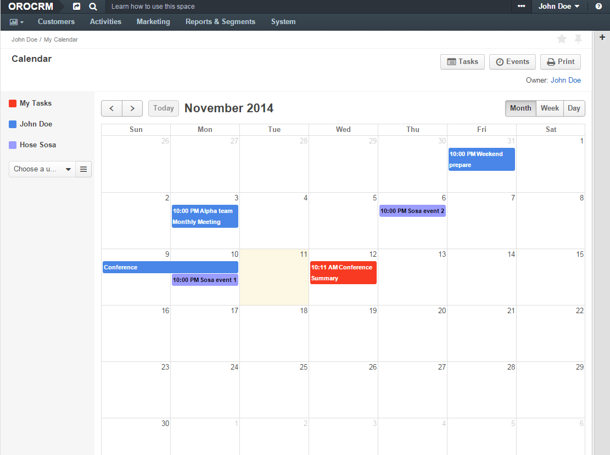

OroCalendarBundle
=================

Table of content
-------
- [Overview](#overview)
- [Calendar Providers](./Resources/doc/provider.md)
- [Context Calendar Menu](./Resources/doc/contextMenu.md)
- [UI](#ui)
- [System Calendars](./Resources/doc/systemCalendars.md)
- [Workflow Action](./Resources/doc/workflowAction.md)
- [Recurring Events](./Resources/doc/recurringEvents.md)

##Overview

This bundle integrates the [jQuery FullCalendar](http://arshaw.com/fullcalendar/) plugin into the Oro Platform and provides other calendar related functionality, such as view calendars of other users, system calendars, synchronization with external calendars, etc.

##UI

The user's calendar is available under an user menu at the top right corner of a screen.

.
