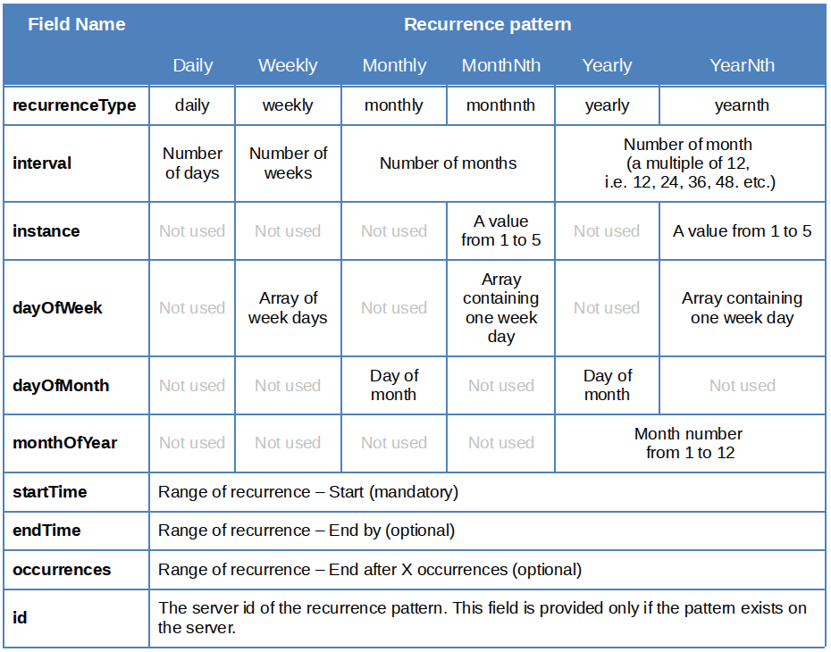

Recurring Events
================

Table of content
-----------------
- [Overview](#overview)
- [Recurrence Pattern](#recurrence-pattern)
- [Pattern Exceptions](#pattern-exceptions)

##Overview

On creating an event in Calendar(currently only with API requests), you can make it repeat on certain days.

##Recurrence Pattern

Each calendar event has "recurrence" field. This is a dictionary containing fields related to the event recurrence. Some fields are mandatory for all recurrence patterns, and some fields are required only for some patterns. The fields are described in the following table:

##Pattern Exceptions

Each occurrence of a recurrent event can be modified so it differs from other occurrences. These exceptions are represented by separate event entities with additional fields. The standard event fields (title, description, start, end etc) can differ from the parent recurrence event fields.
The additional fields are as follows:
- **recurringEventId** – the id of the parent recurring event.
- **originalStart** – the original start date and time of this occurrence. It may differ from the actual start date for the recurrence. 
- **isCancelled** – A boolean field indicating whether the occurrence was cancelled (removed from the user’s calendar).
