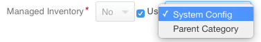
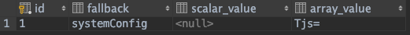

## Entity fallback values ##

You can set up an entity field to fallback to a different entity's field value.
To set up such a field, add it to the entity as a property (or create a migration for adding it),
and add a @ConfigField annotation and doctrine relation to [EntityFieldFallbackValue](../../Entity/EntityFieldFallbackValue.php)
(or array configuration in migration) like the following configuration:

```php
    /**
     * @var EntityFieldFallbackValue
     *
     * @ORM\OneToOne(targetEntity="Oro\Bundle\EntityBundle\Entity\EntityFieldFallbackValue", cascade={"All"})
     * @ORM\JoinColumn(name="manage_inventory_fallback_id", referencedColumnName="id", onDelete="SET NULL")
     * @ConfigField(
     *     defaultValues={
     *          "fallback": {
     *              "fallbackType": "boolean",
     *              "fallbackList": {
     *                  "category" : {
     *                      "fieldName": "manageInventory"
     *                  },
     *                  "systemConfig": {
     *                      "configName": "oro_warehouse.manage_inventory"
     *                  }
     *              }
     *          }
     *     }
     * )
     */
    protected $manageInventory;
```

An example of adding field by migration:

```php
    $categoryTable = $schema->getTable('oro_catalog_category');
    $fallbackTable = $schema->getTable('oro_entity_fallback_value');
    $this->extendExtension->addManyToOneRelation(
        $schema,
        $categoryTable,
        'manageInventory',
        $fallbackTable,
        'id',
        [
            'extend' => [
                'owner' => ExtendScope::OWNER_CUSTOM,
                'cascade' => ['all'],
            ],
            'form' => [
                'is_enabled' => false,
            ],
            'view' => [
                'is_displayable' => false,
            ],
            'fallback' => [
                'fallbackList' => [
                    'systemConfig' => ['configName' => 'oro_warehouse.manage_inventory'],
                    'parentCategory' => ['fieldName' => 'manageInventory'],
                ],
            ],
        ]
    );
```

The `fallbackType` specifies the type of the field value - it is only mandatory if there is no defined system configuration fallback
(which should have the `data_type` in the form definition in `system_configuration.yml`, like:

```yaml
system_configuration:
    (...)
    fields:
        oro_warehouse.manage_inventory:
            data_type: boolean
            type: choice
```

Possible values for the `fallbackType` can be found in [EntityFallbackResolver](../../Fallback/EntityFallbackResolver.php)::$allowedTypes.

The `fallbackList` contains a list of possible fallback entities. The **systemConfig** fallback is a predefined id for falling
back to a system configuration [ConfigValue](../../../ConfigBundle/Entity/ConfigValue.php) value, for which the `configName` fallback configuration
is mandatory (which refers to the form type name defined in `system_configuration.yml`). 
There is a predefined fallback provider for `systemConfig` at [SystemConfigFallbackProvider](../../Fallback/Provider/SystemConfigFallbackProvider.php)

To fallback to a new entity field, you need to create a new fallback provider, extending [AbstractEntityFallbackProvider](../../Fallback/Provider/AbstractEntityFallbackProvider.php)
The provider for the  `category` fallback looks like:

```php
namespace Oro\Bundle\WarehouseBundle\Fallback\Provider;

use Oro\Bundle\CatalogBundle\Entity\Category;
use Oro\Bundle\EntityBundle\Fallback\Provider\AbstractEntityFallbackProvider;
use Oro\Bundle\EntityBundle\ORM\DoctrineHelper;
use Oro\Bundle\ProductBundle\Entity\Product;
use Oro\Bundle\EntityBundle\Exception\Fallback\InvalidFallbackArgumentException;

class CategoryFallbackProvider extends AbstractEntityFallbackProvider
{
    /**
     * @var DoctrineHelper
     */
    protected $doctrineHelper;

    /**
     * ProductCategoryFallbackProvider constructor.
     *
     * @param DoctrineHelper $doctrineHelper
     */
    public function __construct(DoctrineHelper $doctrineHelper)
    {
        $this->doctrineHelper = $doctrineHelper;
    }

    /**
     * {@inheritdoc}
     */
    public function getFallbackHolderEntity(
        $object,
        $objectFieldName
    ) {
        if (!$object instanceof Product) {
            throw new InvalidFallbackArgumentException(get_class($object), get_class($this));
        }

        return $this->doctrineHelper->getEntityRepository(Category::class)->findOneByProduct($object);
    }
}
```

with a service definition in `Resources/config/fallbacks.yml` like:

```yaml
    oro_warehouse.fallback.provider.category_provider:
        class: Oro\Bundle\WarehouseBundle\Fallback\Provider\CategoryFallbackProvider
        parent: oro_entity.fallback.provider.abstract_provider
        arguments:
            - "@oro_entity.doctrine_helper"
        tags:
            - { name: oro_entity.fallback_provider, id: category }
```

We extend the parent `oro_entity.fallback.provider.abstract_provider` service, inject some dependencies, and tag it with
`oro_entity.fallback_provider` as tag name, and `category` as id (this id will go into the @ConfigField `fallbackList` configuration as fallback name
The provider will then need to implement `getFallbackHolderEntity` which defines how to access the parent fallback entity,
and optionally the function `isFallbackSupported` which can add some conditions whether the fallback should appear as option on the ui for a specific instance.

Next we need to render the field in the main object's class type, by embedding the [EntityFieldFallbackValueType](../../Form/Type/EntityFieldFallbackValueType.php) in the main type,
like in `ProductType`:

```php
    $builder->add(
        'manageInventory',
        EntityFieldFallbackValueType::NAME,
        [
            'fallback_translation_prefix' => 'oro.product.fallback',
        ]
    )
```

The only mandatory option is `fallback_translation_prefix`. This type defines 3 fields: `viewValue` (which will hold the entity's own value, if no fallback is wanted),
`useFallback` (checkbox for ui to select/deselect fallback possibility) and `fallback` (which by default will render a dropdown with fallback list,
and which will map to the fallback field of [EntityFieldFallbackValue](../../Entity/EntityFieldFallbackValue.php) holding the fallback id (like `category` or `systemConfig`.
The options and types of those 3 fields can be overridden `value_options`, `fallback_options`, `use_fallback_options`, `value_type` and `fallback_type`.

#### Example of fallback widget ####


#### EntityFieldFallbackValue table content ####


If the `fallback` column contains a value, it means entity uses the fallback value
If it is null and `scalar_value` or `array_value` column contains data, it means entity has it's own value
 
The bundle also exposes a twig function to get the fallback compatible value of a field, which internally uses the 
[EntityFallbackResolver](../../Fallback/EntityFallbackResolver.php).

```twig
{{ oro_entity_fallback_value(entity, 'manageInventory') }}
```
