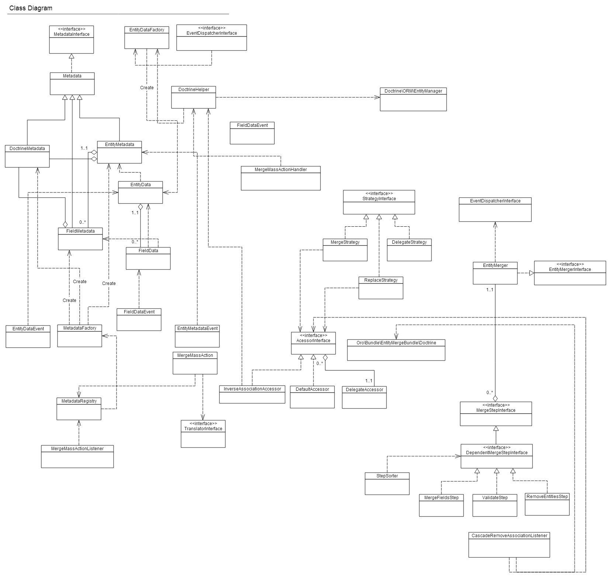

#Classes Diagram of Entity Merge bundle#

---------

### Table of Contents ###

- [Getting Started](./getting-started.md)
	- [What is Entity Merge](./getting-started.md#what-is-entity-merge "What is Entity Merge")
	- [Main Entities](./getting-started.md#main-entities)
	- [How it works](./getting-started.md#how-it-works)
- Classes Diagram
- [Configuration](./merge-configuration.md)

---------

**Following diagram shows dependencies between Entity Merge bundle classes** 

