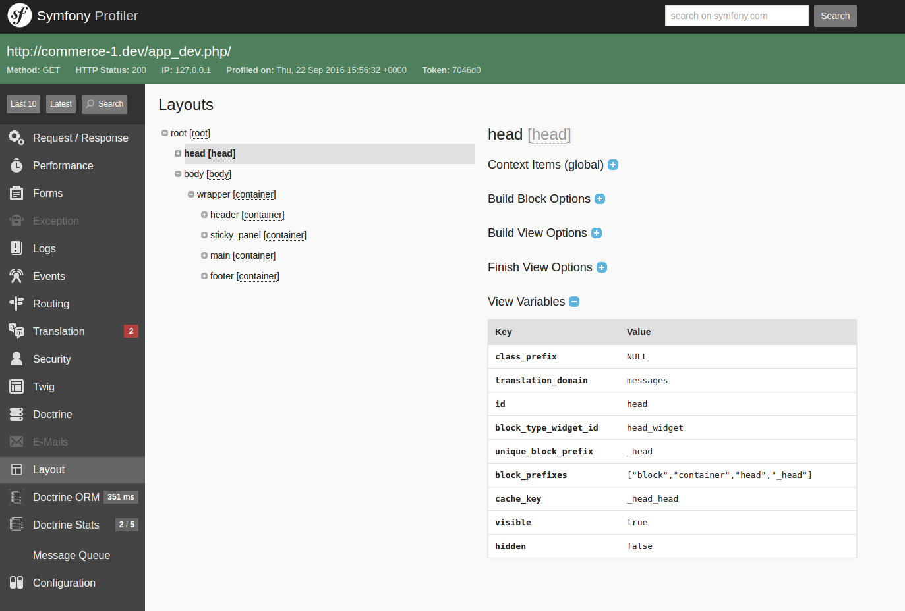

# Debug Information

## Symfony Profiler

In **Symfony Profiler** page you can find section **Layout** that contains:
 - **Context Items**
 - **Context Data Items**
 - **Layout Tree**

### Layout Tree

In left part of **Layout Tree** section you can see tree of **block views** with **block id** and **block type**.
In the right part of **Layout Tree** section you can find information of chosen **block view**.
It contains such blocks:
 - **Context Items** - [LayoutContext](../../../../Component/Layout/LayoutContext.php#L12) items for current page
 - **Context Data Items** - [ContextDataCollection](../../../../Component/Layout/ContextDataCollection.php#L11) items for current page
 - **Build Block Options** - collected when [buildBlock](../../../../Component/Layout/BlockTypeExtensionInterface.php#L18) method is triggered
 - **Build View Options** - collected when [buildView](../../../../Component/Layout/BlockTypeExtensionInterface.php#L34) method is triggered
 - **Finish View Options** - collected when [finishView](../../../../Component/Layout/BlockTypeExtensionInterface.php#L51) method is triggered
 - **View Variables** - [BlockView](../../../../Component/Layout/BlockView.php) vars



Also you can disable **Layout Tree** in developer toolbar, go to `System - Configuration - Development Settings - Generate Layout Tree Dump For The Developer Toolbar`

**IMPORTANT:** This options works with debug mode enabled only

## Developer toolbar

In the developer toolbar panel you can find icon that shows **count of block views** for current page. On mouse over it shows **layout context items** information.


## Debug layout blocks

You can enable **block debug information**, go to `System - Configuration - Development Settings - Include Block Debug Info Into HTML`

Each block in HTML has data attributes:

- `data-layout-debug-block-id` - unique identifier of current block
- `data-layout-debug-block-template` - template of current block that was rendered

**IMPORTANT:** If you want to render block debug information in HTML, you need to define `{{ block('block_attributes') }}` **for each twig block you have**.

**Example:**

```yaml
    ...
    
        <div{{ block('block_attributes') }}>
            {{ block_widget(block) }}
        </div>
    

    
        <header{{ block('block_attributes') }}>
            {{ block_widget(block) }}
        </header>
    
    ...
```


