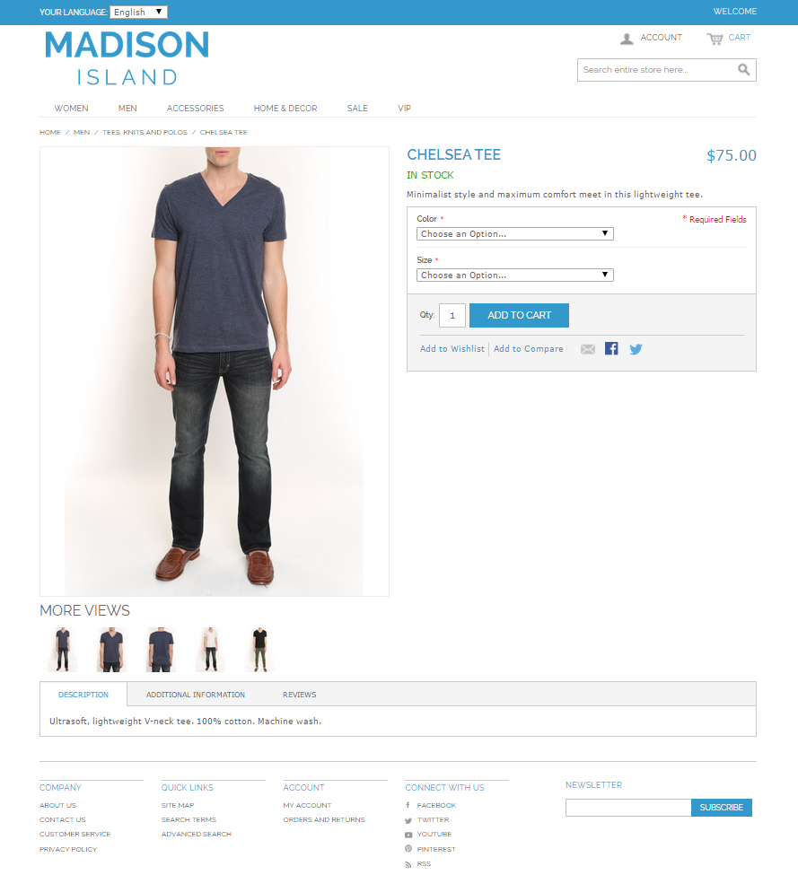

Layout example implementation
=============================

The goal of this guide is to demonstrate the capabilities of the layout engine and show how different layout blocks can be used to implement a simple page.
This guide is intended for those already familiar with layouts. So, please, read our [Quick Start guide](./quick_start.md) before proceeding.

Our guide is divided into the following sections:
* [Getting started](#getting-started)
* [Customizing block rendering](#customizing-block-rendering)
* [Iteration over data](#iteration-over-data)
* [Access to any layout block by ID](#access-to-any-layout-block-by-id)
* [Adding CSS and JS](#adding-css-and-js)
* [Layout blocks positioning](#layout-blocks-positioning)
* [Providing data for layout](#providing-data-for-layout)
* [Ordering of layout blocks](#ordering-of-layout-blocks)
* [Extending exiting block types](#extending-exiting-block-types)
* [Working with lists](#working-with-lists)
* [Working with forms](#working-with-forms)
* [Creating new block types](#creating-new-block-types)
* [Wrapping up](#wrapping-up)
* [Simplify block attribute configuration](#simplify-block-attribute-configuration)

Getting started
-----------------------

Let's consider an example of layout implementation. Imagine you need to create a product page that looks like this:


The simplified page structure is presented by the following [picture](./images/sample_page_structure.gif)

As described in the [Quick Start guide](./quick_start.md), you can create a new theme for this page or use the default one.
Let's assume that we already have a new theme created and activated. And a test controller is set up according to the Quick Start guide.
We start from creating the skeleton of the theme to hold the design of common page elements - head, body, header, footer, etc.
For this we create a default layout update file and place it in `Resources/views/layouts` directory, for example `Resources/views/layouts/first_theme/default.yml`:

```yaml
layout:
    actions:
        - @setBlockTheme:
            themes: 'AcmeLayoutBundle:layouts:first_theme/default.html.twig'
        - @addTree:
            items:
                head:
                    blockType: head
                meta:
                    blockType: meta
                    options:
                        http_equiv: Content-Type
                        content: "text/html; charset=utf-8"
                theme_icon:
                    blockType: external_resource
                    options:
                        href: { @value: $data.theme.icon }
                        rel: shortcut icon
                head_style:
                    blockType: container
                head_script:
                    blockType: container
                body:
                    blockType: body
                page_container:
                    blockType: container
                    options:
                        attr:
                            class: page
                header:
                    blockType: container
                navigation:
                    blockType: container
                    options:
                        attr:
                            id: header-nav
                search:
                    blockType: container
                    options:
                        attr:
                            id: header-search
                main_container:
                    blockType: container
                    options:
                        attr:
                            class: 'main-container col2-left-layout'
                left_panel:
                    blockType: container
                    options:
                        attr:
                            id: col-left
                main_panel:
                    blockType: container
                    options:
                        attr:
                            class: col-main
                content:
                    blockType: container
                footer:
                    blockType: container
                    options:
                        attr:
                            class: footer
            tree:
                root:
                    head:
                        meta: ~
                        theme_icon: ~
                        head_style: ~
                        head_script: ~
                    body:
                        page_container:
                            header:
                                navigation: ~
                                search: ~
                            main_container:
                                left_panel: ~
                                main_panel:
                                    content: ~
                            footer: ~
```

See [layout update](./layout_update.md) topic for more details.

Customizing block rendering
---------------------------------

As you have seen in the previous section we are using the `setBlockTheme` action in our layout update file. This is the block theme responsible for defining how layout blocks are rendered.
Let's define some of the blocks in `Resources/views/layouts/first_theme/default.html.twig` file. Also you can use relative path for block theme like `default.html.twig`.

```twig

    <div{{ block('block_attributes') }}>
        {{ block_widget(block) }}
    </div>



    <header id="header" class="page-header">
        {{ block_widget(block) }}
    </header>



    <div{{ block('block_attributes') }}>
        {{ block_widget(block) }}
    </div>



    <div{{ block('block_attributes') }}>
        {{ block_widget(block) }}
    </div>



    <div{{ block('block_attributes') }}>
        {{ block_widget(block) }}
    </div>



    <div{{ block('block_attributes') }}>
        {{ block_widget(block) }}
    </div>



    <div{{ block('block_attributes') }}>
        {{ block_widget(block) }}
    </div>



    <div class="footer-container">
        <div {{ block('block_attributes') }}>
            {{ block_widget(block) }}
        </div>
    </div>

```

When you open the test page in a browser you'll see the HTML like this:

```html
<!DOCTYPE html>
<html>
    <head>
        <title></title>
        <meta content="text/html; charset=utf-8" http-equiv="Content-Type">
        <link rel="shortcut icon" href="bundles/demo/images/favicon.ico"/>
    </head>
    <body>
        <div class="page">
            <header id="header" class="page-header">
                <div id="header-nav"></div>
                <div id="header-search"></div>
            </header>
            <div class="main-container col2-left-layout">
                <div id="col-left"></div>
                <div class="col-main"></div>
            </div>
            <div class="footer-container">
                <div class="footer"></div>
            </div>
        </div>
    </body>
</html>
```

In our example we need to add `lang="en"` attribute to the `<html>` tag. For this we will redefine the `root_widget` block in our `default.html.twig`.
```twig

    <!DOCTYPE {{ doctype|default('html') }}>
    <html{{ block('block_attributes') }}>
    {{ block_widget(block) }}
    </html>

```
Now we can set the `lang` attribute in our layout update file using `setOption` action:
 ```yaml
     - @setOption:
         id: root
         optionName: attr.lang
         optionValue: en
 ```
 
Iteration over data
-------------------
 
If you need to iterate over some array or collection it should be done in a block template in a block theme file.
Here is how it can look like:

```twig

    <div class="attributes-container">
        
            
            {{ block('container_widget') }}
        
    </div>

```

This block will iterate over all values from `attributes` collection, pass `attribute` variable with the
appropriate value to all children blocks and render all children blocks for every existing attribute. 

Access to any layout block by ID
----------------------------------------

You can access to any layout block from another block by ID
and modify template based on the existence of another block or any of its properties.

```twig

    <!DOCTYPE {{ doctype|default('html') }}>
    <html{{ block('block_attributes') }}>
    {{ block_widget(block) }}
    
        <script type="text/javascript">
            //do something
        </script>
    
    </html>

```

Adding CSS and JS
--------------------

Let's add some CSS and JS to our page. For this we'll use `style` and `script` block types:

```yaml
layout:
    actions:
        - @add:
            id: style_calendar
            parentId: head_style
            blockType: style
            options:
                src: 'js/calendar/calendar.css'
        - @add:
            id: script_prototype
            parentId: head_script
            blockType: script
            options:
                src: 'js/prototype/prototype.js'
        - @add:
            id: script_cookie_path
            parentId: head_script
            blockType: script
            options:
                content: "Mage.Cookies.path = '/';"
```

As you can see we can add inline CSS or JS using `content` option or load them from a separate resource specified in `src` option.
For demonstration purpose, imagine that we need to add some scripts for IE only using conditional comments. In this case we can't use `script` block type but we can use default block type with a customized template.
```yaml
layout:
    actions:
        - @add:
            id: script_ie
            parentId: head_script
            blockType: block
```

In our block theme file defined previously we add:
```twig

    <!--[if lt IE 7]>
        <script type="text/javascript">
            //<![CDATA[
                var BLANK_URL = '/js/blank.html';
            //]]>
        </script>
    <![endif]-->

```

Layout blocks positioning
-----------------------------------

Now we'll change the layout of our product page.
For this we'll create the layout update file and place it in the `Resources/views/layouts/first_theme/demo_layout_test` directory, for example `DemoBundle/Resources/views/layouts/first_theme/demo_layout_test/default.yml`:
Please note that the file is placed in the route specific folder and as the result it will be executed only for the `demo_layout_test` route.

In our default theme we have a two-column layout. But for our example page we want just one column. Let's remove the `left_panel` block and change the class for `main_container`:
```yaml
layout:
    actions:
        - @remove:
            id: left_panel
        - @replaceOption:
            id: main_container
            optionName: attr.class
            oldOptionValue: col2-left-layout
            newOptionValue: col1-layout
```

Here we know the option value that we need to replace. But in case if you just want to add another option to already existing ones you can use `appendOption` action:
```yaml
layout:
    actions:
        - @appendOption:
            id: body
            optionName: attr.class
            optionValue: catalog-product-view
```

Also for our example, we'll need to add a wrapper for the body content. For this we'll add a new `container` to the body and move the content into it.
```yaml
layout:
    actions:
        - @add:
            id: body_wrapper
            blockType: container
            parentId: body
        - @move:
            id: page_container
            parentId: body_wrapper
```
Since `container` block type does not render any html, we'll add the template specifically for our new wrapper:
```twig

    <div class="wrapper">
        {{ block_widget(block) }}
    </div>

```

Let's check what is rendered in the browser. You should be getting something like this:
```html
<!DOCTYPE html>
<html lang="en">
    <head>
        <title></title>
        <meta content="text/html; charset=utf-8" http-equiv="Content-Type">
        <link rel="shortcut icon" href="bundles/demo/images/favicon.ico"/>
        <link rel="stylesheet" type="text/css" href="js/calendar/calendar.css">
        <!--[if lt IE 7]>
            <script type="text/javascript">
                //<![CDATA[
                    var BLANK_URL = '/js/blank.html';
                //]]>
            </script>
        <![endif]-->
        <script type="text/javascript">
            Mage.Cookies.path = '/';
        </script>
        <script type="text/javascript" src="js/prototype/prototype.js"></script>
    </head>
    <body class="catalog-product-view">
        <div class="wrapper">
            <div class="page">
                <header id="header" class="page-header">
                    <div id="header-nav"></div>
                    <div id="header-search"></div>
                </header>
                <div class="main-container col1-layout">
                    <div class="col-main"></div>
                </div>
                <div class="footer-container">
                    <div class="footer"></div>
                </div>
            </div>
        </div>
    </body>
</html>
```

Providing data for layout
-----------------------------------

### Using the layout context ###

On our test page we have a "This is a demo store..." notice. It is clear that this block should be visible only on certain conditions.
For simplicity, we will check if the application is running in debug mode by checking the `debug` value in the layout context which is added by [ApplicationContextConfigurator](../../Layout/Extension/ApplicationContextConfigurator.php).
Let's add the following block template theme file:
```twig

    <div class="global-site-notice demo-notice">
        <div class="notice-inner"><p>{{ "This is a demo store. Any orders placed through this store will not be honored or fulfilled."|trans }}</p></div>
    </div>

```
Now we can added it to the layout depending on the condition using the `visible` option:
```yaml
layout:
    actions:
        - @add:
            id: demo_notice
            parentId: body_wrapper
            blockType: block
            options:
                visible: { @value: $context.debug }
```
Note that if `visible` evaluates to false, the block will not be added to the final layout at all.

Every product page is different since it contains product related data. The layout engine allows to operate this data in the layout update files.
Please, make sure you are familiar with [layout context](layout_context.md) and [layout data](layout_data.md) topics.

Since product data is page specific, we'll be adding it to `data` collection of the layout context using a [context configurator](layout_context.md#context-configurators).

```php
namespace Acme\Bundle\ProductBundle\Layout\Extension;;

use Symfony\Component\HttpFoundation\Request;

use Oro\Component\Layout\ContextInterface;
use Oro\Component\Layout\ContextConfiguratorInterface;

class ProductContextConfigurator implements ContextConfiguratorInterface
{
    /** @var Request|null */
    protected $request;

    /**
     * Synchronized DI method call, sets current request for further usage
     *
     * @param Request $request
     */
    public function setRequest(Request $request = null)
    {
        $this->request = $request;
    }

    /**
     * {@inheritdoc}
     */
    public function configureContext(ContextInterface $context)
    {
        $context->data()->setDefault(
            'product',
            '$request.product_id',
            function () {
                if (!$this->request) {
                    throw new \BadMethodCallException('The request expected.');
                }
                $productId = $this->request->query->get('product_id') ?: $this->request->request->get('product_id');

                if (!$productId) {
                    throw new \RuntimeException("Product Id is not specified");
                }

                $productData = $this->getProductData($productId);
                if (!$productData) {
                    throw new \RuntimeException(sprintf('Product with Id "%s" does not exist.', $productId));
                }

                return $productData;
            }
        );
    }

    /*
     * Demo function. Data should be selected from the database instead.
     *
     * @param int $productId
     * @return null|array
     */
    protected function getProductData($productId)
    {
        $productData = [
            '99' => [
                'id'                => 99,
                'name'              => 'Chelsea Tee',
                'description'       => 'Ultrasoft, lightweight V-neck tee. 100% cotton. Machine wash.',
                'short_description' => 'Minimalist style and maximum comfort meet in this lightweight tee.',
                'category'          => 'Men',
                'subcategory'       => 'Tees, Knits and Polos',
                'url'               => '/chelsea-tea.html',
                'image'             => '/img/mtk000t.jpg',
                'price'             => '$75.00',
                'is_in_stock'       => true
            ]
        ];

        return isset($productData[$productId]) ? $productData[$productId] : null;
    }
}
```

The product Id is received from the request, so for next examples will be adding `?product_id=99` to our test page url. Based on the product Id we obtain the rest of product data. It can be fetched from the database or other sources, but for simplicity we use a simple array here.
To enable our context configurator we have to register it in the DI container with the `layout.context_configurator` tag:
```yaml
    acme_product.layout.context_configurator.product:
        class: Acme\Bundle\ProductBundle\Layout\Extension\ProductContextConfigurator
        calls:
            - [setRequest, [@?request=]]
        tags:
            - { name: layout.context_configurator }
```

Now we can use the product data in the layout update to add the page title, meta description and canonical url:
```yaml
layout:
    actions:
        - @setOption:
            id: head
            optionName: title
            optionValue:
                @join:
                    - ' - '
                    - { @value: {@value: $data.product.name} }
                    - { @value: {@value: $data.product.subcategory} }
                    - { @value: {@value: $data.product.category} }
        - @add:
            id: link_canonical
            parentId: head
            blockType: external_resource
            options:
                rel:  canonical
                href: {@value: $data.product.url}
```
Note how we use [Join](../../../../Component/ConfigExpression/Func/Join.php) function to compose the page title from different product fields.

### Data providers ###

Let's consider another example of providing data to the layout.
To implement a language switcher we'll create a separate data provider class, since this data is used throughout all pages.

```php
namespace Acme\Bundle\LocaleBundle\Layout\Extension\Provider;

use Oro\Component\Layout\ContextInterface;
use Oro\Component\Layout\DataProviderInterface;

class LocaleDataProvider implements DataProviderInterface
{
    /**
     * {@inheritdoc}
     */
    public function getIdentifier()
    {
        throw new \BadMethodCallException('Not implemented');
    }

    /**
     * {@inheritdoc}
     */
    public function getData(ContextInterface $context)
    {
        return [
            'default_language'    => 'english',
            'available_languages' => [
                'english' => 'English',
                'french'  => 'French'
            ]
        ];
    }
}
```

We need to register our data provider in the DI container by `layout.data_provider` tag:
```yaml
    acme_locale.layout.data_provider.locale:
        class: Acme\Bundle\LocaleBundle\Layout\Extension\Provider\LocaleDataProvider
        tags:
            - { name: layout.data_provider, alias: locale }
```
Note that `alias` serves as a key by which the data will be accessible in the layout update file.

Now we can refer to the language data the same way as to the product data and add the language switcher to the layout:
```yaml
layout:
    actions:
        - @add:
            id: lang_switch
            parentId: page_container
            blockType: block
            options:
               vars:
                  default_language: { @value: $data.locale.default_language }
                  available_languages: { @value: $data.locale.available_languages }
                  product_url: { @value: $data.product.url }
```

We also need to create the block template for the language switcher:
```twig

    <div class="header-language-background">
        <div class="header-language-container">
            <div class="store-language-container">
                <div class="form-language">
                    <label for="select-language">Your Language:</label>
                    <select id="select-language" title="Your Language" onchange="window.location.href=this.value">
                        
                            <option value="{{ product_url }}?___store={{ code }}">{{ label }}</option>
                        
                    </select>
                </div>
            </div>
            <p class="welcome-msg">Welcome </p>
        </div>
    </div>

```

This will render the language switcher in the browser but we won't know which language has been selected. To fix this we need to add another context configurator which will store the selected language.
Similar to the `ProductContextConfigurator` we'll fetch the language code from the request and save it in the layout context.

```php
namespace Acme\Bundle\LocaleBundle\Layout\Extension;

use Symfony\Component\HttpFoundation\Request;

use Oro\Component\Layout\ContextInterface;
use Oro\Component\Layout\ContextConfiguratorInterface;

class LocaleContextConfigurator implements ContextConfiguratorInterface
{
    /** @var Request|null */
    protected $request;

    /**
     * Synchronized DI method call, sets current request for further usage
     *
     * @param Request $request
     */
    public function setRequest(Request $request = null)
    {
        $this->request = $request;
    }

    /**
     * {@inheritdoc}
     */
    public function configureContext(ContextInterface $context)
    {
        $context->data()->setDefault(
            'current_language',
            '$request.___store',
            function () {
                if (!$this->request) {
                    throw new \BadMethodCallException('The request expected.');
                }
                $locale = $this->request->query->get('___store') ?: $this->request->request->get('___store');

                return $locale;
            }
        );
    }
}
```

Register the locale context configurator:
```yaml
    acme_locale.layout.context_configurator.locale:
        class: Acme\Bundle\LocaleBundle\Layout\Extension\LocaleContextConfigurator
        calls:
            - [setRequest, [@?request=]]
        tags:
            - { name: layout.context_configurator }
```

We also need to modify our block template to make sure that the language dropdown preselects the current value:
```twig
    
    <select id="select-language" title="Your Language" onchange="window.location.href=this.value">
        
            <option value="{{ product_url }}?___store={{ code }}" selected="selected">{{ label }}</option>
        
    </select>
```

And pass the `current_language` variable to the block using the layout update:
```yml
layout:
    actions:
        - @setOption:
            id: lang_switch
            optionName: vars.current_language
            optionValue: { @value: $data.current_language }
```

Now if you go to `/layout/test?product_id=99&___store=french` url you'll see that French language is preselected.

Ordering of layout blocks
-----------------------------------

By default when adding or moving layout blocks they are placed at the last positon. But the layout engine lets you add or move blocks into any position by specifying the `siblingId`.
For example, let's add the meta description block right after the main meta block.

```yaml
layout:
    actions:
        - @add:
            id: meta_description
            parentId: head
            blockType: meta
            options:
                name: 'description'
                content: {@value: $data.product.description}
            siblingId: meta
```
If you need to place some block before another one, you should use the `prepend: true` attribute.
The same positioning can be achieved using `move` action. Let's move our language switcher before the header block:
```yaml
    - @move:
        id: lang_switch
        parentId: page_container
        siblingId: ~
        prepend: true
```
Note that if `siblingId` is not specified the block will be positioned as the first block in the container.

Extending exiting block types
----------------------------------

Currently the [LinkType](../../Layout/Block/Type/LinkType.php) does not support adding an image inside the `<a>` tag.
For our example we'll extend this block type to have such possibility.
First, create a `LinkExtension` class in place it in: `Acme/Bundle/LayoutBundle/Layout/Block/Extension` dir.

```php
namespace Acme\Bundle\LayoutBundle\Layout\Block\Extension;

use Oro\Component\Layout\AbstractBlockTypeExtension;
use Oro\Component\Layout\BlockInterface;
use Oro\Component\Layout\BlockView;
use Oro\Component\Layout\Block\OptionsResolver\OptionsResolver;

use Oro\Bundle\LayoutBundle\Layout\Block\Type\LinkType;

/**
 * This extension extends links with "image" option, that
 * can be used to add an image inside the link tag.
 */
class LinkExtension extends AbstractBlockTypeExtension
{
    /**
     * {@inheritdoc}
     */
    public function configureOptions(OptionsResolver $resolver)
    {
        $resolver->setDefined('image');
    }

    /**
     * {@inheritdoc}
     */
    public function buildView(BlockView $view, BlockInterface $block, array $options)
    {
        if (!empty($options['image'])) {
            $view->vars['image'] = $options['image'];
        }
    }

    /**
     * {@inheritdoc}
     */
    public function getExtendedType()
    {
        return LinkType::NAME;
    }
}
```

Then, we register it in our container using `layout.block_type_extension` tag:
```yaml
    acme_layout.block_type_extension.link:
        class: Acme\Bundle\LayoutBundle\Layout\Block\Extension\LinkExtension
        tags:
            - { name: layout.block_type_extension, alias: link }
```
Note that alias should correspond to the parent block type.

Now we can customize the twig template for the link block by adding the following lines in the block theme file:
```twig

    <a{{ block('block_attributes') }} href="{{ path is defined ? path : path(route_name, route_parameters) }}">
        {{ block('icon_block') }}
        {{ text|block_text(translation_domain) }}
        {# Render image if defined #}
        {{ block('image_block') }}
    </a>



    

```

Now we can add a logo image into our header block before the navigation block:
```yaml
   - @add:
       id : logo
       parentId: header
       blockType: link
       options:
           image: logo.png
           path: /
           attr:
               class: logo
           vars:
               image_class: large
               image_alt: Madison Island
       siblingId: navigation
       prepend: true
```

This will output the following html:
```html
<a class="logo" href="/"></a>
```

Also when extending an existing block type it is possible to register an extra block prefix for it, which will provide better customization flexibility.
At the moment, every time we need to wrap content into a `<div>` element, we have to add a `container` in the layout update and define its template in block theme file.
This produces quite a lot of copy-paste code. Instead, let's make an extension for the `container` type and register a new block prefix for it depending on `type` option:

```php
namespace Acme\Bundle\LayoutBundle\Layout\Block\Extension;

use Symfony\Component\OptionsResolver\OptionsResolverInterface;

use Oro\Component\Layout\AbstractBlockTypeExtension;
use Oro\Component\Layout\BlockInterface;
use Oro\Component\Layout\BlockView;
use Oro\Component\Layout\Util\BlockUtils;

class ContainerExtension extends AbstractBlockTypeExtension
{
    /**
     * {@inheritdoc}
     */
    public function configureOptions(OptionsResolverInterface $resolver)
    {
        $resolver->setOptional(['type']);
    }

    /**
     * {@inheritdoc}
     */
    public function finishView(BlockView $view, BlockInterface $block, array $options)
    {
        if (!empty($options['type'])) {
            BlockUtils::registerPlugin($view, $options['type'] . '_' . $block->getTypeName());
        }
    }

    /**
     * {@inheritdoc}
     */
    public function getExtendedType()
    {
        return 'container';
    }
}
```

Adding it to the DI container
```yaml
    acme_layout.block_type_extension.container:
        class: Acme\Bundle\LayoutBundle\Layout\Block\Extension\ContainerExtension
        tags:
            - { name: layout.block_type_extension, alias: container }
```

Now we can define a template for wrapping container elements into a `<div>` tag:
```twig

    <div{{ block('block_attributes') }}>
        {{ block_widget(block) }}
    </div>
#}
```

We can use it in the layout update file like this:
```yaml
layout:
    actions:
        - @add:
            id: some_wrapper
            blockType: container
            parentId: some_parent
            options:
                type: div
```
The `type` option serves as a prefix for the `blockType`. So the `type: div` option value tells us to look for the template in the `div_container_widget` block. If the `type` option is not specified, the standard block will be used for rendering.


Working with lists
-----------------------------------
As an example, we'll be adding navigation menu to the page using both ordered and unordered lists.

In the layout update file we do the following:
```yaml
layout:
    actions:
        - @addTree:
            items:
                nav_container:
                    blockType: container
                nav_category_list:
                    blockType: ordered_list
                    options:
                        attr:
                            class: nav-primary
                nav_women_category:
                    blockType: list_item
                    options:
                        attr:
                            class: parent
                nav_women_category_link:
                    blockType: link
                    options:
                        path: /women.html
                        text: Women
                        attr:
                            class: level0 has-children
                nav_women_subcategory_list:
                    blockType: list
                    options:
                        attr:
                            class: level0
                nav_women_all_subcategory:
                    blockType: link
                    options:
                        path: /women.html
                        text: View All Women
                        attr:
                            class: level1
                nav_women_new_subcategory:
                    blockType: link
                    options:
                        path: /women/new-arrivals.html
                        text: New Arrivals
                        attr:
                            class: level1
            tree:
                navigation:
                    nav_container:
                        nav_category_list:
                            nav_women_category:
                                nav_women_category_link: ~
                                nav_women_subcategory_list:
                                    nav_women_all_subcategory: ~
                                    nav_women_new_subcategory: ~
```

Note that we can use `list_item` block type to be able to add custom attributes (e.g. `class`) to the `<li>` tag and add child blocks.
For the list items with no children we can add any other block type, `link` in our example, and it will be wrapped into the `<li>` tag.

So our rendered HTML will look like this:
```html
<nav id="nav">
    <ol class="nav-primary">
        <li class="parent">
            <a class="level0 has-children" href="/women.html">Women</a>
            <ul class="level0">
                <li><a class="level1" href="/women.html">View All Women</a></li>
                <li><a class="level1" href="/women/new-arrivals.html">New Arrivals</a></li>
            </ul>
        </li>
    </ol>
</nav>
```

Note: to customize the `nav_container` block to be rendered in `<nav>` tag we need to add a template in the block theme file:
```twig

    <nav id="nav">
        {{ block_widget(block) }}
    </nav>

```

Breadcrumbs is a special case of a list where items are separated by some symbol. We can customize rendering of the list by adding the following template to our block theme:
```twig

    <div class="breadcrumbs">
        <ul>
        
            
                
                    <li>{{ block_widget(child) }}<span>/ </span></li>
                
                    <li><strong>{{ block_widget(child) }}</strong></li>
                
            
        
        </ul>
    </div>

```

Now we can place the block with `breadcrumbs` Id in our layout update and add some child elements into it:
```yaml
layout:
    actions:
        - @add:
            id : breadcrumbs
            parentId: main_container
            blockType: list
            siblingId: ~
            prepend: true
        - @add:
            id : breadcrumbs_home
            parentId: breadcrumbs
            blockType: link
            options:
                path: /
                text: Home
                attr:
                    title: Go to Home Page
        - @add:
            id : breadcrumbs_product
            parentId: breadcrumbs
            blockType: text
            options:
                text: { @value: $data.product.name }
```

This should render into the following HTML:
```html
<div class="breadcrumbs">
    <ul>
        <li><a title="Go to Home Page" href="/">Home</a><span>/ </span></li>
        <li><strong>Chelsea Tee</strong></li>
    </ul>
</div>
```

Working with forms
-----------------------------------

### Non page specific form ###

Let's implement a simple search form by means of the layout engine.
To use the form in layouts we need to configure the layout context first. Since the search form persists on many pages we will add it to the layout context using another context configurator:
```php
namespace Acme\Bundle\SearchBundle\Layout\Extension;

use Symfony\Component\Form\FormFactory;
use Symfony\Component\OptionsResolver\Options;

use Oro\Component\Layout\ContextConfiguratorInterface;
use Oro\Component\Layout\ContextInterface;

use Oro\Bundle\LayoutBundle\Layout\Form\FormAccessor;

class SearchContextConfigurator implements ContextConfiguratorInterface
{
    /*
     * FormFactory
     */
    protected $formFactory;

    public function __construct(FormFactory $formFactory)
    {
        $this->formFactory = $formFactory;
    }

    /**
     * {@inheritdoc}
     */
    public function configureContext(ContextInterface $context)
    {
        $context->getResolver()
            ->setDefaults(
                [
                    'search_form' => function (Options $options, $value) {
                        if (null === $value) {
                            $value = $this->createSearchForm();
                        }

                        return $value;
                    }
                ]
            )
            ->setAllowedTypes(['search_form' => ['null', 'Oro\Bundle\LayoutBundle\Layout\Form\FormAccessorInterface']]);
    }

    /*
     * @return FormAccessor
     */
    protected function createSearchForm()
    {
        $form = $this->formFactory->create('form');
        $form->add(
            'search',
            'search',
            [
                'attr' => [
                    'maxlength'   => 128,
                    'placeholder' => 'Search entire store here...',
                ]
            ]
        );

        return new FormAccessor($form);
    }
}
```

Registering search context configurator in the DI container:

```yaml
    acme_search.layout.context_configurator.search:
        class: Acme\Bundle\SearchBundle\Layout\Extension\SearchContextConfigurator
        arguments:
            - @form.factory
        tags:
            - { name: layout.context_configurator }
```

Now we can add our search form into the layout.

```yaml
layout:
    actions:
        - @addTree:
            items:
                'searh_form:start':
                    blockType: form_start
                    options:
                        form_name: search_form
                        attr:
                            id: search_mini_form
                search_field:
                    blockType: form_field
                    options:
                        form_name: search_form
                        field_path: search
                search_button:
                    blockType: button
                    options:
                        action: submit
                        text: Submit
                        attr:
                            class: button search-button
                            title: Search
                search_autocomplete:
                    blockType: block
                'searh_form:end':
                    blockType: form_end
                    options:
                        form_name: search_form
            tree:
                search:
                    'searh_form:start': ~
                    search_field: ~
                    search_button: ~
                    search_autocomplete: ~
                    'searh_form:end': ~
```

Note that we are using separate block types `form_start`, `form_end` and `form_field` to render the form. This allows us to easily add content inside the form (e.g. autocomplete block).
For all this block fields we need to specify `form_name` option to bind it to our custom `search_form` form. Also we can use only one block type `form` which will create three child block: `form_start`, `form_fields`, `form_end`.

All that is left is to define the search autocomplete block in our block theme file we'll:
```twig

    <div id="search_autocomplete" class="search-autocomplete"></div>
    <script type="text/javascript">
        var searchForm = new Varien.searchForm('search_mini_form', 'search', '');
        searchForm.initAutocomplete('/catalogsearch/ajax/suggest/', 'search_autocomplete');
    </script>

```

As the result you'll be getting and HTML like this:
```html
<div id="header-search">
    <form id="search_mini_form" action="/catalogsearch/result/" method="get">
        <div class="control-group">
            <label class="control-label required" for="form_search-uid-556af114b1fb4">Search<em>*</em></label>
            <div class="controls">
                <input type="search" id="form_search-uid-556af2fc646e0" name="form[search]" required="required" maxlength="128" placeholder="Search entire store here..." data-ftid="form_search">
            </div>
        </div>
        <button class="button search-button" title="Search" type="submit">Submit</button>
        <div id="search_autocomplete" class="search-autocomplete"></div>
        <script type="text/javascript">
            var searchForm = new Varien.searchForm('search_mini_form', 'search', '');
            searchForm.initAutocomplete('/catalogsearch/ajax/suggest/', 'search_autocomplete');
        </script>
        <input type="hidden" id="form__token-uid-556af114b2701" name="form[_token]" data-ftid="form__token" value="9bd7b70c4218e3130d0deee54047a7a8b466531e">
    </form>
</div>
```

### Page specific form ###

For the case when the form is page specific, we can return the form in the controller. We can create the form directly in the controller or return its identifier in the DI container.
Let's try the second approach and create the form for adding a product to the shopping cart.
First, we'll create a new form type and register it in the container:

```php
namespace Acme\Bundle\ProductBundle\Form\Type;

use Symfony\Component\Form\AbstractType;
use Symfony\Component\Form\FormBuilderInterface;

class ProductType extends AbstractType
{

    /**
     * {@inheritdoc}
     */
    public function buildForm(FormBuilderInterface $builder, array $options)
    {
        $builder
            ->add(
                'color',
                'choice',
                [
                    'label'    => 'Color',
                    'required' => true,
                    'choices'  => [
                        '' => 'Choose an Option...',
                    ],
                ]
            )
            ->add(
                'qty',
                'text',
                [
                    'required' => true,
                    'label' => 'Qty'
                 ]
            );
    }

    /**
     * {@inheritdoc}
     */
    public function getName()
    {
        return 'acme_product_product';
    }
}
```

Also we will register the form in the container using the newly created form type:
```yaml
    acme_product.form.type.product:
        class: Acme\Bundle\ProductBundle\Form\Type\ProductType
        tags:
            - { name: form.type, alias: acme_product_product }

    acme_product.form.product:
        class:                        Symfony\Component\Form\Form
        factory_method:               createNamed
        factory_service:              form.factory
        arguments:
            - ~
            - 'acme_product_product'
```

Now in our controller we can simply return the form Id from the container:
```php
    /**
     * @Route("/test", name="demo_layout_test")
     * @Layout
     */
    public function testAction()
    {
        return [
            'form' => 'acme_product.form.product'
        ];
    }
```

Now we can render this form by adding it to the layout update file:
```yaml
layout:
    actions:
        - @setBlockTheme:
            themes: 'AcmeLayoutBundle:layouts:first_theme/demo_layout_test/product.html.twig'
        - @addTree:
            items:
                product_view:
                    blockType: container
                    options:
                        type: div
                        attr:
                            class: product-view
                product_essential:
                    blockType: container
                    options:
                        type: div
                        attr:
                            class: product-essential
                form_start:
                    blockType: form_start
                    options:
                        form_action: /checkout
                        attr:
                            id: product_addtocart_form
                color_field:
                    blockType: form_field
                    options:
                        form_name: form
                        field_path: color
                qty_field:
                    blockType: form_field
                    options:
                        form_name: form
                        field_path: qty
                add_to_cart_button:
                    blockType: button
                    options:
                        type: button
                        text: Add to Cart
                        attr:
                            onclick: "productAddToCartForm.submit(this)"
                            title: Add to Cart
                            class: button btn-cart
                form_end:
                    blockType: form_end
            tree:
                main_panel:
                    product_view:
                        product_essential:
                            form_start: ~
                            color_field: ~
                            qty_field: ~
                            add_to_cart_button: ~
                            form_end: ~
```

This will output the similar HTML:
```html
<div class="product-view">
    <div class="product-essential">
        <form id="product_addtocart_form" action="/checkout" method="post">
            <div class="control-group">
                <label class="control-label required" for="color-uid-556dc223b4c23">Color<em>*</em></label>
                <div class="controls">
                    <select id="color-uid-556dc223b4c23" name="color" required="required" data-ftid="color">
                        <option value="" selected="selected">Choose an Option...</option>
                    </select>
                </div>
            </div>
            <div class="control-group">
                <label class="control-label required" for="qty-uid-556dc223b4d40">Qty<em>*</em></label>
                <div class="controls">
                    <input type="text" id="qty-uid-556dc223b4d40" name="qty" required="required" data-ftid="qty">
                </div>
            </div>
            <button onclick="productAddToCartForm.submit(this)" title="Add to Cart" class="button btn-cart">Add to Cart</button>
            <input type="hidden" id="_token-uid-556dc223b4f1d" name="_token" data-ftid="_token" value="c15138c5384cb471ecccd1a32d99f44f5800a15a">
        </form>
    </div>
</div>
```

Creating new block types
-----------------------------------

Since the existing layout block types are covering only basic scenarios, it is often required to create new ones.

You can create custom block type by providing DI configuration for it. Configuration provides possibility to set name and name of a parent, and setup options of the block. See below examples.

Simple block type:
```yaml
services:
    acme_demo.block_type.datetime:
        parent: oro_layout.block_type.abstract_configurable
        calls:
            - [setOptionsConfig, [{datetime: {required: true}, format: {default: 'd-m-Y'}, timezone: ~}]]
            - [setName, ['datetime']]
        tags:
            - { name: layout.block_type, alias: datetime }
```

`setOptions` is associative array where key is the name of option, and value is a array with 'default' and 'require' possible keys. Also you can provide '~' as a value what mean define option.

Container block type:
```yaml
services:
    acme_demo.block_type.sidebar:
        parent: oro_layout.block_type.abstract_configurable_container
        calls:
            - [setName, ['sidebar']]
        tags:
            - { name: layout.block_type, alias: sidebar }
```

Block type inherited from "text" type:
```yaml
services:
    acme_demo.block_type.title:
        parent: oro_layout.block_type.abstract_configurable
        calls:
            - [setOptionsConfig, [{level: {default: 1}}]]
            - [setName, ['title']]
            - [setParent, ['text']]
        tags:
            - { name: layout.block_type, alias: title }
```

Also you can create block type extension via DI configuration. This configuration allows to setup additional options for block types.

```yaml
services:
    custom_acme_demo.block_type.extension.sidebar:
        parent: oro_layout.block_type.extension.abstract_configurable
        calls:
            - [setOptionsConfig, [{minimized: {default: false}]]
            - [setExtendedType, ['sidebar']]
        tags:
            - { name: layout.block_type_extension, alias: sidebar }
```

Usually the definition of layout block types and types extension are located in `Resource\config\block_types.yml`, but you can use any file.

If you want to create block type with custom properties mapping extend your block type class from `Oro\Component\Layout\Block\Type\AbstractType` or implement `Oro\Component\Layout\BlockTypeInterface`.

Let's see how this is done on the example of `ImageType` that will be responsible for rendering `` elements.

First, let's create the block type file itself and place it in the `Acme/Bundle/LayoutBundle/Layout/Block/Type` directory:
```php
namespace Acme\Bundle\LayoutBundle\Layout\Block\Type;

use Symfony\Component\OptionsResolver\OptionsResolverInterface;

use Oro\Component\Layout\Block\Type\AbstractType;
use Oro\Component\Layout\BlockInterface;
use Oro\Component\Layout\BlockView;
use Oro\Component\Layout\Util\BlockUtils;

class ImageType extends AbstractType
{
    /**
     * {@inheritdoc}
     */
    public function configureOptions(OptionsResolverInterface $resolver)
    {
        $resolver
            ->setRequired(['path'])
            ->setDefined(['alt']);
    }

    /**
     * {@inheritdoc}
     */
    public function buildView(BlockView $view, BlockInterface $block, array $options)
    {
        BlockUtils::processUrl($view, $options, true);

        if (!empty($options['alt'])) {
            $view->vars['alt'] = $options['alt'];
        }
    }

    /**
     * {@inheritdoc}
     */
    public function getName()
    {
        return 'image';
    }
}
```

Now we should register it in the DI container using the `layout.block_type` tag:
```yaml
    acme_layout.block_type.image:
        class: Acme\Bundle\LayoutBundle\Layout\Block\Type\ImageType
        tags:
             - { name: layout.block_type, alias: image }
```

All that's left is to define the default template for our block type in `Resources/views/layouts/first_theme/default.html.twig`:
```twig

    

```

Now we can add the product image box to our example page:
```yaml
layout:
    actions:
        - @setBlockTheme:
            themes: 'AcmeLayoutBundle:layouts:first_theme/demo_layout_test/product.html.twig'
        - @addTree:
            items:
                product_image_box:
                    blockType: container
                    options:
                        type: div
                        attr:
                            class: product-img-box
                product_image_container:
                    blockType: container
                product_more_views:
                    blockType: container
                product_image:
                    blockType: image
                    options:
                        path: { @value: $data.product.image }
                        alt: { @value: $data.product.name }
                        attr:
                            id: image-main
                            class: gallery-image visible
                            title: { @value: $data.product.name }
                product_gallery:
                    blockType: list
                    options:
                        attr:
                            class: product-image-thumbs
                product_thumb:
                    blockType: link
                    options:
                        path: '#'
                        image: { @value: $data.product.image }
                        attr:
                            class: thumb-link
            tree:
                product_essential:
                    product_image_box:
                        product_image_container:
                            product_image: ~
                        product_more_views:
                            product_gallery:
                                product_thumb: ~
```

And add some block definitions to the block theme file:
```twig

    <div class="product-image product-image-zoom">
        <div class="product-image-gallery">
            {{ block_widget(block) }}
        </div>
    </div>



    <div class="more-views">
        <h2>More Views</h2>
        {{ block_widget(block) }}
    </div>

```

The resulting HTML will look as follows:
```html
<div class="product-img-box">
    <div class="product-image product-image-zoom">
        <div class="product-image-gallery">
            
        </div>
    </div>
    <div class="more-views">
        <h2>More Views</h2>
        <ul class="product-image-thumbs">
            <li><a class="thumb-link" href="#"></a></li>
        </ul>
    </div>
</div>
```

Wrapping up
-------------
So far we've seen how the layout engine can be extended to suit every day needs. Now we can add the rest of the blocks to the layout to finish our sample product view page.

```yaml
layout:
    actions:
        - @setBlockTheme:
            themes: 'AcmeLayoutBundle:layouts:first_theme/demo_layout_test/product.html.twig'
        - @add:
            id: product_shop
            parentId: product_essential
            blockType: container
            options:
                type: div
                attr:
                    class: product-shop
            siblingId: product_image_box # add right after this block
        - @addTree:
            items:
                product_options:
                    blockType: container
                    options:
                        type: div
                        attr:
                            id: product-options-wrapper
                            class: product-options
                product_options_bottom:
                    blockType: container
                    options:
                        type: div
                        attr:
                            class: product-options-bottom
                required_fields_note:
                    blockType: container
                    options:
                        type: p
                        attr:
                            class: product-options-bottom
                required_fields_note_text:
                     blockType: text
                     options:
                        text: "* Required Fields"
                # Displaying product data using custom block template and passing it in "vars" option
                product_name:
                    blockType: block
                    options:
                        vars:
                            name: { @value: $data.product.name }
                product_price:
                    blockType: block
                    options:
                        vars:
                            price: { @value: $data.product.price }
                # All blocks are managed in the layout update. No custom block templates are required.
                product_extra:
                    blockType: container
                    options:
                        type: div
                        attr:
                            class: extra-info
                product_availability:
                    blockType: container
                    options:
                        type: p
                        attr:
                            class:
                                @join:
                                    - ' '
                                    - availability
                                    - { @iif: [$data.product.is_in_stock, 'in-stock', 'out-of-stock'] }
                product_availability_label_wrapper:
                    blockType: container
                    options:
                        type: span
                        attr:
                            class: label
                product_availability_value_wrapper:
                    blockType: container
                    options:
                        type: span
                        attr:
                            class: value
                product_availability_label:
                    blockType: text
                    options:
                        text: Availability
                product_availability_value:
                    blockType: text
                    options:
                        text: { @iif: [$data.product.is_in_stock, 'In Stock', 'Out of Stock'] }
                product_short_description:
                    blockType: container
                    options:
                        type: div
                        attr:
                            class: short-description
                product_short_description_wrapper:
                    blockType: container
                    options:
                        type: span
                        attr:
                            class: std
                product_short_description_value:
                    blockType: text
                    options:
                        text: { @value: $data.product.short_description }
                # Adding list of links in 2 different ways.
                # 1 - Using only layout update
                product_add_to_links:
                    blockType: list
                    options:
                        attr:
                            class: add-to-links
                product_add_to_wishlist_link:
                    blockType: link
                    options:
                        path:
                            @join:
                              - '/'
                              - wishlist/index/add/product/
                              - { @value: $data.product.id }
                        text: Add to Wishlist
                        attr:
                            class: link-wishlist
                # 2 - Using custom block template
                product_share_links:
                    blockType: list
                    options:
                        attr:
                            class: sharing-links
                        vars:
                            links: [{path: '/sendfriend', text: 'Email to a Friend'}, {path: '/facebook', text: 'Share on Facebook'}]
            tree:
                product_shop:
                    product_name: ~
                    product_price: ~
                    product_extra:
                        product_availability:
                            product_availability_label_wrapper:
                                product_availability_label: ~
                            product_availability_value_wrapper:
                                product_availability_value: ~
                    product_short_description:
                        product_short_description_wrapper:
                            product_short_description_value:
                    product_options:
                        required_fields_note:
                            required_fields_note_text: ~
                    product_options_bottom:
                        product_add_to_links:
                            product_add_to_wishlist_link: ~
                        product_share_links: ~
        # Final position does not depend on move operations order
        - @move:
            id: color_field
            parentId: product_options
            siblingId: ~
            prepend: true
        - @add:
            id: qty_wrapper
            parentId: add_to_cart_wrapper
            blockType: container
            options:
                type: div
                attr:
                    class: qty-wrapper
        - @add:
            id: add_to_cart_buttonaa
            parentId: add_to_cart_wrapper
            blockType: container
            options:
                type: div
                attr:
                    class: add-to-cart-buttons
        - @move:
            id: add_to_cart_button
            parentId: add_to_cart_buttonaa
        - @move:
            id: qty_field
            parentId: qty_wrapper
        - @move:
            id: add_to_cart_wrapper
            parentId: product_options_bottom
            siblingId: ~
            prepend: true
        # Adding product collateral tabs
        - @add:
            id: product_collateral_tabs
            parentId: product_view
            blockType: container
            siblingId: product_essential
        - @add:
            id: product_collateral_tab_description
            parentId: product_collateral_tabs
            blockType: text
            options:
                text: { @value: $data.product.description }
                vars:
                    tabLabel: "Description"
        # Adding footer links
        - @add:
            id: company_links
            parentId: footer
            blockType: list
            options:
                label: "Company"
                attr:
                    class: "links"
        - @add:
            id: social_media_links
            parentId: footer
            blockType: list
            options:
                label: "Connect With Us"
                attr:
                    class: "links social-media"
        - @add:
            id: footer_about_us_link
            parentId: company_links
            blockType: link
            options:
                path: "/about-us/"
                text: About Us
        - @add:
            id: footer_facebook_link
            parentId: social_media_links
            blockType: link
            options:
                path: "#"
                text: Facebook
```

Our block theme will include the following blocks:
```twig

    <span {{ block('block_attributes') }}>
        {{ block_widget(block) }}
    </span>



    <p {{ block('block_attributes') }}>
        {{ block_widget(block) }}
    </p>



    <div class="product-name">
        <span class="h1">{{ name }}</span>
    </div>



    <div class="price-info">
        <div class="price-box">
            <span class="regular-price" id="product-price">
                <span class="price">{{ price }}</span>
            </span>
        </div>
    </div>



    <ul{{ block('block_attributes') }}>
        
            <li><a href="{{ link.path }}">{{ link.text }}</a></li>
        
    </ul>



    <div class="product-collateral toggle-content tabs">
        <dl id="collateral-tabs" class="collateral-tabs">
            
                <dt class="tab"><span>{{ child.vars.tabLabel }}</span></dt>
                <dd class="tab-container">
                    <div class="tab-content">
                        {{ block_widget(child) }}
                    </div>
                </dd>
            
        </dl>
    </div>



    <div{{ block('block_attributes') }}>
        <div class="block-title">
            <strong><span>{{ label }}</span></strong>
        </div>
        {{ block_widget(block) }}
    </div>



    {{ block('footer_links_block') }}



    {{ block('footer_links_block') }}

```

In the result we'll be getting the following HTML for the main content:
```html
<div class="product-view">
    <div class="product-essential">
        <form id="product_addtocart_form" action="/checkout" method="post">
            <div class="product-img-box">
                <div class="product-image product-image-zoom">
                    <div class="product-image-gallery">
                        
                    </div>
                </div>
                <div class="more-views">
                    <h2>More Views</h2>
                    <ul class="product-image-thumbs">
                        <li><a class="thumb-link" href="#"> </a></li>
                    </ul>
                </div>
            </div>
            <div class="product-shop">
                <div class="product-name">
                    <span class="h1">Chelsea Tee</span>
                </div>
                <div class="price-info">
                    <div class="price-box">
                        <span class="regular-price" id="product-price">
                            <span class="price">$75.00</span>
                        </span>
                    </div>
                </div>
                <div class="extra-info">
                    <p class="availability in-stock">
                        <span class="label">Availability</span>
                        <span class="value">In Stock</span>
                    </p>
                </div>
                <div class="short-description">
                    <span class="std">Minimalist style and maximum comfort meet in this lightweight tee.</span>
                </div>
                <div id="product-options-wrapper" class="product-options">
                    <div class="control-group"><label class="control-label required" for="color-uid-557060c04f53a">Color<em>*</em></label>
                        <div class="controls">
                            <select id="color-uid-557060c04f53a" name="color" required="required" data-ftid="color">
                                <option value="" selected="selected">Choose an Option...</option>
                            </select>
                        </div>
                    </div>
                    <p class="product-options-bottom">* Required Fields</p>
                </div>
                <div class="product-options-bottom">
                    <div class="add-to-cart">
                        <div class="qty-wrapper">
                            <div class="control-group">
                                <label class="control-label required" for="qty-uid-557060c04f5f4">Qty<em>*</em></label>
                                <div class="controls">
                                    <input type="text" id="qty-uid-557060c04f5f4" name="qty" required="required" data-ftid="qty">
                                </div>
                            </div>
                        </div>
                        <div class="add-to-cart-buttons">
                            <button onclick="productAddToCartForm.submit(this)" title="Add to Cart" class="button btn-cart">Add to Cart</button>
                        </div>
                    </div>
                    <ul class="add-to-links">
                        <li><a class="link-wishlist" href="wishlist/index/add/product//99">Add to Wishlist </a></li>
                    </ul>
                    <ul class="sharing-links">
                        <li><a href="/sendfriend">Email to a Friend</a></li>
                        <li><a href="/facebook">Share on Facebook</a></li>
                    </ul>
                </div>
            </div>
            <input type="hidden" id="_token-uid-557060c04f772" name="_token" data-ftid="_token" value="befbf76fe2155ddb5efec185140b05808790a7c6">
        </form>
    </div>
    <div class="product-collateral toggle-content tabs">
        <dl id="collateral-tabs" class="collateral-tabs">
            <dt class="tab"><span>Description</span></dt>
            <dd class="tab-container">
                <div class="tab-content">
                    Ultrasoft, lightweight V-neck tee. 100% cotton. Machine wash.
                </div>
            </dd>
        </dl>
    </div>
</div>
```

And the footer like this:
```html
<div class="footer-container">
    <div class="footer">
        <div class="links">
            <div class="block-title">
                <strong><span>Company</span></strong>
            </div>
            <ul class="links">
                <li><a href="/about-us/">About Us</a></li>
            </ul>
        </div>
        <div class="links social-media">
            <div class="block-title">
                <strong><span>Connect With Us</span></strong>
            </div>
            <ul class="links social-media">
                <li><a href="#">Facebook</a></li>
            </ul>
        </div>
    </div>
</div>
```

Simplify block attribute configuration
-------------
For simplify block attribute configuration use twig function `layout_attr_defaults(attr, default_attr)`:
```twig

```
If you use prefix `~` value `attr` concatenate `default_attr` value with this prefix.
