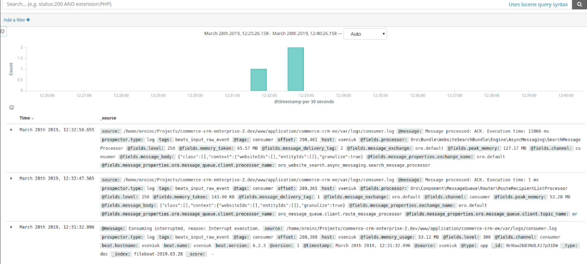
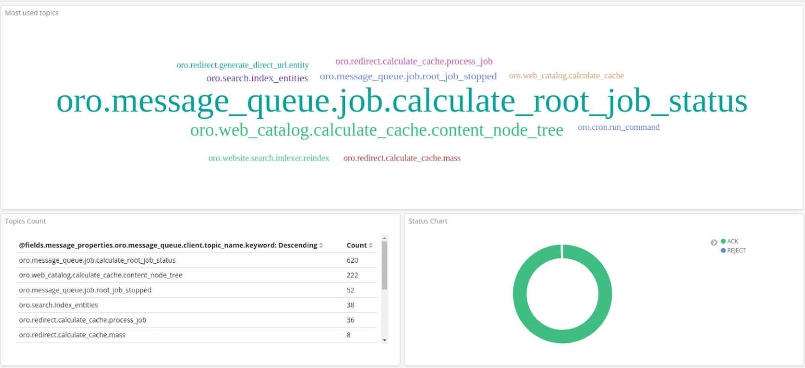
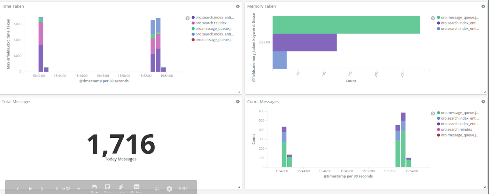

# Writing Logs to ELK Stack

ELK Stack  is the acronym for three open source projects: [Elasticsearch](https://www.elastic.co/products/elasticsearch), [Logstash](https://www.elastic.co/products/logstash), and [Kibana](https://www.elastic.co/products/kibana). Elasticsearch is a search and analytics engine. Logstash is a server‑side data processing pipeline that ingests data from multiple sources simultaneously, transforms it, and then sends it to a "stash" like Elasticsearch. Kibana lets users visualize data with charts and graphs in Elasticsearch.

## Installing ELK Stack

See documentation how to install ELK Stack on [Elastic website](https://www.elastic.co/start).

## Using Logstash Formatter

Logstash supports a variety of inputs that pull in events from a multitude of common sources, all at the same time, see [documetation](https://www.elastic.co/products/logstash) on Elastic website under Logstash product page.
Configure [Monolog Logstash formatter](https://github.com/Seldaek/monolog/blob/master/src/Monolog/Formatter/LogstashFormatter.php) in your `config_%env%.yml` file.

```yml

# path/to/config_prod.yml

monolog:
    handlers:
        consumer:
            type:       stream
            path:       "%kernel.logs_dir%/consumer.log"
            level:      debug
            channel:    ["consumer"]
            formatter:  monolog.formatter.logstash
```

Logs will be formatted like:

```json
{
    "@timestamp":" 2019-04-30T08:49:54.289986+03:00",
    "@source":"source",
    "@fields": {
        "channel":"consumer",
        "level":250,
        "processor":"Oro\\Component\\MessageQueue\\Router\\RouteRecipientListProcessor",
        "message_id":"oro.5cc7e18f1a6746.10499608",
        "message_body":"",
        "message_properties": {
             "oro.message_queue.client.topic_name":"oro.redirect.calculate_cache.mass",
             "oro.message_queue.client.processor_name":"oro_message_queue.client.route_message_processor",
             "oro.message_queue.client.queue_name":"oro.default"
        },
        "message_headers": {
            "content_type":"text/plain",
            "message_id":"oro.5cc7e18f1a6746.10499608",
            "timestamp":1556603279
        },
        "message_priority":2,
        "elapsed_time":"8 ms",
        "memory_usage":"54.02 MB",
        "peak_memory":"54.01 MB",
        "memory_taken":"151.43 KB",
        "ctxt_status":"ACK",
        "ctxt_time_taken":3
    },
    "@message":"Message processed: ACK. Execution time: 3 ms",
    "@tags": ["consumer"],
    "@type":"app"
}
```

## Using Filebeat

Filebeat helps you keep the simple things simple by offering a lightweight way to forward and centralize logs and files.
Filebeat comes with internal modules (auditd, Apache, NGINX, System, MySQL, and more) that simplify the collection, parsing, and visualization of common log formats down to a single command.

Filebeat configuration:

```yml
output.logstash
    enabled: true
    hosts: ["localhost:5044"]

filebeat.prospectors:
- type: log
    paths:
        - /path/to/the/application/var/logs/consumer*.log
    json:
        keys_under_root: true
        overwrite_keys: true
```

## Visualisation

Kibana works in pair with Elasticsearch and gives possibility to search, view, and interact with data stored in Elasticsearch indices. You can easily perform advanced data analysis and visualise your data in a variety of charts, tables, and maps. 

Kibana benefits:

* Interactive charts
* Mapping support
* Pre-built aggregations and filters
* Easily Accessible dashboards



### Dashboard

You can easily set up dashboards and reports and share them with others. All you need is a browser to view and explore the data.

### Charts and metrics

Using Kibana’s pre-built aggregations and filters, you can run a variety of analytics like histograms, top-N queries, and trends with just a few clicks.





## References

* [Elastic ELK stack](https://www.elastic.co/start)
* [Elastic Logstash](https://www.elastic.co/products/logstash)
* [Elastic Filebeat](https://www.elastic.co/products/beats/filebeat)
* [Elastic Kibana](https://www.elastic.co/products/kibana)
* [Elastic Elasticsearch](https://www.elastic.co/products/elasticsearch)
* [Monolog LogstashFormatter](https://github.com/Seldaek/monolog/blob/master/src/Monolog/Formatter/LogstashFormatter.php)
