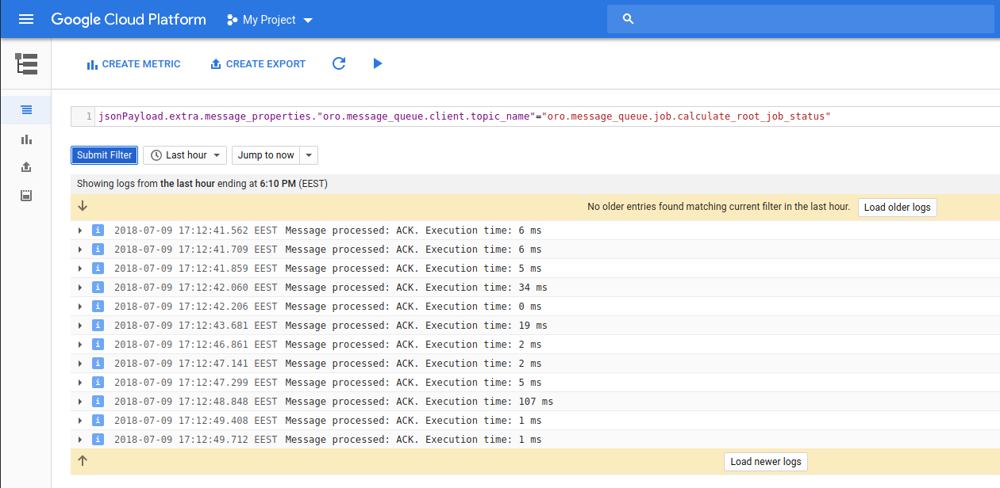
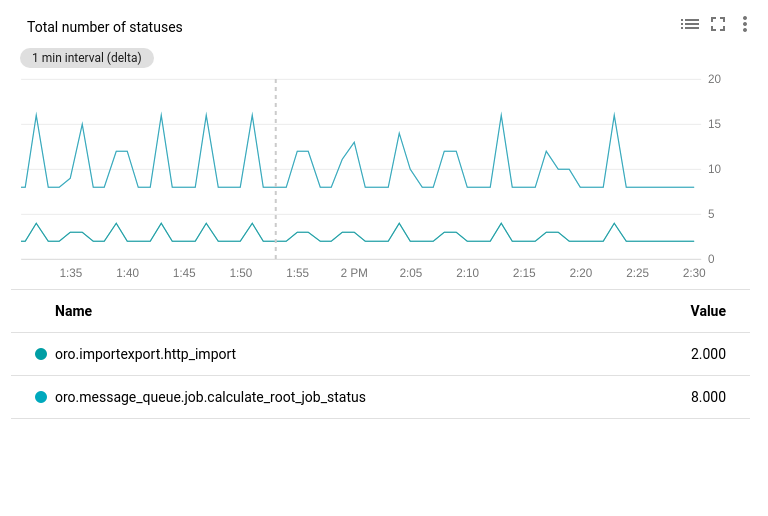
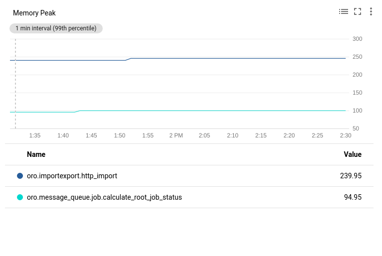
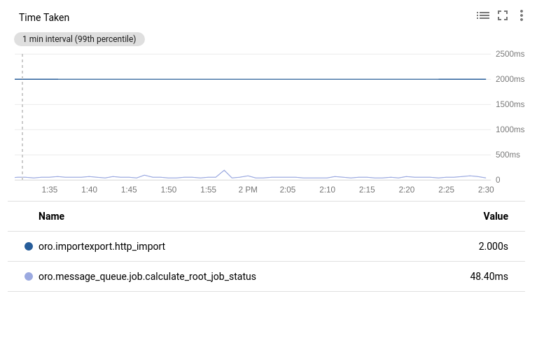
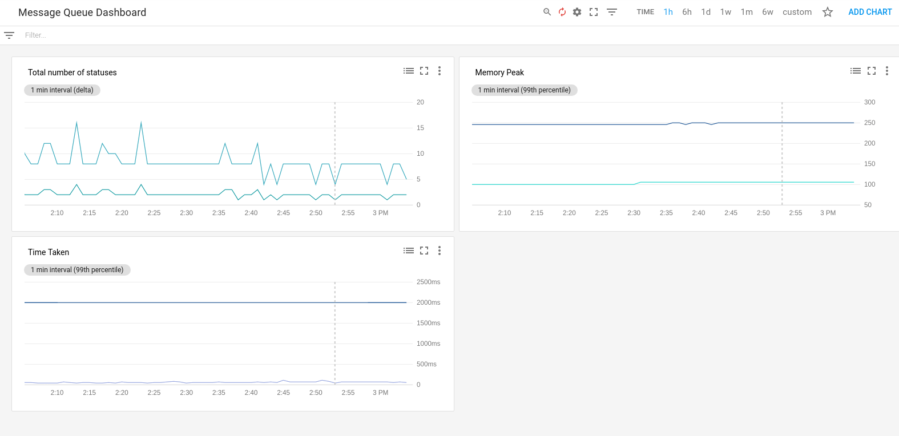

# Writing Logs to Stackdriver

[Stackdriver Logging](https://cloud.google.com/stackdriver/) allows you to store, search, analyze, monitor, and alert on log data.

Logs can be streamed to the Stackdriver with [Logging Agent](https://cloud.google.com/logging/docs/agent/) or manually using [GCloud SDK](https://github.com/GoogleCloudPlatform/google-cloud-php).

Simple example how you can stream your message queue logs to the Stackdriver with custom [Monolog Handler](https://symfony.com/doc/current/logging.html#handlers-that-modify-log-entries).

Add Google Cloud SDK package:

```bash
COMPOSER=dev.json composer require "google/cloud":"~0.70" 
```

Create **StackdriverHandler** that using GCloud SDK:

```php
<?php
// src/Acme/Bundle/DemoBundle/Log/Handler/StackdriverHandler.php

namespace Acme\Bundle\DemoBundle\Log\Handler;

use Google\Cloud\Logging\LoggingClient;
use Monolog\Handler\PsrHandler;
use Monolog\Logger;

class StackdriverHandler extends PsrHandler
{
    /**
     * StackdriverHandler constructor.
     */
    public function __construct()
    {
        $client = new LoggingClient([
            'projectId' => 'Your Project Id',
        ]);

        $logger = $client->psrLogger('oro_message_queue');

        // In current example logs with level Logger::NOTICE and higher will be streamed to the Stackdriver
        parent::__construct($logger, Logger::NOTICE);
    }

    /**
     * {@inheritDoc}
     */
    public function handle(array $record)
    {
        $record['context']['extra'] = $record['extra'];

        return parent::handle($record);
    }
}
```

Define service in DI:
```yaml
# src/Acme/Bundle/DemoBundle/Resources/config/services.yml

services:
    acme_demo.log.handler.stackdriver:
        class: 'Acme\Bundle\DemoBundle\Log\Handler\StackdriverHandler'
```

Configure Monolog handler to listen only message queue logs:
```yaml
# src/Acme/Bundle/DemoBundle/Resources/config/oro/app.yml

monolog:
    handlers:
        message_queue.consumer.stackdriver:
            type: service
            id: acme_demo.log.handler.stackdriver
            channels: ['!mq_job_transitive']
```

Check the *Google Cloud Platform > Stackdriver > Logging > Logs*, now you can configure filters and monitor all logs streamed to the Stackdriver.



## Logs-based Metrics

Logs-based metrics is useful tool to check wats is going on with message consuming, more details you can find [here](https://cloud.google.com/logging/docs/logs-based-metrics/).

Few examples of logs-based metrics are listed below:

### The total number of statuses received

* Check ["How to create Counter Metric"](https://cloud.google.com/logging/docs/logs-based-metrics/counter-metrics)
* In the viewer panel, create a filter `jsonPayload.status=("REJECT" OR "REQUEUE" OR "ACK")` it shows only the message processed log entries 
* In the **Metric Editor** panel, set the following fields:

Field           | Value
--------------- | --------------
**Name**        | status_count
**Add Label**   | **Name**: topic, **Label type**: String, **Field name**: `jsonPayload.extra.message_properties."oro.message_queue.client.topic_name"`
**Add Label**   | **Name**: status, **Label type**: String, **Field name**: `jsonPayload.status`
**Type**        | Counter

Current metrics shows total number of all statuses grouped by **Topic Name** with **Status**



### Memory peak of received messages

* Check ["How to create Distribution Metric"](https://cloud.google.com/logging/docs/logs-based-metrics/distribution-metrics)
* In the viewer panel, create a filter `jsonPayload.status=("REJECT" OR "REQUEUE" OR "ACK")` it shows only the message processed log entries 
* In the **Metric Editor** panel, set the following fields:

Field                              | Value
---------------------------------- | ----------------------------------
**Name**                           | peak_memory
**Add Label**                      | **Name**: topic, **Label type**: String, **Field name**: `jsonPayload.extra.message_properties."oro.message_queue.client.topic_name"`
**Add Label**                      | **Name**: status, **Label type**: String, **Field name**: `jsonPayload.status`
**Type**                           | Distribution
**Field name**                     | jsonPayload.extra.peak_memory
**Extraction regular expression**  | `([0-9.]+) MB`
**Histogram buckets Type**         | Linear *(setup current and below values by yours preferences)*
**Start value**                    | 40
**Number of buckets**              | 200
**Bucket width**                   | 5

Current metrics shows Peak of Memory for each message grouped by **Topic Name** with **Status**



### Time taken of received messages

* Check ["How to create Distribution Metric"](https://cloud.google.com/logging/docs/logs-based-metrics/distribution-metrics)
* In the viewer panel, create a filter `jsonPayload.status=("REJECT" OR "REQUEUE" OR "ACK")` it shows only the message processed log entries 
* In the **Metric Editor** panel, set the following fields:

Field                              | Value
---------------------------------- | ----------------------------------
**Name**                           | time_taken
**Add Label**                      | **Name**: topic, **Label type**: String, **Field name**: `jsonPayload.extra.message_properties."oro.message_queue.client.topic_name"`
**Add Label**                      | **Name**: status, **Label type**: String, **Field name**: `jsonPayload.status`
**Units**                          | ms
**Type**                           | Distribution
**Field name**                     | jsonPayload.time_taken
**Histogram buckets Type**         | Linear *(setup current and below values by yours preferences)*
**Start value**                    | 5
**Number of buckets**              | 200
**Bucket width**                   | 10

Current metrics shows total processing time for each message grouped by **Topic Name** with **Status**



## Message Queue Dashboard

Configure "Message Queue Dashboard" (more details you can find [here](https://cloud.google.com/monitoring/charts/)) and [create charts and alerts](https://cloud.google.com/logging/docs/logs-based-metrics/charts-and-alerts).
You can monitor and be notified if something is not going as expected.


