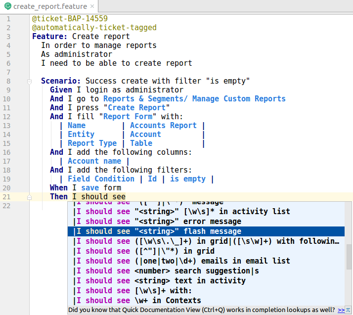
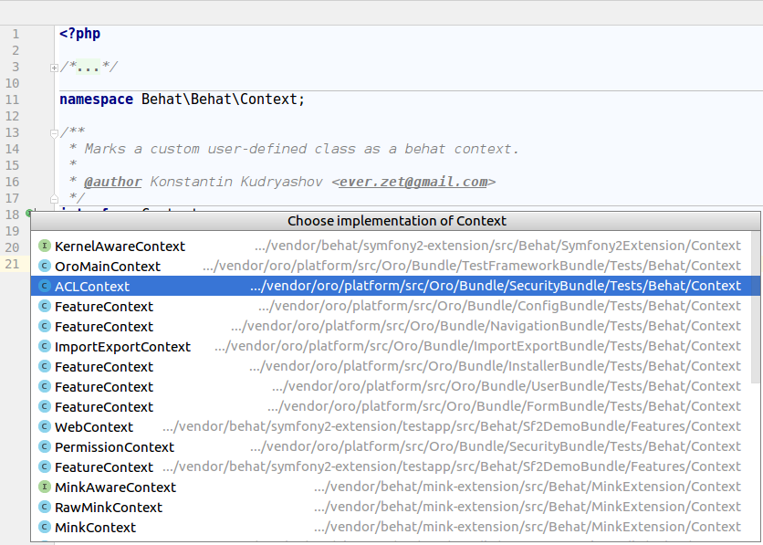
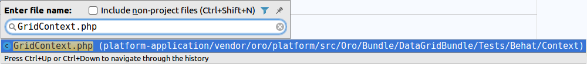
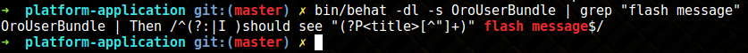
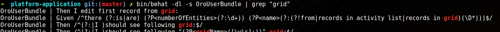

# OroBehatExtension

## Content

- [Before You Begin](#before-you-begin)
- [Conventions](#conventions)
- [Getting Started](#getting-started)
  - [Configuration](#configuration)
    - [Application Configuration](#application-configuration)
    - [Behat Configuration](#behat-configuration)
  - [Installation](#installation)
    - [Install dev dependencies](#install-dev-dependencies)
    - [Application Initial State](#application-initial-state)
    - [Install Test Automation Tools](#install-test-automation-tools)
  - [Test Execution](#test-execution)
    - [Prerequisites](#prerequisites)
    - [Run tests](#run-tests)
- [Architecture](#architecture)
  - [DI Containers](#di-containers)
  - [Autoload Suites](#autoload-suites)
  - [Feature isolation](#feature-isolation)
- [Page Object](#page-object)
  - [Elements](#elements)
  - [Mapping Form Fields](#mapping-form-fields)
  - [Embedded Form Mappings](#embedded-form-mappings)
  - [Page element](#page-element)
- [Fixtures](#fixtures)
  - [Feature fixtures](#feature-fixtures)
  - [Inline fixtures](#inline-fixtures)
  - [Alice fixtures](#alice-fixtures)
  - [Entity references](#entity-references)
- [Health Checkers](#health-checkers)
- [Write your first feature](#write-your-first-feature)
- [Troubleshooting](#troubleshooting)
  - [Increase application performance (Ubuntu)](#increase-application-performance-ubuntu)
    - [(optional) Create startup script](#optional-create-startup-script)
  - [Couldn't generate random unique value in 128 tries](#couldnt-generate-random-unique-value-for-orobundleuserbundleentityuser-username-in-128-tries)
  - [Append snippets](#append-snippets)
  - [How to find the necessary step](#how-to-find-the-necessary-step)
    - [Auto suggestion in PhpStorm](#auto-suggestion-in-phpstorm)
    - [Find the Necessary Context](#find-the-necessary-context)
    - [Use Grep in Console](#use-grep-in-console)

## Before You Begin

The information below summarizes concepts and tools that are important for understanding and use of the test framework delivered within OroBehatExtension.

**Behavior-driven development (BDD)** is a software development process that emerged from test-driven development (TDD).
The Behavior-driven development combines the general techniques and principles of TDD
with ideas from domain-driven design and object-oriented analysis and design to provide software development and management teams
with shared tools and a shared process to collaborate on software development.
[Read more at Wiki](https://en.wikipedia.org/wiki/Behavior-driven_development)

**Behat** is a Behavior Driven Development framework for PHP.
[See more in behat documentation](http://docs.behat.org/en/v3.0/)

**Mink** is an open source browser controller/emulator for web applications, developed using PHP.
[Mink documentation](http://mink.behat.org/en/latest/)

**OroElementFactory** creates elements in contexts.
See more information about [page object pattern](http://www.seleniumhq.org/docs/06_test_design_considerations.jsp#page-object-design-pattern).

**Symfony2 Extension** provides integration with Symfony2.
[See Symfony2 Extension documentation](https://github.com/Behat/Symfony2Extension/blob/master/doc/index.rst)

**@OroTestFrameworkBundle\Behat\ServiceContainer\OroTestFrameworkExtension** provides integration with Oro BAP based applications.

**Selenium2Driver** Selenium2Driver provides a bridge for the WebDriver's wire protocol.
See [Driver Feature Support](http://mink.behat.org/en/latest/guides/drivers.html)

**ChromeDriver** WebDriver is an open source tool for automated testing of webapps across many browsers. 
It provides capabilities for navigating to web pages, user input, JavaScript execution, and more. 
[Website](https://sites.google.com/a/chromium.org/chromedriver/)

## Conventions

This section summarizes limitations and agreements that are important for shared test maintenance and use. 

- **Use form mapping instead of selectors in your scenarios** to keep them clear and understandable for people from both technical and nontechnical world.

  **Don't**:

  ```gherkin
      I fill in "oro_workflow_definition_form[label]" with "User Workflow Test"
      I fill in "oro_workflow_definition_form[related_entity]" with "User"
  ```
  **Do**:
  
  ```gherkin
      And I fill "Workflow Edit Form" with:
        | Name                  | User Workflow Test |
        | Related Entity        | User               |
  ```

  ```yaml
      Workflow Edit Form:
        selector: 'form[name="oro_workflow_definition_form"]'
        class: Oro\Bundle\TestFrameworkBundle\Behat\Element\Form
        options:
          mapping:
            Name: 'oro_workflow_definition_form[label]'
            Related Entity: 'oro_workflow_definition_form[related_entity]'
  ```

- **Use menu and links to get the right pages instead of the direct page url**. See [Page element](#page-element) for more information.

  **Don't**:
  ```gherkin
      And I go to "/users"
  ```
  
  **Do**:

  ```gherkin
      And I open User Index page
  ```
- **Avoid scenario redundancy** (e.g. repeating the same sequence of steps, like login, in multiple scenarios).
Cover the feature with the sequential scenarios where every following scenario reuses outcomes (the states and data) prepared by their predecessors.
This path was chosen because of the following benefits:

  - Faster scenario execution due to the shared user session and smart data preparation.
    The login action in the initial scenario opens the session that is reusable by the following scenarios.
    Preliminary scenarios (e.g. create) prepare data for the following scenarios (e.g. delete).
  - Feature level isolation boosts execution speed, especially in the slow test environments.
  - Minimized routine development actions
    (e.g. you don't have to load fixtures for every scenario; instead, you reuse the available outcomes of the previous scenarios).
  - Easy handling of the application states that are difficult to emulate with data fixtures only (e.g. when adding new entity fields in the UI).

  By coupling scenarios, the ease of debugging and bug localization get sacrificed.
  It is difficult to debug UI features and the scenarios that happen after several preliminary scenarios.
  The longer the line, the harder it is to isolate the issue.
  Once the issue occurs, you have to spend additional time to localize it and identify the root cause
  (e.g. the delete scenario may be malfunctioning vs the delete scenario may fail due to the issues in the preliminary scenario, for example, create). is
  The good point is that the most critical actions/scenarios usually precede the less critical.
  Who cares about the delete if the create does not work in the first place? ;)

- **Use semantical yml fixtures**.
  Use only the entities that are in the bundle you are testing.
  Any other entities should be included via import.
  See [Alice fixtures](#alice-fixtures)

- **Name elements in camelCase style without spaces**.
  You can still refer to it using the camelCase style with spaces in the behat scenarios.
  For example, an element named ```OroProductForm``` may be mentioned in the step of the scenario as "Oro Product From":
  
  ```
  I fill "Oro Product From" with:
  ```

- **Use ```Scenario: Feature Background``` instead of the Background step**

## Getting Started

### Configuration

#### Application Configuration

Use default configuration for the application installed in production mode.
If you don't have any mail server configured locally, set the ```mailer_transport``` setting in *parameters.yml* to ```null```.

#### Behat Configuration

The base configuration is located in [behat.yml.dist](../../config/behat.yml.dist).
Every application has its own behat.yml.dist file in the root of the application directory.
Create your ```behat.yml```(it is ignored by git automatically and is never committed to the remote repository),
import base configuration and change it to fit your environment:

```yaml
imports:
  - ./behat.yml.dist

default: &default
    extensions: &default_extensions
        Behat\MinkExtension:
            browser_name: chrome
            base_url: "http://your-domain.local"

```

### Installation

#### Install dev dependencies

If you installed dependencies with ```--no-dev``` parameter earlier, remove ```composer.lock``` file from the root of the application directory.

Install dev dependencies using the following command:

```bash
composer install
```

#### Application Initial State

In Oro application, the initial state is the one application enters after installation without demo data.

Scenarios that test features should rely on this state and should create any data that is necessary for additional verifications.

Data may be created by the steps of the scenario or as [fixtures](#fixtures).

Install application without demo data in production mode using the following command:

```bash
app/console oro:install  --drop-database --user-name=admin --user-email=admin@example.com --application-url=http://dev-crm.local/ \
  --user-firstname=John --user-lastname=Doe --user-password=admin \
  --organization-name=ORO --env=prod --sample-data=n --timeout=3000
```

#### Install Test Automation Tools

To execute scenarios that use Oro application features run WebKit browser (using ChromeDriver).
To install ChromeDriver, run the following commands:

```bash
CHROME_DRIVER_VERSION=$(curl -sS chromedriver.storage.googleapis.com/LATEST_RELEASE)
mkdir -p "$HOME/chrome" || true
wget "http://chromedriver.storage.googleapis.com/${CHROME_DRIVER_VERSION}/chromedriver_linux64.zip" -O "$HOME/chrome/chromedriver_linux64_${CHROME_DRIVER_VERSION}.zip"
unzip "$HOME/chrome/chromedriver_linux64_${CHROME_DRIVER_VERSION}.zip" -d "$HOME/chrome"
sudo ln -s "$HOME/chrome/chromedriver" /usr/local/bin/chromedriver
```

**Note:** These commands create a subdirectory for chrome in your home directory,
          downloads chromedriver into directory that you just created, uncompress files,
          creates symbolic link.

After the command execution is complete, you can use ```chromedriver``` in the terminal.

### Test Execution

#### Prerequisites

Run ChromeDriver:

```bash
chromedriver --url-base=wd/hub --port=4444 > /tmp/driver.log 2>&1
``` 

> To run ChromeDriver in background, append ampersand symbol (&) to the end of line, like in the following examples:
> ```bash
> chromedriver --url-base=wd/hub --port=4444 > /tmp/driver.log 2>&1 &
> ```

#### Run tests

Before you begin, it is highly recommended to make yourself familiar with behat arguments and options.
Run ```bin/behat --help``` for a detailed description.

When the Oro application is installed without demo data and is running, and the ChromeDriver is running,
you can start running the behat tests by feature from the root of the application.

You may use one of the following commands.

Run feature test scenario:

```bash
bin/behat vendor/oro/platform/src/Oro/Bundle/UserBundle/Tests/Behat/Features/login.feature -vvv
```

Preview all available feature steps:

```bash
bin/behat -dl -s OroUserBundle
```

View steps with full description and examples:

```bash
bin/behat -di -s OroUserBundle
```

Every bundle has its dedicated test suite that can be run separately:

```bash
bin/behat -s OroUserBundle
```

## Architecture

### DI Containers

Behat is a symfony console application with its own container and services.
Behat container may be configured through Extensions using *behat.yml* in the root of the application directory.

Application container may be used by injected Kernel in your Context after you implement ```KernelAwareContext``` and use ```KernelDictionary``` trait.

```php
use Behat\Symfony2Extension\Context\KernelAwareContext;
use Behat\Symfony2Extension\Context\KernelDictionary;
use Oro\Bundle\TestFrameworkBundle\Behat\Context\OroFeatureContext;

class FeatureContext extends OroFeatureContext implements KernelAwareContext
{
    use KernelDictionary;

    public function useContainer()
    {
        $doctrine = $this->getContainer()->get('doctrine');
    }
}
```

Moreover, you can inject application services in behat Context:
```yml
oro_behat_extension:
  suites:
    OroCustomerAccountBridgeBundle:
      contexts:
        - OroImportExportBundle::ImportExportContext:
            - '@oro_entity.entity_alias_resolver'
            - '@oro_importexport.processor.registry'
```


### Autoload Suites

```Oro\Bundle\TestFrameworkBundle\Behat\ServiceContainer\OroTestFrameworkExtension``` is used for building testing suites.

During initialization, extension creates a test suite with a bundle name if any ```Tests/Behat/Features``` directory exists in a bundle.
Thus, if the bundle has no Features directory - no test suite would be created for it.

If you need some specific feature steps for your bundle, create the ```AcmeDemoBundle\Tests\Behat\Context\FeatureContext``` class.
This context is added to the suite with other common contexts.
The complete list of common context is configured in the behat configuration file under the ```shared_contexts```.

You can manually configure test suite for a bundle in the application behat configuration:

```yml
default: &default
  suites:
    AcmeDemoBundle:
      type: symfony_bundle
      bundle: AcmeDemoBundle
      contexts:
        - Oro\Bundle\TestFrameworkBundle\Tests\Behat\Context\OroMainContext
        - OroDataGridBundle::GridContext
        - AcmeDemoBundle::FeatureContext
      paths:
        - 'vendor/Acme/DemoBundle/Tests/Behat/Features'
```

or in a bundle behat configuration ```{BundleName}/Tests/Behat/behat.yml```:

```yml
oro_behat_extension:
  suites:
    AcmeDemoBundle:
      contexts:
        - Oro\Bundle\TestFrameworkBundle\Tests\Behat\Context\OroMainContext
        - OroDataGridBundle::GridContext
        - AcmeDemoBundle::FeatureContext
      paths:
        - '@AcmeDemoBundle/Tests/Behat/Features'
```

Manually configured test suits are not autoloaded by the extension.


### Feature isolation

Every feature can interact with the application and perform CRUD operations.
As a result, the database may be modified.
To avoid data collisions, the features are isolated: the database and cache directories are dumped before running the feature tests;
they are restored after the feature tests execution is complete.

Every isolator must implement ```Oro\Bundle\TestFrameworkBundle\Behat\Isolation\IsolatorInterface``` and ```oro_behat.isolator``` tag with priority.
See [isolators.yml](ServiceContainer/config/isolators.yml)

#### Disable feature isolation

You can disable feature isolation by adding ```--skip-isolators=database,cache``` option to behat console command.
In this case, the combination of the feature tests might run much faster, but the test logics should care about the database and cache consistency.

## Page Object

### Elements

Elements is a service layer in behat tests. They wrap the complex business logic.
Take a minute to investigate base Mink [NodeElement](https://github.com/minkphp/Mink/blob/9ea1cebe3dc529ba3861d87c818f045362c40484/src/Element/NodeElement.php).
It has many public methods, some of them are applicable only to some elements.
Every Bundle tests may contain particular number of elements.
All elements must be described in ```{BundleName}/Tests/Behat/behat.yml``` in the following way:

```yml
oro_behat_extension:
  elements:
    Login:
      selector: '#login-form'
      class: 'Oro\Bundle\TestFrameworkBundle\Behat\Element\Form'
      options:
        mapping:
          Username: '_username'
          Password: '_password'
```
where:
1. ```Login``` is an element name that MUST be unique.
 The element can be created in context by ```OroElementFactory``` by its name:

 ```php
    $this->elementFactory->createElement('Login')
 ```

2. ```selector``` defines how web driver shall find the element on the page.
By default, when the selector type is not specified, the [css selector](http://mink.behat.org/en/latest/guides/traversing-pages.html#css-selector) is used.
XPath selector is also supported and may be provided with the following configuration:

 ```yml
    selector:
        type: xpath
        locator: //span[id='mySpan']/ancestor::form/
 ```

3. the ```class``` namespace for element's class (should be extended from ```Oro\Bundle\TestFrameworkBundle\Behat\Element\Element```).
When omitted, the ```Oro\Bundle\TestFrameworkBundle\Behat\Element\Element``` class is used by default.

4. ```options``` is an array of additional options that will be stored in ```options``` property of Element class.
It is highly recommended to supply a class with options mapping for the form elements.
This will increase test speed and ensure more accurate fields mapping.

### Mapping Form Fields

By default, tests use the [named field selector](http://mink.behat.org/en/latest/guides/traversing-pages.html#named-selectors) to map form fields.
Name field selector searched for the field by its id, name, label or placeholder.
You are free to use any selector for form fields mapping or wrap an element into the particular behat element.

behat.yml
```yml
oro_behat_extension:
  elements:
    Payment Method Config Type Field:
      class: Oro\Bundle\PaymentBundle\Tests\Behat\Element\PaymentMethodConfigType
    PaymentRuleForm:
      selector: "form[id^='oro_payment_methods_configs_rule']"
      class: Oro\Bundle\TestFrameworkBundle\Behat\Element\Form
      options:
        mapping:
          Method:
            type: 'xpath'
            locator: '//div[@id[starts-with(.,"uniform-oro_payment_methods_configs_rule_method")]]'
            element: Payment Method Config Type Field
```
Now you should implement the element's ```setValue``` method:

```php
<?php
namespace Oro\Bundle\PaymentBundle\Tests\Behat\Element;
use Oro\Bundle\TestFrameworkBundle\Behat\Element\Element;
class PaymentMethodConfigType extends Element
{
    /**
     * {@inheritdoc}
     */
    public function setValue($value)
    {
        $values = is_array($value) ? $value : [$value];
        foreach ($values as $item) {
            $parentField = $this->getParent()->getParent()->getParent()->getParent();
            $field = $parentField->find('css', 'select');
            self::assertNotNull($field, 'Select payment method field not found');
            $field->setValue($item);
            $parentField->clickLink('Add');
            $this->getDriver()->waitForAjax();
        }
    }
}
```

Now you can use it in a standard step:

```gherkin
Feature: Payment Rules CRUD
  Scenario: Creating Payment Rule
    Given I login as administrator
    And I go to System/ Payment Rules
    And I click "Create Payment Rule"
    When I fill "Payment Rule Form" with:
      | Method | PayPal |
```

### Embedded Form Mappings

Sometimes, a form appears in the iframe.
Behat can switch to the iframe by its id.
To fill in the form in the iframe correctly, specify iframe id in the form options:

```yml
oro_behat_extension:
  elements:
    MagentoContactUsForm:
      selector: 'div#page'
      class: Oro\Bundle\TestFrameworkBundle\Behat\Element\Form
      options:
        embedded-id: embedded-form
        mapping:
          First name: 'oro_magento_contactus_contact_request[firstName]'
          Last name: 'oro_magento_contactus_contact_request[lastName]'
```

### Page element

Page element encapsulates entire web page with its url and path to the page.
Every Page element should extend from ```Oro\Bundle\TestFrameworkBundle\Behat\Element\Page```.

Typical Page configuration:

```yml
oro_behat_extension:
  pages:
    UserProfileView:
      class: Oro\Bundle\UserBundle\Tests\Behat\Page\UserProfileView
      route: 'oro_user_profile_view'
```

Sample Page class:

```php
<?php

namespace Oro\Bundle\UserBundle\Tests\Behat\Page;

use Oro\Bundle\TestFrameworkBundle\Behat\Element\Page;

class UserProfileView extends Page
{
    /**
     * {@inheritdoc}
     */
    public function open(array $parameters = [])
    {
        $userMenu = $this->elementFactory->createElement('UserMenu');
        $userMenu->find('css', 'i.fa-sort-desc')->click();

        $userMenu->clickLink('My User');
    }
}
```

Now you can use several meaningful steps:

```gherkin
    And I open User Profile View page
    And I should be on User Profile View page
```

## Fixtures

### Feature fixtures

Every time when behat runs a new feature, application state is reset to default 
(see [Feature isolation](#feature-isolation) for more information):
there is only one admin user, one organization, one business unit and default roles in the database.

The feature tests must rely on data that is available in the application after the oro:install command execution.
In most cases, this is not enough.
Thereby you have two ways to get more data in the system: using inline fixtures, or alice fixtures.

### Inline fixtures

You can create any number of any entities in the feature tests.
The ```FixtureContext``` guesses the entity class, creates the necessary number of objects,
and uses [faker](https://github.com/fzaninotto/faker) to fill in the required fields when their value was not specified explicitly.
You use both [faker](https://github.com/fzaninotto/faker) and [entity references](#entity-references) in inline fixtures.

```yml
  Given the following contacts:
    | First Name | Last Name | Email     |
    | Joan       | Anderson  | <email()> |
    | Craig      | Bishop    | <email()> |
    | Jean       | Castillo  | <email()> |
    | Willie     | Chavez    | <email()> |
    | Arthur     | Fisher    | <email()> |
    | Wanda      | Ford      | <email()> |
  And I have 5 Cases
  And there are 5 calls
  And there are two users with their own 7 Accounts
  And there are 3 users with their own 3 Tasks
  And there is user with its own Account
```

### Alice fixtures

Sometimes you need many different entities with complex relationships.
In such cases, you can use alice fixtures.
Alice is a library that allows you easily create fixtures in yml format.
See [Alice Documentation](https://github.com/nelmio/alice/blob/2.x/README.md).

Fixtures should be located in the ```{BundleName}/Tests/Behat/Features/Fixtures``` directory.
For load a fixture before the feature tests execution,
add a tag (annotation) that is constructed using the following convention ```@fixture-BundleName:fixture_file_name.yml```, e.g.

```gherkin
@fixture-OroCRMBundle:mass_action.yml
Feature: Mass Delete records
```

It is also possible to load fixtures for any other bundles available for application.

For example:
```gherkin
@fixture-OroUserBundle:user.yml
@fixture-OroOrganizationBundle:BusinessUnit.yml
Feature: Adding attributes for workflow transition
```

Additionally, Alice allows you to [include files](https://github.com/nelmio/alice/blob/a060587f3c90edd92a65c6c0d163972f49bc4e21/doc/fixtures-refactoring.md#including-files)
via extension, so you can import files from other bundles:

```yaml
include:
    - @OroCustomerBundle/Tests/Behat/Features/Fixtures/CustomerUserAmandaRCole.yml
```

**You should always include fixtures from other bundles with entities that were declared within that bundle [see Conventions](#conventions).**

### Entity references

You can use references to the entities in both inline and alice fixtures.
[See Alice documentation about References](https://github.com/nelmio/alice/blob/2.x/doc/relations-handling.md#handling-relations).
```{Bundle}\Tests\Behat\ReferenceRepositoryInitializer``` used for create references for objects that already exist in database.
It is prohibited to modify or add new entities within Initializer.
It should implement ```ReferenceRepositoryInitializerInterface``` and should not have dependencies.
For show all references use ```bin/behat --available-references``` command.

The most common used references:

- ```@admin``` - Admin user
- ```@adminRole``` - Administrator role
- ```@organization``` - Default organization
- ```@business_unit``` - Default business unit

## Health Checkers

There is native behat posiblitiy to invokes formatters without executing the tests and hooks.
You can try:

```bash
bin/behat --dry-run
```

This can be useful in case when you are not sure that you declare all needed context for your feature.
OroBehatExtension enhances this feature and add some extra functionality.

### FixturesChecker

Each feature can have alice fixtures, add by tags [see documentation](#alice-fixtures)
**FixturesChecker** will check every feacher for ability of fixture loading, without actually load the fixture.

## Write your first feature

Every bundle should contain its own behat tests for features in the ```{BundleName}/Tests/Behat/Features/``` directory.
Every feature is a separate file with the ```.feature``` extension and some specific syntax
(See more at [Cucumber doc reference](https://cucumber.io/docs/reference)).

A feature starts with the following:
* The ```Feature:``` keyword and feature name (these should stay on the same line),
* An optional description (can be formatted as multiple lines). Having meaningful description is highly recommended.

Next goes the feature scenario - specific example that illustrates a business rule and consists of sequential steps.
In addition to being a test specification and test documentation, a scenario defines the test steps and serves as an executable specification of the system.

Normally, a step starts with ***Given***, ***When***, or ***Then***.
If there are multiple Given or When steps underneath each other, you can use ***And*** or ***But*** to organize them into logical groups.
Cucumber does not differentiate between the keywords, but choosing the right one is important for the readability of the scenario as a whole.

Please,take a look at the login.feature in OroUserBundle:
[UserBundle/Tests/Behat/Features/login.feature](https://github.com/orocrm/platform/blob/50047c1d8abc5f811d0db759b501b8d27b0bff65/src/Oro/Bundle/UserBundle/Tests/Behat/Features/login.feature)

```gherkin
Feature: User login
  In order to login in application
  As an OroCRM admin
  I need to be able to authenticate

Scenario: Success login
  Given I am on "/user/login"
  When I fill "Login Form" with:
      | Username | admin |
      | Password | admin |
  And I press "Log in"
  Then I should be on "/"

Scenario Outline: Fail login
  Given I am on "/user/login"
  When I fill "Login Form" with:
      | Username | <login>    |
      | Password | <password> |
  And I press "Log in"
  Then I should be on "/user/login"
  And I should see "Invalid user name or password."

  Examples:
  | login | password |
  | user  | pass     |
  | user2 | pass2    |
```

1. The line ```Feature: User login``` starts the feature and gives it a title.
2. Behat does not parse the next 3 lines of text. (In order to... As an... I need to...).
  These lines provide a human-readable context to the people who will review or modify this feature. They 
  describe the business value derived from the inclusion of the feature in the software.
3. The line ```Scenario: Success login``` starts the scenario and provides a description of the scenario.
4. The next 6 lines are the scenario steps. Every step is matched to a regular expression that is defined in the Context.
5. The line ```Scenario Outline: Fail login``` starts the next scenario.
  In the scenario outline, the placeholders are used instead of the actual values,
  and the values for scenario execution are provided as a set of examples below the outline.
  Scenario Outlines helps you run these steps several times, iterating through the values provided in the ```Examples:``` section
  and thus testing the same flow with different input.
  The Scenario Outline is a template which is never run on its own.
  Instead, a Scenario that follows an outline runs once for each row in the Examples section beneath it (except for the first header row that is skipped).
  Think of a placeholder as of a variable.
  It is replaced with a real value from the ``Examples:`` table row,
  where the text between the placeholder angle brackets (e.g., <login>) matches the text of the table column header (e.g., | login |).

## Troubleshooting

### Increase application performance (Ubuntu)

In behat we have such isolators ([see Feature isolation](#feature-isolation)) to make behat features independent to each other.
One of those isolators is a database.
It creates database dump before start execution, then drops it and restores it from dump after each feature.
This can take a while (up to 2 minutes on slow ssd).
If you run behat tests often you would like to decrease this time.
To boost database isolator you can mount database directory to RAM.
We will use [tmpfs](https://en.wikipedia.org/wiki/Tmpfs)

Create a tmpfs directory:

```bash
sudo mkdir /var/tmpfs
sudo mount -t tmpfs -o size=4G tmpfs /var/tmpfs
```

Edit ```/etc/mysql/mysql.conf.d/mysqld.cnf```

```ini
datadir = /var/tmpfs/mysql
```

Add new storage to ```/etc/fstab```:

```ini
tmpfs  /var/tmpfs  tmpfs  nodev,nosuid,noexec,noatime,size=4G  0 0
```

Copy MySQL to tmpfs:

```bash
sudo service mysql stop
sudo cp -Rfp /var/lib/mysql /var/tmpfs
```

We’ll need to tell AppArmor to let MySQL write to the new directory by creating an alias between the default directory and the new location.

```bash
echo "alias /var/lib/mysql/ -> /var/tmpfs/mysql," | sudo tee -a /etc/apparmor.d/tunables/alias
```

For the changes to take effect, restart AppArmor:

```bash
sudo systemctl restart apparmor
```

Now you can start mysql again:

```bash
sudo service mysql start
```

#### (optional) Create startup script

After you restart the computer, all the data and the database structure will lost.
You should copy data directory manually after every restart.
Alternatively, you can create a startup script that may be launched automatically as a systemd service.

To prepare for auto-recovery using a startup script:

1. Create a mysql_copy_tmpfs.sh in the bin directory (e.g. /usr/local/bin):
```bash
#!/bin/bash
cp -Rfp /var/lib/mysql /var/tmpfs
```

2. Create a unit configuration file */etc/systemd/system/mysql_copy_tmpfs.service* that will schedule priority of the service execution before the mysql starts:
```unit
[Unit]
Description=Copy mysql to tmpfs
Before=mysql.service
After=mount.target

[Service]
User=mysql
Type=oneshot
ExecStart=/bash/script/path/mysql_copy_tmpfs.sh

[Install]
WantedBy=multi-user.target
```

3. Once you're done creating the files, enable the configured service:
```bash
systemctl enable mysql_copy_tmpfs.service
```
It will start automatically after rebooting the machine.
For more details see systemd.service man page.

### Couldn't generate random unique value for Oro\Bundle\UserBundle\Entity\User: username in 128 tries.

Hot fix.
Check your fixture.
Remove (unique) suffix in entity property in entity fixture, like in the following example:

**Incorrect fixture**:
```yaml
Oro\Bundle\UserBundle\Entity\User:
    charlie:
      firstName: Marge
      lastName: Marge Simpson
      username (unique): marge228
```
**Corrected fixture**:
```yaml
Oro\Bundle\UserBundle\Entity\User:
    charlie:
      firstName: Marge
      lastName: Marge Simpson
      username: marge228
```

**Route cause (why this happens?)**
Alice remembers all the values for the given entity property and tries to generate a unique value,
but this causes issues when there is just one value for the entity property.
This option still may be used if combined with the autogenerated fake value, like in the following example:

```yaml
Oro\Bundle\UserBundle\Entity\User:
    charlie:
      firstName (unique): <firstName()>
      lastName: Marge Simpson
      username: marge228
```

### Append snippets

The feature development consists of the following design stages:
- Create a feature draft - implement a high-level scenario that covers the story.
  At this stage, you should have a clear understanding of the business outcome that is achieved by the feature test automation.
- Specify all the scenarios that may happen when using the feature. Exact steps are steel not necessary.
- Finalize the big picture of the implementation and plan the individual steps.

Some of the steps may be already fully automated.
Ideally, you should automate the missing steps after you plan using them in your feature test scenarios.
If feature functionality is already implemented, it is necessary to implement the behat steps involved in the feature testing.
However, sometimes it is impossible to do right away (because of the incomplete feature implementation, blocking issues or missing information).

In this case, you can temporarily mock the steps that are missing implementation. 

A quick way to do so is to do a dry-run of your feature tests. In the console, run the following command:

```bash
bin/behat path/to/your.feature --dry-run --append-snippets --snippets-type=regex
```

The featue is executed in the *--dry-run* mode,
and at the final stage of execution you are prompted to add undefined steps mock implementation to one of the existing contexts.

### How to find the necessary step

When you design test automation scenarios for the new feature, you may have trouble finding steps for reuse from hundred of the steps that are already automated. 
Use the useful tricks below to find the necessary step.

#### Auto Suggestion in PhpStorm

While designing a scenario in feature file, you can start typing a keyword and PhpStorm will offer you hints on the implemented steps that match the keywords,
e.g. when you type grid or form, the steps that involve these items pop up in the suggestions block.



> If PhpStorm does not offer you any hints as you type, please, verify the following:
>
> 1. You have installed vendors for at list one application
> 2. You have installed behat plugin for PhpStorm

#### Find the Necessary Context

Every Context class should implement ```Behat\Behat\Context\Context``` interface.
Get the list of implemented contexts and find the necessary one by name.




Usually, the name of context is self-explanatory, e.g. GridContext, FormContext, ACLContext etc.

#### Use Grep in Console

If for any reason you do not use PhpStorm or behat plugin,
you still can find the necessary step by filtering the output of the command that previews all the feature steps (use grep). Just type in your console:

```bash
bin/behat -dl -s AcmeDemoBundle | grep "flash message"
```



```bash
bin/behat -dl -s AcmeDemoBundle | grep "grid"
```



> You can use the behat command line interface only after you install the application. 

## ToDo

- Separate this README to multipage document
- Explain "wait for ajax" flow
- Feature debugging
