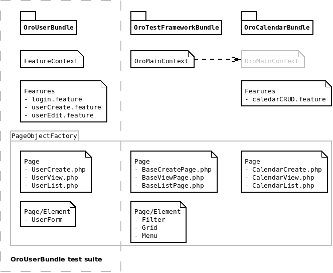

# Behat Tests

### Official documentation

[Behat documentation](http://docs.behat.org/en/v3.0/)
[Mink documentation](http://mink.behat.org/en/latest/)
[Page object extension documentation](http://behat-page-object-extension.readthedocs.org/en/latest/index.html)


### Architecture

Mink provide ```MinkContext``` with basic feature steps.
```OroMainContext``` is extended from ```MinkContext``` and add many additional steps for tests.

To look the all available feature steps:

```bash
bin/behat -dl -s OroTestFrameworkBundle
```

Every bundle has its own test suite and can be run separately:

 ```bash
 bin/behat -s OroUserBundle
 ```

During initialization, Extension will create test suite with bundle name if any ```Tests/Behat/Feature``` directory exits.
Thus, if bundle has no Feature directory - no test suite would be crated for it.

If you need some specific feature steps for your bundle you should create ```Tests/Behat/Context/FeatureContext``` class.
Instead of ```OroMainContext``` FeatureContext will be used for bundle test suite.
Perhaps FeatureContext may be extends from OroMainContext for redefine some feature steps.

Page Object Extension provide ```PageObjectAware``` interface for injecting PageObjectFactory that know about all pages and elements in application.
Read more about Page Object Extension in official documentation ([Page Object Extension documentation](http://behat-page-object-extension.readthedocs.org/en/latest/guide/introduction.html))





### BDD and Behat

Sopose you have user story that user with some role can execute.
You can describe this behavior by simple convention in .feature file (see [Behat documentation](http://docs.behat.org/en/v3.0/guides/1.gherkin.html#writing-features))


### Configuration

Base configuration is holded by behat.yml.dist.
You can copy to behat.yml and edit it for your needs.
Every bundle that configured symfony_bundle suite type will not be autoloaded by ```OroTestFrameworkExtension```


### Autoload
Through ```OroTestFrameworkExtension``` that was enabled in behat.yml, for every bundle that has features (one or more) in ```{bundle_name}/Tests/Behat/Features/``` will generated its own test suite.
