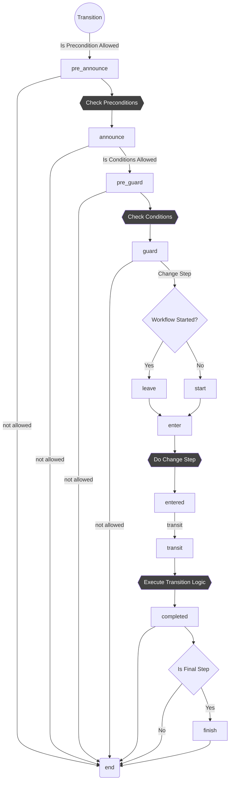

# OroWorkflowBundle

OroWorkflowBundle enables developers to incorporate business processes into the Oro applications by defining and managing conditional sequences of entity transformations in Workflows and Processes YAML configuration files.

It contains two important features, workflows and processes.

*A workflow* is a complex solution that allows users to perform a set of actions with predefined conditions -
each next action depends on the previous one. Usually, workflows are used to manage a specific entity and to create additional related entities.

*Processes* provide the possibility to automate tasks related to entity management. They use the main doctrine events to perform described tasks at the right time. Each process can be performed immediately or after a timeout. Processes use the OroMessageQueue component and the bundle to provide the possibility of delayed execution.

## Workflow Transition Flow

See [website documentation](https://doc.oroinc.com/backend/entities-data-management/workflows/) for more details.

