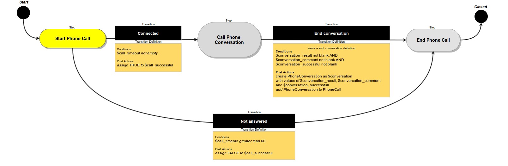

Configuration Reference
=======================

Table of Contents
-----------------
 - [Overview](#overview)
 - [Configuration File](#configuration-file)
 - [Configuration Loading](#configuration-loading)
 - [Defining a Workflow](#defining-a-workflow)
   - [Example](#example)
 - [Attributes Configuration](#attributes-configuration)
   - [Example](#example-1)
 - [Steps configuration](#steps-configuration)
   - [Example](#example-2)
 - [Transitions Configuration](#transitions-configuration)
   - [Example](#example-3)
 - [Transition Definition Configuration](#transition-definition-configuration)
   - [Example](#example-4)
 - [Conditions Configuration](#conditions-configuration)
   - [Example](#example-5)
 - [Post Actions](#post-actions)
   - [Example](#example-6)
 - [Example Workflow Configuration](#example-workflow-configuration)
   - [Configuration](#configuration)
   - [PhoneCall Entity](#phonecall-entity)
   - [PhoneConversation Entity](#phoneconversation-entity)
   - [Flow Diagram](#flow-diagram)

Overview
========

Configuration of Workflow declares all aspects related to specific workflow:

* basic properties of workflow like name and label
* steps and transitions
* attributes involved in workflow
* entity that is related to workflow

Structure of configuration is declared in class Oro\Bundle\WorkflowBundle\Configuration\WorkflowConfiguration.

Configuration File
==================

Configuration must be placed in a file named Resources/config/workflow.yml. For example
src/Acme/DemoWorkflowBundle/Resources/config/workflow.yml.

Configuration file may be split by parts. All included parts must be placed under imports section. Imports may be used
in any part of workflow configuration.

**Example - workflow.yml**
```
imports:
    - { resource: 'oro/workflow/b2b_flow_lead.yml' }
    - { resource: 'oro/workflow/b2b_flow_sales.yml' }
    - { resource: 'oro/workflow/b2b_flow_sales_funnel.yml' }
```

**Example - b2b_flow_lead.yml**
```
imports:
    - { resource: 'b2b_flow_lead/steps.yml' }
    - { resource: 'b2b_flow_lead/attributes.yml' }
    - { resource: 'b2b_flow_lead/transitions.yml' }
    - { resource: 'b2b_flow_lead/transition_definitions.yml' }

workflows:
    b2b_flow_lead:
        label: 'Unqualified Sales Lead'
        entity: OroCRM\Bundle\SalesBundle\Entity\Lead
        entity_attribute: lead
        start_step: new
```

Configuration Loading
=====================

To load configuration execute a command:

```
php app/console oro:workflow:definitions:load
```
Command has two options: "directories" that allows user to specify which directories will be used to find definitions,
and "workflows" that define names of definitions required to load.

**Important**

Workflow configuration cannot be merged, it means that you cannot override workflow that is defined in other bundle.
If you will declare a workflow and another bundle will declare it's own workflow with the same name the command will
trigger exception and data won't be saved.

Defining a Workflow
===================

Root element of configuration is "workflows". Under this element workflows can be defined.

Single workflow configuration has next properties:

* **name**
    *string*
    Workflow should have a unique name in scope of all application. As workflow configuration doesn't support merging
    two workflows with the same name will lead to exception during configuration loading.
* **label**
    *string*
    This value will be shown in the UI
* **entity**
    *string*
    Class name of workflow related entity. **Important:** Entity either must be extended or custom
    or it must have fields to contain workflow item and step.
* **entity_attribute**
    *string*
    Name of the attribute used to store related entity
* **is_system**
    *boolean*
    Flag that define whether this definition is system. System definition can't be edited or removed.
    All definitions loaded from *.yml files automatically marked as system.
* **start_step**
    *string*
    The name of start step. If Workflow has start transition then start_step is optional, otherwise it's required.
* **steps_display_ordered**
    *boolean*
    If this flag is true, then workflow step widget will show all steps according to their order (including not passed)
    on entity view page, otherwise widget will show only passed steps.
* **attributes**
    Contains configuration for Attributes
* **steps**
    Contains configuration for Steps
* **transitions**
    Contains configuration for Transitions
* **transition_definitions**
    Contains configuration for Transition Definitions

Example
-------
```
workflows:                                                    # Root elements
    b2b_flow_sales:                                           # A unique name of workflow
        label: B2B Sales Flow                                 # This will be shown in UI
        entity: OroCRM\Bundle\SalesBundle\Entity\Opportunity  # Workflow will be used for this entity
        entity_attribute: opportunity                         # Attribute name used to store root entity
        is_system: true                                       # Workflow is system, i.e. not editable and not deletable
        start_step: qualify                                   # Name of start step
        steps_display_ordered: true                           # Show all steps in step widget
        attributes:                                           # configuration for Attributes
                                                              # ...
        steps:                                                # configuration for Steps
                                                              # ...
        transitions:                                          # configuration for Transitions
                                                              # ...
        transition_definitions:                               # configuration for Transition Definitions
                                                              # ...
```

Attributes Configuration
========================

Workflow define configuration of attributes. When Workflow Item is created it can manipulate it's own data
(Workflow Data) that is mapped by Attributes. Each attribute must to have a type and may have options.
When Workflow Item is saved it's data is serialized according to configuration of attributes. Saving data that is
not mapped by any attribute or mismatched with attribute type is restricted.

Single attribute can be described with next configuration:

* **unique name**
    Workflow attributes should have unique name in scope of Workflow that they belong to.
    Step configuration references attributes by this value.
* **type**
    *string*
    Type of attribute. Next types are supported:
    * **boolean**
    * **bool**
        *alias for boolean*
    * **integer**
    * **int**
        *alias for integer*
    * **float**
    * **string**
    * **array**
        elements of array should be scalars or objects that supports serialize/deserialize
    * **object**
        object should support serialize/deserialize, option "class" is required for this type
    * **entity**
        Doctrine entity, option "class" is required and it must be a Doctrine manageable class
* **label**
    *string*
    Label can be shown in the UI
* **entity_acl**
    Defines an ACL for the specific entity stored in this attribute.
    * **update**
        *boolean*
        Can entity be updated. Default value is true.
    * **delete**
        *boolean*
        Can entity be deleted. Default value is true.
* **property_path**
    *string*
    Used to work with attribute value by reference and specifies path to data storage. If property path is specified
    then all other attribute properties except name are optional - they can be automatically guessed
    based on last element (field) of property path.
* **options**
    Options of an attribute. Currently next options are supported
    * **class**
        *string*
        Fully qualified class name. Allowed only when type either entity or object.
    * **multiple**
        *boolean*
        Indicates whether several entities are supported. Allowed only when type is entity.

**Notice**
Attribute configuration does not contain any information about how to render attribute on step forms,
it's responsibility of "Steps configuration". This make possible to render one attribute in different ways on steps.
Browse class *Oro\Bundle\WorkflowBundle\Model\AttributeAssembler* for more details.

Example
-------

```
workflows:
    b2b_flow_sales:
        # ...
        new_account:
            label: 'Account'
            type: entity
            entity_acl:
                delete: false
            options:
                class: OroCRM\Bundle\AccountBundle\Entity\Account
        new_company_name:
            label: 'Company name'
            type: string
        opportunity:
            property_path: sales_funnel.opportunity
        opportunity_name:
            property_path: sales_funnel.opportunity.name
```

Steps configuration
===================

Steps are like nodes in graph of Workflow Transitions. Step must have a unique name and label and can optionally
contain form options, allowed transitions and other options. If Workflow has type wizard user will be able to see in
what step Workflow instance is at the moment, possible transitions and form of current step (if it is configured
via form options). Step can be connected with attributes via form options. On different step it is possible to attach
any attribute with any form options.

Summarizing all above, step has next configuration:

* **name**
    *string*
    Step must have unique name in scope of Workflow
* **label**
    *string*
    Label of step, can be shown in UI if Workflow has type wizard
* **order**
    *integer*
    This value is used in wizard page to sort steps in UI.
* **is_final**
    *boolean*
    If true than step will be counted as workflow final step.
* **entity_acl**
    Defines an ACL for the workflow related entity when workflow is in this step.
    * **update**
        *boolean*
        Can entity be updated. Default value is true.
    * **delete**
        *boolean*
        Can entity be deleted. Default value is true.
* **allowed_transitions**
    Optional list of allowed transitions. If no transitions are allowed it's same as is_final option set to true

Example
-------

```
workflows:
    phone_call:
        # ...
        steps:
            start_call:
                label: 'Start Phone Call'
                allowed_transitions: # list of allowed transitions from this step
                    - connected
                    - not_answered
             start_conversation:
                label: 'Call Phone Conversation'
                allowed_transitions:
                    - end_conversation
            end_call:
                label: 'End Phone Call'
                is_final: true
```

Transitions Configuration
=========================

Transitions changes current step of Workflow Item when it's performed. It also uses Transition Definition to check if
it's allowed and to perform Post Actions.

Transition configuration has next options:

* **unique name**
    *string*
    A transition must have unique name in scope of Workflow. Step configuration references transitions by this value.
* **step_to**
    *string*
    Next step name. This is a reference to step that will be set to Workflow Item after transition is performed.
* **transition_definition**
    A references to Transition Definition configuration
* **is_start**
    *boolean*
    If true than this transition can be used to start new workflow. At least one start transition is required if
    workflow doesn't have start_step attribute.
* **is_hidden**
    *boolean*
    Indicates that this transition must be hidden at frontend.
* **is_unavailable_hidden**
    *boolean*
    Indicates that this transition must be hidden at frontend in case when transition is not allowed.
* **acl_resource**
    *string*
    ACL resource name that will be checked while checking that transition execution is allowed
* **acl_message**
    *string*
    Message, that will be sown in case when acl_resource is not granted.
* **message**
    *string*
    Notification message, that will be shown at frontend before transition execution.
* **display_type**
    *string*
    Frontend transition form display type. Possible options are: dialog, page.
    Display type "page" require "form_options" to be set.
* **display_type**
    *string*
    Frontend transition form display type. Possible options are: dialog, page.
    Display type "page" require "form_options" to be set.
* **page_template**
    *string*
    Custom transition template for transition pages. Should be extended from OroWorkflowBundle:Workflow:transitionForm.html.twig.
* **dialog_template**
    *string*
    Custom transition template for transition dialogs. Should be extended from OroWorkflowBundle:Widget:widget/transitionForm.html.twig.
* **frontend_options**
    Can have such frontend options as **class** (a CSS class applied to transition button), **icon**
    (CSS class of icon of transition button).
* **form_options**
    These options will be passed to form type of transition, they can contain options for form types of attributes that
    will be shown when user clicks transition button.
* **schedule**
    These options configure schedule of performing transition. This block can contain following options:
    - **cron** (*string*) - cron-definition for define schedule of performing transition.
    - **filter** (*string*) - WHERE part of DQL string. This option can filter entities and perform transition by 
    schedule only for needed entities. 
    Following aliases are available:
        - **e** - entity
        - **wd** - WorkflowDefinition
        - **wi** - WorkflowItem
        - **ws** - WorkflowStep
    Transition for the entity is performing by schedule only if in a moment of performing workflow for this entity is 
    at the appropriate step and all other conditions are met.
* **transition_definition**
    *string*
    Name of associated transition definition.

Example
-------

```
workflows:
    phone_call:
        # ...
        transitions:
            connected:                                      # Unique name of transition
                label: 'Connected'                          # Label can be used in UI
                step_to: start_conversation                 # The name of next step that will be set to Workflow Item
                                                            # when transition will be performed

                transition_definition: connected_definition # A reference to Transition Definition configuration
                schedule:
                    cron: '0 * * * *'                       # try to perform transition every hour
                    filter: "e.expired = 1"                 # performing of transition by schedule will be executed only for entities with field `expired` = true 
                frontend_options:
                    icon: 'icon-ok'                         # add icon to transition button with class "icon-ok"
                    class: 'btn-primary'                    # add css class "btn-primary" to transition button
                form_options:
                    attribute_fields:                       # fields of form that will be shown when transition button is clicked
                        call_timeout:
                            form_type: integer
                            options:
                                required: false
            not_answered:
                label: "Not answered"
                step_to: end_call
                transition_definition: not_answered_definition
            end_conversation:
                label: 'End conversation'
                step_to: end_call
                transition_definition: end_conversation_definition
```

Transition Definition Configuration
===================================

Transition Definition is used by Transition to check Conditions and to perform Init Action and Post Actions.

Transition definition configuration has next options.

* **conditions**
    Configuration of Conditions that must satisfy to allow transition
* **post_actions**
    Configuration of Post Actions that must be performed after transit to next step will be performed.
* **init_actions**
    Configuration of Init Actions that may be performed on workflow item before conditions and post actions.

Example
-------

```
workflows:
    phone_call:
        # ...
        transition_definitions:
            connected_definition: # Try to make call connected
                # Check that timeout is set
                conditions:
                    @not_blank: [$call_timeout]
                # Set call_successfull = true
                post_actions:
                    - @assign_value: [$call_successfull, true]
                init_actions:
                    - @increment_value: [$call_attempt]
            not_answered_definition: # Callee did not answer
                # Make sure that caller waited at least 60 seconds
                conditions: # call_timeout not empty and >= 60
                    @and:
                        - @not_blank: [$call_timeout]
                        - @ge: [$call_timeout, 60]
                # Set call_successfull = false
                post_actions:
                    - @assign_value: [$call_successfull, false]
            end_conversation_definition:
                conditions:
                    # Check required properties are set
                    @and:
                        - @not_blank: [$conversation_result]
                        - @not_blank: [$conversation_comment]
                        - @not_blank: [$conversation_successful]
                # Create PhoneConversation and set it's properties
                # Pass data from workflow to conversation
                post_actions:
                    - @create_entity: # create PhoneConversation
                        class: Acme\Bundle\DemoWorkflowBundle\Entity\PhoneConversation
                        attribute: $conversation
                        data:
                            result: $conversation_result
                            comment: $conversation_comment
                            successful: $conversation_successful
                            call: $phone_call
```

Conditions Configuration
========================

Conditions configuration is a part of Transition Definition Configuration. It declares a tree structure of conditions
that are applied on the Workflow Item to check is the Transition could be performed. Single condition configuration
contains alias - a unique name of condition and options.

Optionally each condition can have a constraint message. All messages of not passed conditions will be shown to user
when transition could not be performed.

There are two types of conditions - preconditions and actually transit conditions. Preconditions is used to check
whether transition should be allowed to start, and actual conditions used to check whether transition can be done.
Good example of usage is transition forms: preconditions are restrictions to show button that open transition
form dialog, and actual transitions are used to validate form content after submitting.

Alias of condition starts from "@" symbol and must refer to registered condition. For example "@or" refers to logical
OR condition.

Options can refer to values of Workflow Data using "$" prefix. For example "$call_timeout" refers to value of
"call_timeout" attribute of Workflow Item that is processed in condition.

Also it is possible to refer to any property of Workflow Item using "$." prefix. For example to refer date time when
Workflow Item was created a string "$.created" can be used.

Example
-------

```
workflows:
    phone_call:
        # ...
        transition_definitions:
            # some transition definition
            qualify_call:
                pre_conditions:
                    @equal: [$status, "in_progress"]
                conditions:
                    # empty($call_timeout) || (($call_timeout >= 60 && $call_timeout < 100) || ($call_timeout > 0 && $call_timeout <= 30))
                    @or:
                        - @blank: [$call_timeout]
                        - @or:
                            - @and:
                                message: Call timeout must be between 60 and 100
                                parameters:
                                    - @greater_or_equal: [$call_timeout, 60]
                                    - @less: [$call_timeout, 100]
                            - @and:
                                message: Call timeout must be between 0 and 30
                                parameters:
                                    - @less_or_equal: [$call_timeout, 30]
                                    - @greater: [$call_timeout, 0]
```

Post Actions and Init Action
============================

Post Actions and Init Action configuration complements Transition Definition configuration.

Post Actions will be performed during transition AFTER conditions will be qualified and current Step of Workflow Item
will be changed to the corresponding one (step_to option) in the Transition.

Init Actions may be performed before transition. One of possible init actions usage scenario is to fill Workflow
Item with default values, which will be used by Transition form if it any exist.

Action configuration consists from alias of Action (which is a unique name of Action) and options
(if such are required).

Similarly to Conditions alias of Action starts from "@" symbol and must refer to registered Action. For example
"@create_entity" refers to Action which creates entity.

Example
-------

```
workflows:
    phone_call:
        # ...
        transition_definitions:
            # some transition definition
                init_actions:
                    - @assign_value: [$call_attempt, 1]
                post_actions:
                    - @create_entity: # create an entity PhoneConversation
                        class: Acme\Bundle\DemoWorkflowBundle\Entity\PhoneConversation
                        attribute: $conversation
                        data: # Fill values of freshly created PhoneConversation with data from current WorkflowItem
                            result: $conversation_result
                            comment: $conversation_comment
                            successful: $conversation_successful
                            call: $phone_call
```

Example Workflow Configuration
==============================

In this example configuration of Workflow there are two entities:

* Phone Call
* Phone Conversation


When Workflow Item is created it's connected to Phone Call. On the first step "Start Call" user can go to
"Call Phone Conversation Step" if a callee answered or to "End Phone Call" step if callee didn't answer.
On the step "Call Phone Conversation" User enter Workflow Data and go to "End Phone Call" step via "End conversation"
transition. On this transition a new Entity of Phone Conversation is created and assigned to Phone Call entity.

Configuration
-------------

```
workflows:
    phone_call:
        label: 'Demo Call Workflow'
        entity: Acme\Bundle\DemoWorkflowBundle\Entity\PhoneCall
        enabled: true
        start_step: start_call
        steps:
            start_call:
                label: 'Start Phone Call'
                allowed_transitions:
                    - connected
                    - not_answered
            start_conversation:
                label: 'Call Phone Conversation'
                allowed_transitions:
                    - end_conversation
            end_call:
                label: 'End Phone Call'
                is_final: true
        attributes:
            phone_call:
                label: Phone Call
                type: entity
                options:
                    class: Acme\Bundle\DemoWorkflowBundle\Entity\PhoneCall
            call_timeout:
                type: integer
                label: 'Call Timeout'
            call_successfull:
                type: boolean
                label: 'Call Successful'
            conversation_successful:
                type: boolean
                label: 'Conversation Successful'
            conversation_comment:
                type: string
                label: 'Conversation Comment'
            conversation_result:
                type: string
                label: 'Conversation Result'
            conversation:
                type: entity
                label: 'Conversation'
                options:
                    class: Acme\Bundle\DemoWorkflowBundle\Entity\PhoneConversation
        transitions:
            connected:
                label: 'Connected'
                step_to: start_conversation
                transition_definition: connected_definition
            not_answered:
                label: "Not answered"
                step_to: end_call
                transition_definition: not_answered_definition
            end_conversation:
                label: 'End conversation'
                step_to: end_call
                transition_definition: end_conversation_definition
        transition_definitions:
            connected_definition: # Try to make call connected
                # Check that timeout is set
                conditions:
                    @not_blank: [$call_timeout]
                # Set call_successfull = true
                post_actions:
                    - @assign_value:
                        parameters: [$call_successfull, true]
            not_answered_definition: # Callee did not answer
                # Make sure that caller waited at least 60 seconds
                conditions: # call_timeout not empty and >= 60
                    @and:
                        - @not_blank: [$call_timeout]
                        - @ge: [$call_timeout, 60]
                # Set call_successfull = false
                post_actions:
                    - @assign_value:
                        parameters: [$call_successfull, false]
            end_conversation_definition:
                conditions:
                    # Check required properties are set
                    @and:
                        - @not_blank: [$conversation_result]
                        - @not_blank: [$conversation_comment]
                        - @not_blank: [$conversation_successful]
                # Create PhoneConversation and set it's properties
                # Pass data from workflow to conversation
                post_actions:
                    - @create_entity: # create PhoneConversation
                        parameters:
                            class: Acme\Bundle\DemoWorkflowBundle\Entity\PhoneConversation
                            attribute: $conversation
                            data:
                                result: $conversation_result
                                comment: $conversation_comment
                                successful: $conversation_successful
                                call: $phone_call
```

PhoneCall Entity
----------------
```
<?php

namespace Acme\Bundle\DemoWorkflowBundle\Entity;

use Doctrine\Common\Collections\ArrayCollection;
use Doctrine\ORM\Mapping as ORM;

/**
 * @ORM\Table(name="acme_demo_workflow_phone_call")
 * @ORM\Entity
 */
class PhoneCall
{
    /**
     * @ORM\Column(name="id", type="integer")
     * @ORM\Id
     * @ORM\GeneratedValue(strategy="AUTO")
     */
    private $id;

    /**
     * @ORM\Column(name="number", type="string", length=255)
     */
    private $number;

    /**
     * @ORM\Column(name="name", type="string", length=255, nullable=true)
     */
    private $name;

    /**
     * @ORM\Column(name="description", type="text", nullable=true)
     */
    private $description;

    /**
     * @ORM\OneToMany(targetEntity="PhoneConversation", mappedBy="call")
     **/
    private $conversations;

    public function __construct()
    {
        $this->conversations = new ArrayCollection();
    }

    public function getId()
    {
        return $this->id;
    }

    public function setNumber($number)
    {
        $this->number = $number;
        return $this;
    }

    public function getNumber()
    {
        return $this->number;
    }

    public function setName($name)
    {
        $this->name = $name;
        return $this;
    }

    public function getName()
    {
        return $this->name;
    }

    public function setDescription($description)
    {
        $this->description = $description;

        return $this;
    }

    public function getDescription()
    {
        return $this->description;
    }

    public function getConversations()
    {
        return $this->conversations;
    }
}
```

PhoneConversation Entity
------------------------
```
<?php

namespace Acme\Bundle\DemoWorkflowBundle\Entity;

use Doctrine\ORM\Mapping as ORM;

/**
 * @ORM\Table(name="acme_demo_workflow_phone_conversation")
 * @ORM\Entity
 */
class PhoneConversation
{
    /**
     * @ORM\Column(name="id", type="integer")
     * @ORM\Id
     * @ORM\GeneratedValue(strategy="AUTO")
     */
    private $id;

    /**
     * @ORM\ManyToOne(targetEntity="PhoneCall", inversedBy="conversations")
     * @ORM\JoinColumn(name="call_id", referencedColumnName="id")
     */
    private $call;

    /**
     * @ORM\Column(name="result", type="string", length=255, nullable=true)
     */
    private $result;

    /**
     * @ORM\Column(name="comment", type="string", length=255, nullable=true)
     */
    private $comment;

    /**
     * @ORM\Column(name="successful", type="boolean", nullable=true)
     */
    private $successful;

    public function getId()
    {
        return $this->id;
    }

    public function setResult($result)
    {
        $this->result = $result;

        return $this;
    }

    public function getResult()
    {
        return $this->result;
    }

    public function setComment($comment)
    {
        $this->comment = $comment;
        return $this;
    }

    public function getComment()
    {
        return $this->comment;
    }

    public function setSuccessful($successful)
    {
        $this->successful = $successful;
        return $this;
    }

    public function isSuccessful()
    {
        return $this->successful;
    }

    public function setCall($call)
    {
        $this->call = $call;
        return $this;
    }

    public function getCall()
    {
        return $this->call;
    }
}
```

Flow Diagram
------------


