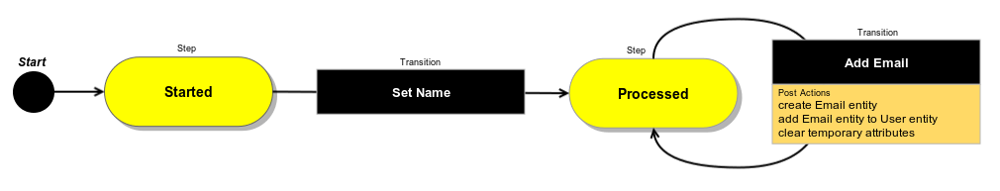

Getting Started
===============

Table of Contents
-----------------
 - [What is Workflow?](#what-is-workflow)
 - [Main Entities](#main-entities)
 - [How it works?](#how-it-works)
 - [Workflow Fields](#workflow-fields)
 - [Activation State](#activation-state)
 - [Configuration](#configuration)
 - [Console commands](#console-commands)

What is Workflow?
-----------------

Workflow is a complex solution that allows user to perform set of actions with predefined conditions
for specific entity - each next action depends on previous. Also Workflow can be described as some kind of wizard
that helps user to perform complex actions.
Usually Workflow is used to manage some specific type of entity and to create additional entities.

Main Entities
-------------

Workflow consists of several related entities.

* **Step** - entity that shows current status of Workflow. Before rendering each transitions checked
is it allowed for current Workflow Item. Contains name, label and list of allowed transitions. Entity involved
in workflow has relation to current workflow step.

* **Attribute** - entity that represent one value in Workflow Item, used to render field value on a step form.
Attribute knows about its type (string, object, entity etc.) and additional options.
Attribute contains name and label as additional parameters.

* **Transition** - action that change current step of Workflow Item (i.e. moves it from one step to another). Transition
is allowed if it's Conditions are satisfied. Before Transition performed Init Actions are executed and after
transition performed - Post Actions are executed. Transition can be used as a start transition - it means that this
transition will start Workflow and create new instance of Workflow Item. Transition optionally could have a form. In
this case this form will be showed to user when Transition button is clicked. Transition contains name, label and some
additional options. Optionally transition can contain form with list of attributes.

* **Condition** - defines whether specific Transition is allowed with specified input data. Conditions can be nested.

* **Actions** - actions are assigned to Transition and executed when Transition is performed.
There are two kind of actions: Init Action and Post Actions. The difference between them is that
Init Actions are executed before Transition and Post Actions are executed after Transition.
Actions can be used to manage entities (create, find), manipulate attributes (f.e. assign values)
and to perform any other actions.

* **Workflow** - aggregates steps, attributes and transitions. Workflow is a model that doesn't have it's own state
but it can be referred by Workflow Items.

* **Workflow Data** - container aggregated by Workflow Item where each value associated with some Attribute.
Those values can be entered by user directly or assigned via Actions.

* **Workflow Item** - associated with Workflow and indirectly associated with Steps, Transitions and
Attributes. Has it's own state in Workflow Data, current Step and other data. Workflow Item stored in entity that has
associated workflow.

How it works?
-------------

Entity can have assigned workflow - it means that on entity view page there will be list of passed steps and
allowed transition buttons. When user clicks button with start transition (and submit transition form if it's exist)
in the background a new instance of Workflow Item of specific Workflow is created.

Each Step has a list of allowed Transitions, and each Transition has list of Conditions that define whether this
Transition can be performed with specific Workflow Item state. If Transition is allowed then user can perform it.
If Transition has Init Actions they are executed before Transition. If transition has Post Actions then
these Post Actions will be performed right after Transition. So, user can move entity through Steps of Workflow until
he reach the final Step where Workflow will be finished.
It's also possible that Workflow doesn't have a final step. In this case user can perform transitions until they are
allowed.

Workflow Item stores all collected data and current step, so, user can stop his progress on Workflow at any moment and
then return to it, and Workflow will have exactly the same state. Each Workflow Item represents workflow
started for some specific entity - this entity stores links to Workflow Item and current Step.

Workflow Fields
---------------

Each entity that has workflow must also have special fields to store Workflow Item and Workflow Step entities.
These fields must be named as $workflowItem and $workflowStep. Here is example of their configuration:

```php
/**
 * @var WorkflowItem
 *
 * @ORM\OneToOne(targetEntity="Oro\Bundle\WorkflowBundle\Entity\WorkflowItem")
 * @ORM\JoinColumn(name="workflow_item_id", referencedColumnName="id", onDelete="SET NULL")
 */
protected $workflowItem;

/**
 * @var WorkflowStep
 *
 * @ORM\ManyToOne(targetEntity="Oro\Bundle\WorkflowBundle\Entity\WorkflowStep")
 * @ORM\JoinColumn(name="workflow_step_id", referencedColumnName="id", onDelete="SET NULL")
 */
protected $workflowStep;

/**
 * @param WorkflowItem $workflowItem
 * @return Opportunity
 */
public function setWorkflowItem($workflowItem)
{
    $this->workflowItem = $workflowItem;

    return $this;
}

/**
 * @return WorkflowItem
 */
public function getWorkflowItem()
{
    return $this->workflowItem;
}

/**
 * @param WorkflowItem $workflowStep
 * @return Opportunity
 */
public function setWorkflowStep($workflowStep)
{
    $this->workflowStep = $workflowStep;

    return $this;
}

/**
 * @return WorkflowStep
 */
public function getWorkflowStep()
{
    return $this->workflowStep;
}

```

Also workflow can be assigned to any extended or custom entities - if this case these fields
will be created automatically when first workflow for this entity will be created.

Activation State
----------------

By default all new workflow created in inactive state - it means that there will be no steps and transition
on entity view page. Only one workflow for each entity can be active in one time.

Activation of workflow can be performed in several ways.

### User Interface

User can activate workflow through UI in Workflow datagrid - it available in menu under "System" > "Workflows".
Here each workflow can be activated either using row actions "Activate" and "Deactivate", or from Workflow view page
using appropriate buttons.

### Annotation

Developer can add workflow configuration to @Config entity annotation where active workflow will be specified.
This approach can be used if there is a need to automatically activate workflow on application installation.
Here is example of such configuration:

```php
/**
 * ...
 *
 * @Config(
 *  ...
 *  defaultValues={
 *      ...
 *      "workflow"={
 *          "active_workflow"="example_user_flow"
 *      }
 *  }
 * )
 */
class User
{
    ...
}
```

### REST API

WorkflowBundle provides REST API the allows to activate or deactivate workflow.

Activation URL attributes:
* **route:** oro_api_workflow_activate
* **parameter:** workflowDefinition - name of the appropriate workflow

Deactivation URL attributes:
* **route:** oro_api_workflow_deactivate
* **parameter:** entityClass - entity which workflow should be deactivated

### Workflow Manager

WorkflowBundle has WorkflowManager service (oro_workflow.manager) that provides methods to activate and deactivate
workflows:
* **activateWorkflow(workflowIdentifier)** - activate workflow by workflow name, Workflow instance,
    WorkflowItem instance or WorkflowDefinition instance;
* **deactivateWorkflow(entityClass)** - deactivate workflow by entity class.

Configuration
-------------

All Workflow entities are described in configuration. Look at example of simple Workflow configuration that performs
some action with User entity.

```
workflows:
    example_user_flow:                            # name of the workflow
        label: 'User Workflow Example'            # workflow label for UI representation
        entity: Oro\Bundle\UserBundle\Entity\User # workflow related entity
        entity_attribute: user                    # attribute name of current entity that can be used in configuration
        start_step: started                       # step that will be assigned automatically to new entities
        steps_display_ordered: true               # defines whether all steps will be shown on view page in steps widget

        steps:                                    # list of all existing steps in workflow
            started:                              # step where user should enter firstname and lastname
                label: 'Started'                  # step label
                order: 10                         # order of step (ascending)
                allowed_transitions:              # list of allowed transition from this step
                    - set_name                    # first name and last name should be entered on this transition
            processed:                            # step where user can review entered data
                label: 'Processed'                # step label
                order: 20                         # steps will be shown in ascending
                allowed_transitions:              # order of step
                   - add_email                    # new email should be added on this transition

        attributes:                                           # list of all existing attributes in workflow
            first_name:                                       # first name of a user
                property_path: user.firstName                 # path to entity property (automatically defined attribute metadata)
            middle_name:                                      # middle name of a user
                property_path: user.middleName                # path to entity property (automatically defined attribute metadata)
            last_name:                                        # last name of a user
                property_path: user.lastName                  # path to entity property (automatically defined attribute metadata)
            email_string:                                     # email string temporary attribute
                label: 'Email'                                # attribute label
                type: string                                  # attribute type
            email_entity:                                     # email entity temporary attribute
                label: 'Email Entity'                         # attribute label
                type: entity                                  # attribute type
                options:                                      # attribute options
                    class: Oro\Bundle\UserBundle\Entity\Email # entity class name

        transitions:                                        # list of all existing transitions in workflow
            set_name:                                       # transition from step "started" to "processed"
                label: 'Set Name'                           # transition label
                step_to: processed                          # next step after transition performing
                transition_definition: set_name_definition  # link to definition of conditions and post actions
                form_options:                               # options which will be passed to form type of transition
                    attribute_fields:                       # list of attribute fields which will be shown
                        first_name:                         # attribute name
                            options:                        # list of form field options
                                required: true              # define this field as required
                                constraints:                # list of constraints
                                    - NotBlank: ~           # this field must be filled
                        middle_name: ~                      # attribute name
                        last_name:                          # attribute name
                            options:                        # list of form field options
                                required: true              # define this field as required
                                constraints:                # list of constraints
                                    - NotBlank: ~           # this field must be filled
            add_email:                                      # transition from step "add_email" to "add_email" (self-transition)
                label: 'Add Email'                          # transition label
                step_to: processed                          # next step after transition performing
                transition_definition: add_email_definition # link to definition of conditions and post actions
                form_options:                               # options which will be passed to form type of transition
                    attribute_fields:                       # list of attribute fields which will be shown
                        email_string:                       # attribute name
                            options:                        # list of form field options
                                required: true              # define this field as required
                                constraints:                # list of constraints
                                    - NotBlank: ~           # this field must be filled
                                    - Email: ~              # field must contain valid email

        transition_definitions:                                   # list of all existing transition definitions
            set_name_definition: []                               # definitions for transition "set_name", no extra conditions or actions here
            add_email_definition:                                 # definition for transition "add_email"
                post_actions:                                     # list of action which will be performed after transition
                    - @create_entity:                             # create email entity
                        class: Oro\Bundle\UserBundle\Entity\Email # entity class
                        attribute: $email_entity                  # entity attribute that should store this entity
                        data:                                     # data for creating entity
                            email: $email_string                  # entered email
                            user: $user                           # current user
                    - @call_method:                               # call specific method from entity class
                        object: $user                             # object that should call method
                        method: addEmail                          # method that should be called
                        method_parameters:                        # parameters that will be passed to the called method
                            [$email_entity]                       # add email from temporary attribute
                    - @unset_value:                               # unset temporary properties
                            [$email_string, $email_entity]        # clear email string and entity

```

This configuration describes Workflow that includes two steps - "set_name" and "add_email".

On step "started" user can update full name (first, middle and last name) using transition "set_name".
Then on step "processed" user can add additional emails using transition "add_email".

To perform transition "set_name" user should fill first and last name, and middle name is optional. After this
transition entered data will be automatically set to user through attribute property paths.
And to perform transition "add_email" user must enter valid email - it must be not empty and has valid format.
This transition creates new Email entity with assigned email string and User entity, then adds it to User entity to
create connection and clears temporary attributes in last action.

Following diagram shows this logic in graphical representation.



**Note:** If you want to test this flow in real application, you can put this configuration in file
Oro/Bundle/UserBundle/Resources/config/workflow.yml, reload definitions using console command
``app/console oro:workflow:definitions:load`` and activate it from UI -
after that you can go to User view page and test it.

Console commands
----------------

WorkflowBundle provides following console commands to work with workflows.

#### oro:workflow:definitions:load

This command loads workflow's configurations from *.yml configuration files to the database. It used
during application installation and update processes. Command has two optional options:

- **--directories** - specifies directories used to find configuration files (multiple values allowed);
- **--workflows** - specifies names of the workflows that should be loaded (multiple values allowed).

**Note:** You must execute this command every time when workflow configurations were changed at "*.yml" files.

#### oro:workflow:transit

This command perform transition with specified name for WorkflowItem with specified ID. It used for performing scheduled
transitions. Command has two required option:

- **--workflow-item** - identifier of WorkflowItem.
- **--transition** - name of Transition.
