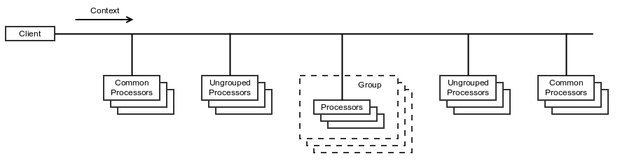

# Oro ChainProcessor Component

## Table of Contents
 - [Overview](#overview)
 - [Getting Started](#getting-started)
 - [Context](#context)
 - [Actions](#actions)
 - [Types of Processors](#types-of-processors)
 - [Processors Priority](#processors-priority)
 - [Applicable Checkers](#applicable-checkers)
 - [Key Classes](#key-classes)

## Overview

The Oro ChainProcessor component implements enhanced [Chain of Responsibility](http://www.oodesign.com/chain-of-responsibility-pattern.html) design pattern and allows efficiently process requests without hard-wiring handler relationships and precedence, or request-to-handler mappings.

The following enhancements of the original design pattern are added to make a configuration of requests processing more flexible:

- Processors can be grouped in some logical groups.
- The execution order of processors can be configured using `priority` attribute of a processor and a group.
- The execution of processors' groups can be skipped during a request processing.
- It is possible to execute a part of processors' groups instead of all processors registered in a chain.
- A list of processors executed for a concrete request can be filtered based on attributes of each processor.
- It is easy to add new rules are used to check whether a processor should be executed.




## Getting Started

Lets imagine that you need a different types of textual representations of some group of objects, e.g. entities. One of straightforward solution may be using of `__toString()` magic method or some custom `toString($parameters)` method. In some simple cases this solution may be a good approach. But in case if you want to allow external code to change existing representation of your objects or add new types of representations this solution is not seem as a good choice.

The Oro ChainProcessor component can help to solve this task. It is supposed that your application is built using Symfony Framework, but the Oro ChainProcessor component can be easily adapted to other frameworks.

- Register compiler passes

```php
<?php

namespace Acme\Bundle\TextRepresentationBundle;

use Symfony\Component\DependencyInjection\Compiler\PassConfig;
use Symfony\Component\DependencyInjection\ContainerBuilder;
use Symfony\Component\HttpKernel\Bundle\Bundle;

use Oro\Component\ChainProcessor\DependencyInjection\CleanUpProcessorsCompilerPass;
use Oro\Component\ChainProcessor\DependencyInjection\LoadAndBuildProcessorsCompilerPass;

class AcmeTextRepresentationBundle extends Bundle
{
    /**
     * {@inheritdoc}
     */
    public function build(ContainerBuilder $container)
    {
        $container->addCompilerPass(
            new LoadAndBuildProcessorsCompilerPass(
                'text_representation.processor_bag_config_provider',
                'text_representation.processor'
            )
        );
        $container->addCompilerPass(
            new CleanUpProcessorsCompilerPass(
                'text_representation.simple_processor_factory',
                'text_representation.processor'
            ),
            PassConfig::TYPE_BEFORE_REMOVING
        );
    }
}
```

- Create the main processor that will execute text representation processors

```php
<?php

namespace Acme\Bundle\TextRepresentationBundle;

use Oro\Component\ChainProcessor\ActionProcessor;
use Oro\Component\ChainProcessor\ContextInterface;

class TextRepresentationProcessor extends ActionProcessor
{
    /**
     * {@inheritdoc}
     */
    public function process(ContextInterface $context)
    {
        $context->setAction('get_text_representation');

        $this->executeProcessors($context);

        if (!$context->hasResult()) {
            throw new \RuntimeException(
                sprintf('Cannot convert "%s" to string.', get_class($context->get('object')))
            );
        }
    }
}
```

- Create a class that will be an entry point of text representation functionality

```php
<?php

namespace Acme\Bundle\TextRepresentationBundle;

use Oro\Component\ChainProcessor\Context;

class ObjectToStringConverter
{
    /** @var TextRepresentationProcessor */
    protected $processor;

    /**
     * @param TextRepresentationProcessor $processor
     */
    public function __construct(TextRepresentationProcessor $processor)
    {
        $this->processor = $processor;
    }

    /**
     * @param object      $object
     * @param string|null $representationType
     *
     * @return string
     */
    public function convertObjectToString($object, $representationType = null)
    {
        $context = $this->processor->createContext();
        $context->set('object', $object);
        $context->set('class', get_class($object));
        if (null !== $representationType) {
            $context->set('representationType', $representationType);
        }
        $this->processor->process($context);

        return $context->getResult();
    }
}
```

- Register services in DI container

```yaml
services:
    text_representation.object_to_string_converter:
        class: Acme\Bundle\TextRepresentationBundle\ObjectToStringConverter
        arguments:
            - '@text_representation.processor'

    text_representation.processor:
        class: Acme\Bundle\TextRepresentationBundle\TextRepresentationProcessor
        public: false
        arguments:
            - '@text_representation.processor_bag'

    text_representation.processor_bag:
        class: Oro\Component\ChainProcessor\ProcessorBag
        public: false
        arguments:
            - '@text_representation.processor_bag_config_provider'
            - '@text_representation.processor_factory'
            - '%kernel.debug%'

    text_representation.processor_bag_config_provider:
        class: Oro\Component\ChainProcessor\ProcessorBagConfigProvider
        public: false
        arguments:
            - # groups
                'get_text_representation': ['prepare_data', 'format']

    text_representation.processor_factory:
        class: Oro\Component\ChainProcessor\ChainProcessorFactory
        public: false
        calls:
            - [addFactory, ['@text_representation.simple_processor_factory', 10]]
            - [addFactory, ['@text_representation.di_processor_factory']]

    text_representation.simple_processor_factory:
        class: Oro\Component\ChainProcessor\SimpleProcessorFactory
        public: false

    text_representation.di_processor_factory:
        class: Oro\Component\ChainProcessor\DependencyInjection\ProcessorFactory
        public: false
        arguments:
            - '@service_container'
```

- Implement a simple processor that will get an object identifier and register it in `prepare_data` group

```php
<?php

namespace Acme\Bundle\TextRepresentationBundle\Processor;

use Oro\Component\ChainProcessor\ContextInterface;
use Oro\Component\ChainProcessor\ProcessorInterface;

class GetObjectId implements ProcessorInterface
{
    /**
     * {@inheritdoc}
     */
    public function process(ContextInterface $context)
    {
        if ($context->has('objectId')) {
            // object id is already retrieved
            return;
        }
        $object = $context->get('object');
        if (!method_exists($object, 'getId')) {
            throw new \RuntimeException(sprintf('Expected "%s::getId()"', get_class($object)));
        }
        $context->set('objectId', $object->getId());
    }
}
```

```yaml
    text_representation.processor.get_object_id:
        class: Acme\Bundle\TextRepresentationBundle\Processor\GetObjectId
        tags:
             - { name: text_representation.processor, action: get_text_representation, group: prepare_data, priority: -10 }
```

- Implement a simple processor that will represents an object as `class name - object id` and register it in `format` group

```php
<?php

namespace Acme\Bundle\TextRepresentationBundle\Processor;

use Oro\Component\ChainProcessor\ContextInterface;
use Oro\Component\ChainProcessor\ProcessorInterface;

class FormatClassNameIdPair implements ProcessorInterface
{
    /**
     * {@inheritdoc}
     */
    public function process(ContextInterface $context)
    {
        if ($context->hasResult()) {
            // already formatted
            return;
        }
        $context->setResult(sprintf('%s - %s', $context->get('class'), $context->get('objectId')));
    }
}
```

```yaml
    text_representation.processor.format_class_name_id_pair:
        class: Acme\Bundle\TextRepresentationBundle\Processor\FormatClassNameIdPair
        tags:
             - { name: text_representation.processor, action: get_text_representation, group: format, priority: -10 }
```

Now we can get a test representation for almost all entities:

```php
    $converter = $this->getContainer()->get('text_representation.object_to_string_converter');

    $entity = new User();
    $entity->setId(123);

    echo $converter->convertObjectToString($entity);
```

But what if some bundle has an entity which does not have `getId()`, but have `getCode()` to get a value of identity field? In this case a special processor can be created in this bundle and registered in DI container with a filter by this entity:

```php
<?php

namespace Acme\Bundle\AnotherBundle\Processor;

use Oro\Component\ChainProcessor\ContextInterface;
use Oro\Component\ChainProcessor\ProcessorInterface;

class GetObjectIdForTestEntity implements ProcessorInterface
{
    /**
     * {@inheritdoc}
     */
    public function process(ContextInterface $context)
    {
        if ($context->has('objectId')) {
            return;
        }
        $object = $context->get('object');
        $context->set('objectId', $object->getCode());
    }
}
```

```yaml
services:
    text_representation.processor.get_object_id_for_test_entity:
        class: Acme\Bundle\AnotherBundle\Processor\GetObjectIdForTestEntity
        tags:
             - { name: text_representation.processor, action: get_text_representation, group: prepare_data, class: Acme\Bundle\AnotherBundle\Entity\TestEntity }
```

Next, lets imagine that some bundle need to change a text representation from `class name - object id` to `[class name - object id]`. This can be achieved by adding a processor that will be executed after a processor built the previous representation:

```php
<?php

namespace Acme\Bundle\AnotherBundle\Processor;

use Oro\Component\ChainProcessor\ContextInterface;
use Oro\Component\ChainProcessor\ProcessorInterface;

class DecorateClassNameIdPair implements ProcessorInterface
{
    /**
     * {@inheritdoc}
     */
    public function process(ContextInterface $context)
    {
        $context->setResult(sprintf('[%s]', $context->getResult()));
    }
}
```

```yaml
    text_representation.processor.decorate_class_name_id_pair:
        class: Acme\Bundle\AnotherBundle\Processor\DecorateClassNameIdPair
        tags:
             - { name: text_representation.processor, action: get_text_representation, group: format, priority: -20 }
```

This was just an example how the Oro ChainProcessor component may be used. The next section provides a list of key classes that may help you to investigate this component. Also you can find advanced usage of it in OroPlatform.

## Context

The [context](./Context.php) is abstraction designed to isolate implementations of processors from the environment in which they are executed. Actually the context is just key-value storage for input and output data.

## Actions

The action is a set of operations what should be performed over the context to get output data for some input data.

## Types of Processors

There are three types of processors:
  - **common processors** - These processors are executed for all actions. They may be helpful if you need to do some common things at the beginning or at the ending.
  - **ungrouped processors** - The same as above but in scope of specified action.
  - **grouped processors** - It is most generally used processors. They are defined in scope of specified action and logically grouped.

## Processors Priority

Each processor and each group of processors can have the `priority` attribute that is used to specify the order of processors execution. The higher the priority, the earlier the processor is executed. The default priority is 0.

The processors are executed in the following order:
  - initial common processors
  - initial ungrouped processors
  - grouped processors
  - final ungrouped processors
  - final common processors

The following table shows limitations for values of the priority attribute.

| Processor type | Processor priority | Group priority |
|----------------|--------------------|----------------|
| initial common processors | greater than or equals to 0 |  |
| initial ungrouped processors | greater than or equals to 0 |  |
| grouped processors | from -255 to 255 | from -255 to 255 |
| final ungrouped processors | less than 0 |  |
| final common processors | less than 0 |  |

## Applicable Checkers

The applicable checkers are used to filter processors to be executed for the current execution context. All applicable checkers you want to use should be registered in a [processor bag](./ProcessorBag.php) and must implement [ApplicableCheckerInterface](./ApplicableCheckerInterface.php).

There is a list of existing applicable checkers that are registered in the processor bag by default:

- [GroupRangeApplicableChecker](./GroupRangeApplicableChecker.php) - It allows to execute processors only from specified range of groups. To set the range you can use `setFirstGroup` and `setLastGroup` methods of the context.
- [SkipGroupApplicableChecker](./SkipGroupApplicableChecker.php) - It allows to skip processors included in some groups. To manage skipped groups  you can use `skipGroup` and `undoGroupSkipping` methods of the context.
- [MatchApplicableChecker](./MatchApplicableChecker.php) - It allows to filter processors based on data stored in the context.

## Key Classes

Here is a list of key classes:

- [ActionProcessor](./ActionProcessor.php) - The base class for processors for your actions. This class executes processors registered in [ProcessorBag](./ProcessorBag.php) and suitable for the specified [Context](./Context.php).
- [Context](./Context.php) - The base implementation of an execution context.
- [ProcessorBag](./ProcessorBag.php) - A container for processors and applicable checkers.
- [ProcessorBagConfigBuilder](./ProcessorBagConfigBuilder.php) - A builder for processors map used in the ProcessorBag.
- [ProcessorInterface](./ProcessorInterface.php) - An interface of processors.
- [ApplicableCheckerInterface](./ApplicableCheckerInterface.php) - An interface of applicable checkers.
- [ProcessorBagAwareApplicableCheckerInterface](./ProcessorBagAwareApplicableCheckerInterface.php) - An interface that should be implemented by applicable checkers that need access to the processor bag.

