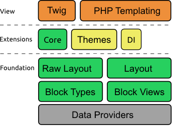

Oro Layout Component
====================

**IMPORTANT**: This component is not finished yet.

`Oro Layout Component` provides tools for

- defining elements of layout, so-called blocks, that can be used for building a different types of layouts, including HTML, XML and so on.
- manage a layout structure and themes.

Introduction
------------

The `Oro Layout Component` has several key concepts which need to be understood before you start learning this functionality:

 - A layout is a set of widgets are arranged in a hierarchy structure. Where a widget is some logical block contains some content.
 - Neither the layout nor a widget do not know how they should be converted (or in other words, rendered) into output string, for example HTML. To make this conversion we are using renderers, for example a renderer based on TWIG templates. 
 - The root idea and implementation of Oro layouts are mostly similar to Symfony's [Forms](http://symfony.com/doc/current/book/forms.html) component, but big difference is that layouts support only on-way data flow. It means that content of layout widgets can be rendered based on data, but layouts cannot be used to process user-submitted data.
 - There are two core layout widgets:
	- **block**
	The block represents a widget which cannot contain any other widgets. Examples of blocks can be a label, a chart, a grid and so on.
	- **container**
	The container is a structural widget which can contain other widgets. Examples of containers can be a header, a side bar, a page body and so on.

High-Level Architecture
-----------------------



The Oro Layout component includes three main layers:

 - The **Foundation** layer provides main architectural components are used to build a layout.
 - The **Extensions** layer extends the layout with some more useful features like loading widgets from DI container and working with layout inheritance.
 - The **View** layer provides components responsible for translating a layout to rendering HTML, XML or any other format.

The Oro Layout component provides several pluggable extensions out of the box:

 - The **Core** extension provides all widget definitions (called block types) implemented by the component.
 - The **DI** extension adds support for Symfony's [Dependency Injection](http://symfony.com/doc/current/components/dependency_injection/introduction.html) component.
 - The **Themes** extensions allows to build layouts based on other layouts and provide flexible configuration of layouts.


Layout life cycle
-----------------

In general terms, the layout goes through the stages outlined in the following table.

| Stage | Description |
|------ |-------------|
| **create the layout context** | The layout context should be created manually by calling the constructor of the [LayoutContext](./LayoutContext.php) class. If needed, additional variables can be added to the context at this stage. |
| **configure the layout context** | At this stage the `configureContext` method of all registered [layout configurators](./ContextConfiguratorInterface.php) is called. |
| **resolve the layout context** | After this stage adding new variables to the layout context is not possible, but it is still possible to change the value of existing variables. |
| **add `root` block** | The root block should be added manually to start executing of the layout update chain. See description of the next stage for more details. | 
| **execute layout updates** | The layout updates are linked to the layout blocks, so they are executed after a block is added to the layout. If a block is not specified for an layout update it is linked to the root block. |
| **build blocks** | A block hierarchy is build starting from a parent block. The `buildBlock` method of the base block type is called at first, then the `buildBlock` method of all registered extensions of the base block type is called; next the `buildBlock` method of the inherited block type and its extensions is called, etc. |
| **build block views** | A block view hierarchy is build starting from a parent block. The `buildView` method of the base block type is called at first, then the `buildView` method of all registered extensions of the base block type is called; next the `buildView` method of the inherited block type and its extensions is called, etc. The `buildView` method is called before child views are built, so it is not possible to access child views there. |
| **finish building of block views** | At first a parent view is finishing building. The `finishView` method of the base block type is called at first, then the `finishView` method of all registered extensions of the base block type is called; next the `finishView` method of the inherited block type and its extensions is called, etc. The `finishView` method is called after child views are built, but before child view are finished building. |
| **render the layout** | the layout rendering is the same as in Symfony Forms. See [How to Customize Form Rendering](http://symfony.com/doc/current/cookbook/form/form_customization.html) for more details. |


The following example shows how a simple layout can be build.

```php
$context = new LayoutContext();
$context->getResolver()
	->setRequired(['some_variable']);
$context->set('some_variable', 'some_value');

$layoutFactory = Layouts::createLayoutFactory();
$layout = $layoutFactory->createLayoutBuilder()
	->add('root', null, 'root')
	->add('header', 'root', 'header')
	->add('logo', 'header', 'logo', ['title' => 'Hello World!'])
	->getLayout($context);

echo $layout->render();
```

Also you can render only layout subtree instead of full tree.
For this you should add `root_id` variable to context.

```php
$context->getResolver()->setOptional(['root_id']);
$context->set('root_id', 'some_block_id');
...
echo $layout->render();
```

For deeper understanding of how the layout works you can investigate [Layouts](./Layouts.php) class, the `getLayout` method of [LayoutBuilder](./LayoutBuilder.php) class and [BlockFactory](./BlockFactory.php) class. Also pay attention to the `postExecuteAction` method of [DeferredLayoutManipulator](./DeferredLayoutManipulator.php) class and [LayoutRegistry](./LayoutRegistry.php) class.


Developer reference
-------------------

Here is a list of most important classes of Oro Layout component:

 - [LayoutManager](./LayoutManager.php) is the main entry point to the Oro Layout component.
 - [Layouts](./Layouts.php) is the static helper that can be used if a dependency injection container is not used in your application.
 - [Layout](./Layout.php) represents a layout which is ready to be be rendered.
 - [LayoutBuilder](./LayoutBuilder.php) provides a set of methods to build the layout.
 - [LayoutRegistry](./LayoutRegistry.php) holds all layout extensions.
 - [RawLayout](./RawLayout.php) represents a storage for all layout data, including a list of items, hierarchy of items, aliases, etc. This is internal class and usually you do not need to use it outside of the component.
 - [RawLayoutBuilder](./RawLayoutBuilder.php) provides a way to build the layout data storage. This is internal class and usually you do not need to use it outside of the component.
 - [DeferredLayoutManipulator](./DeferredLayoutManipulator.php) allows to construct a layout without worrying about the order of method calls.
 - [BlockTypeInterface](./BlockTypeInterface.php) provides an interface for all block types.
 - [AbstractType](./Block/Type/AbstractType.php) can be used as a base class for all **block** block types.
 - [AbstractContainerType](./Block/Type/AbstractContainerType.php) can be used as a base class for all **container** block types.
 - [BlockFactory](./BlockFactory.php) implements the logic for building layout blocks and their views.
 - [DataProviderInterface](./DataProviderInterface.php) provides the interface for all data providers.
 - [ThemeExtension](./Extension/Theme/ThemeExtension.php) loads layout updates with imports.
